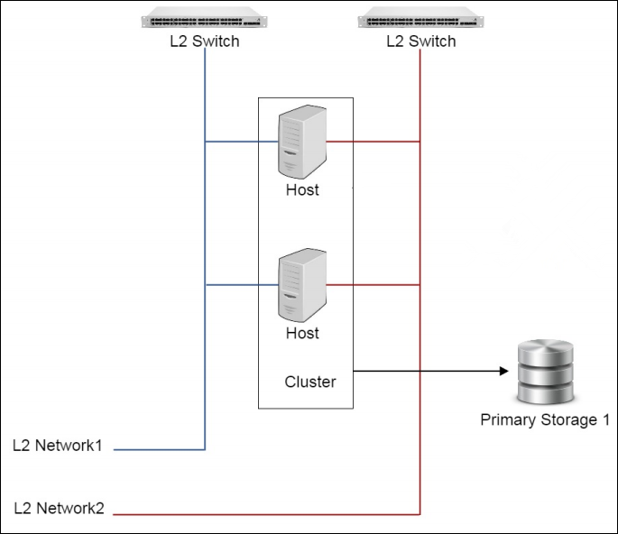
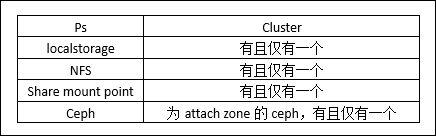
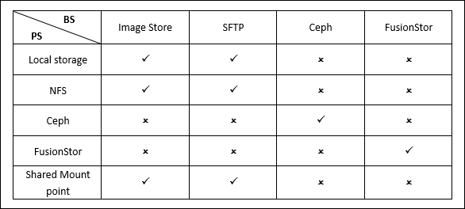

# 9 集群管理

一个集群是类似主机（Host）组成的逻辑组. 在同一个集群中的主机必须安装相同的操作系统（虚拟机管理程序,hypervisor）, 拥有相同的二层网络连接, 可以访问相同的主存储. 在实际的数据中心, 一个集群通常对应一个机架（rack）。

原本默认仅支持一个集群，在初始化的过程中，由初始化程序自动创建。用户之后新增的所有物理机均会添加到这个集群之中。随着需求的扩大，单一一个集群已经不能满足用户的配置要求。集群与主存储、网络之间存在着挂载卸载的关系，其结构如图9-1所示。

###### 图9-1 集群结构图

* 一个主存储可以加载多个集群，一个集群只能挂载一个主存储, 这个主存储可以被集群中的所有物理机访问。同时, 主存储也可以从集群卸载。主存储与集群的依赖关系如图9-2所示.

###### 图9-2 集群与主存储关系图

注意：不建议用户使用Share mount point挂载多个集群。

* 只要集群中的主机都在所挂载的L2网络所代表的物理二层广播域中，一个集群可以挂载一个或多个L2网络。一个网卡只能创建一个L2网络，同一类型的多块网卡可以用统一的网卡名创建多个L2网络，但只能挂载到不同的集群。

* 集群本身与镜像服务器没有直接的依赖关系，一个镜像服务器可以为多个集群提供服务。需要注意的是集群所挂载的主存储和镜像服务器（备份存储）具有相关性。

> 例如Ceph主存储只能与Ceph镜像服务器一同工作，如果用户只添加了本地镜像仓库与Ceph主存储，云主机也是不能创建成功的。主存储（PS）和镜像服务器（BS）的相关性关系如图9-3所示

###### 图9-3 主存储与备份存储关系图

