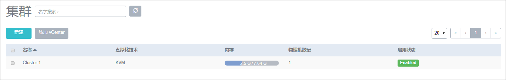
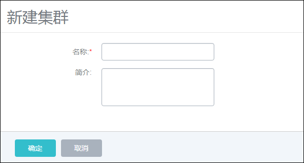
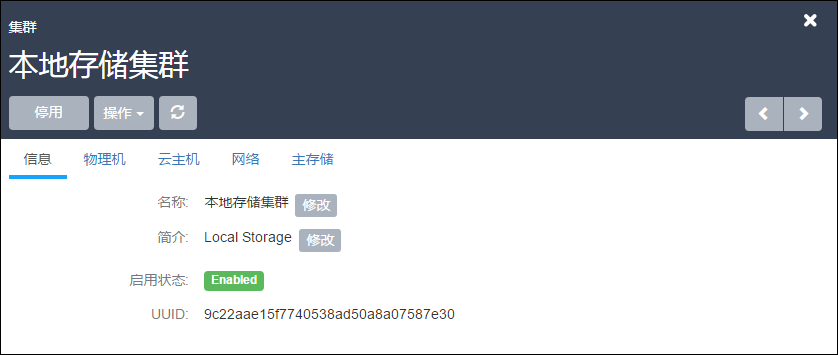
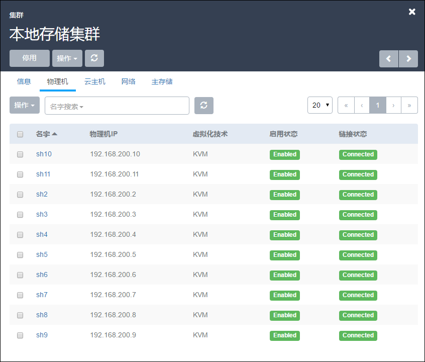
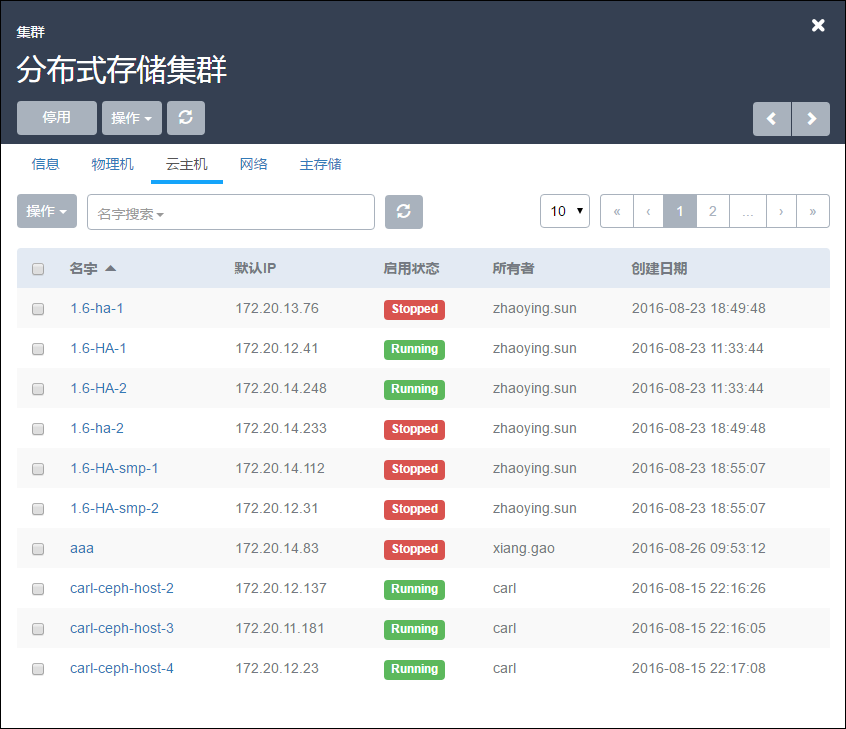
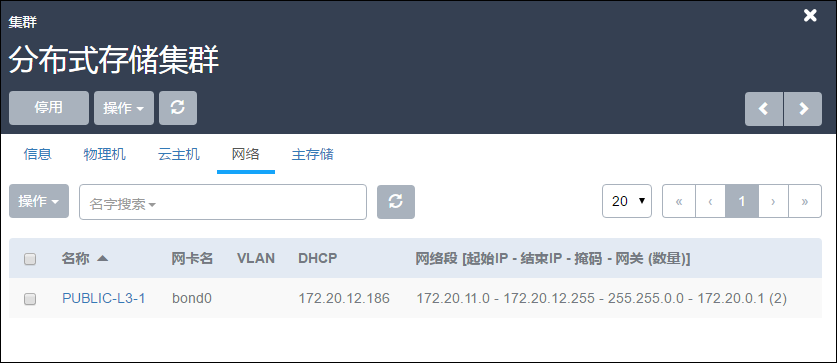
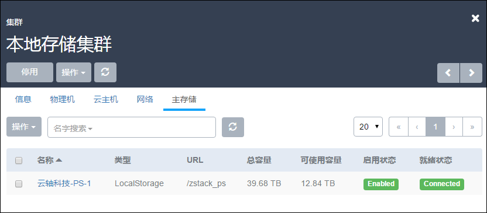

# 9.1 集群操作

点击菜单栏的集群按钮，进入集群管理界面，如图9-1-1所示。在集群管理界面，可以查看集群列表的信息，包括：虚拟化技术、内存、物理机数量、启用状态。并对集群进行新建、启用、停用、删除等操作。

###### 图9-1-1 集群管理界面

对集群操作的相关定义如下：

* 新建：添加一个集群。在集群主界面点击新建按钮，会弹出新的新建集群界面，如图9-1-2所示，输入集群的名称、简介。

* 启用：将处于停用状态的集群启用。

* 停用：停止使用某个集群，同时会停用这个集群中的所有物理机。但用户可以手动启用集群中的某个物理机，也可以添加物理机到这个集群。

* 删除：删除集群，同时也会删除集群中的所有物理机。

###### 图9-1-2 新建集群界面

在集群列表界面，点击相应集群的名字，可以展开集群的详细信息并对集群进行相应的操作，如图9-1-3所示。可支持启用、停用、删除、修改名字、简介等操作。点击右上角关闭按钮可以关闭窗口。

###### 图9-1-3  集群详细信息界面

在集群的详细信息页面，支持如下操作。

1.修改名字、简介等操作：

支持对集群的名字、简介进行修改。

2.操作物理机：
在集群的详情页面可以显示该集群中物理机的IP、虚拟化技术、状态等信息。支持对物理机进行启用、停用、重连、维护模式、删除的操作。如图9-1-4所示。

###### 图9-1-4  物理机操作界面

3.操作云主机：
在集群的详情页面可以显示该集群中所有物理机上的云主机信息。支持对云主机的启动、停止、重启、删除、恢复、彻底删除、高可用级别的操作。如图9-1-5所示。

###### 图9-1-5 云主机操作界面

4.操作网络：在集群的详情页面可以显示该集群上所加载的网络信息。支持对网络进行加载和卸载的操作。如图9-1-6所示

###### 图9-1-6 网络操作界面

5.操作主存储：

在集群的详情页面可以显示该集群上所加载的主存储信息。支持对存储进行加载和卸载的操作。如图9-1-7所示。

###### 图9-1-7 存储操作界面。