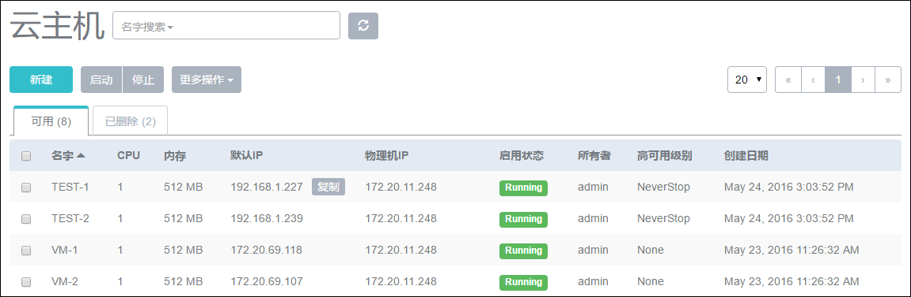

# 15.2 云主机高可用的应用场景

1.云主机异常关机

不管是通过UI停止云主机还是在云主机上进行操作导致云主机关机，设置高可用级别为NeverStop的云主机都会自动重启，如图15-2-1，15-2-2，15-2-3所示。

###### 图15-2-1 NeverStop云主机关机后自动重启（1）

###### 图15-2-2 NeverStop云主机关机后自动重启（2）

###### 图15-2-3 NeverStop云主机关机后自动重启（3）

2.云主机所在的物理机异常断电、异常断网、异常关机

如图15-2-4，15-2-5，15-2-6所示。

若主存储为本地存储，当物理机出现异常情况时，其上的云主机会转为stopped状态。

若主存储为网络共享存储，当物理机出现异常情况时，其上的NeverStop云主机会自动迁移到其他可用的物理机上。

###### 图15-2-4物理机异常时NeverStop云主机自动迁移（1）

###### 图15-2-5物理机异常时NeverStop云主机自动迁移（2）

###### 图15-2-6物理机异常时NeverStop云主机自动迁移（3）

3.云主机所在的物理机进入维护模式

如图15-2-7，15-2-8所示。

若主存储为本地存储，当物理机进入维护模式后，其上的云主机会进入stopped状态。

若主存储为网络共享存储，当物理机进入维护模式后，其上的云主机不管是否设置了高可用级别都会迁移到其他可用的物理机上。

###### 图15-2-7物理机进入维护模式时云主机自动迁移（1）

###### 图15-2-8物理机进入维护模式时云主机自动迁移（2）

注意：以下情况，云主机的高可用无法实现的：

1.只有一台物理机；

2.其他物理机的可用资源不足；

3.其他物理机被停用。

另外，在卸载云主机网络、删除集群网络等情况下，设置云主机的高可用级别对云主机的状态是没有任何影响的。

