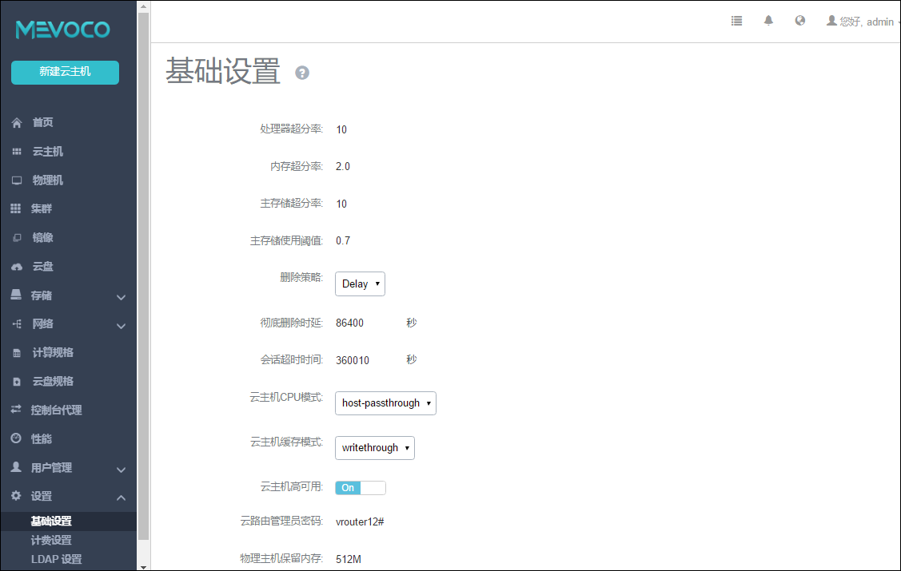

# 15.1 云主机高可用设置

全局设置：

在基础设置界面的高可用设置按钮，如图15-1-1所示：

###### 图15-1-1全局高可用设置界面

On代表全局打开云主机高可用设置，打开后，云主机的高可用级别才可设置，如图15-1-2所示；

Off代表全局关闭云主机高可用设置，关闭后，云主机的高可用级别设置全部失效，且不可见，如图15-1-3所示。

默认情况下高可用全局设置为On。如果再次打开后，原本已经设置过为高可用的云主机，则高可用恢复关闭之前的状态。

###### 图15-1-2全局高可用On时的云主机界面

###### 图15-1-3全局高可用Off时的云主机界面

创建云主机时设置高可用，如图15-1-4所示：

1.在新建云主机时，点击“新建云主机”按钮，在新界面输入名字、计算规格、镜像等字段；

2.点击“展开高级设置”，修改高可用级别为“NeverStop”；

3.点击“确定”，创建云主机。

###### 图15-1-4新建云主机设置高可用级别

在云主机界面即可看到已创建的所有云主机的高可用级别，如图15-1-5所示。默认情况下，新创建的云主机的高可用级别为None。

###### 图15-1-5云主机界面显示高可用级别

已有云主机修改高可用级别：

具体实现方式有两种：

1.在云主机界面勾选某一云主机，点击“更多操作”下的“高可用级别”即可对该云主机的高可用级别进行修改，如图15-1-6，15-1-7所示。

###### 图15-1-6 修改云主机高可用级别方法一（1）

###### 图15-1-7修改云主机高可用级别方法一（2）

2.点击某一云主机，弹出云主机详情页，点击高可用级别后的“修改”按钮即可对该云主机的高可用级别进行修改，如图15-1-8，15-1-9所示。

###### 图15-1-8 修改云主机高可用级别方法二（1）

###### 图15-1-9修改云主机高可用级别方法二（2）

