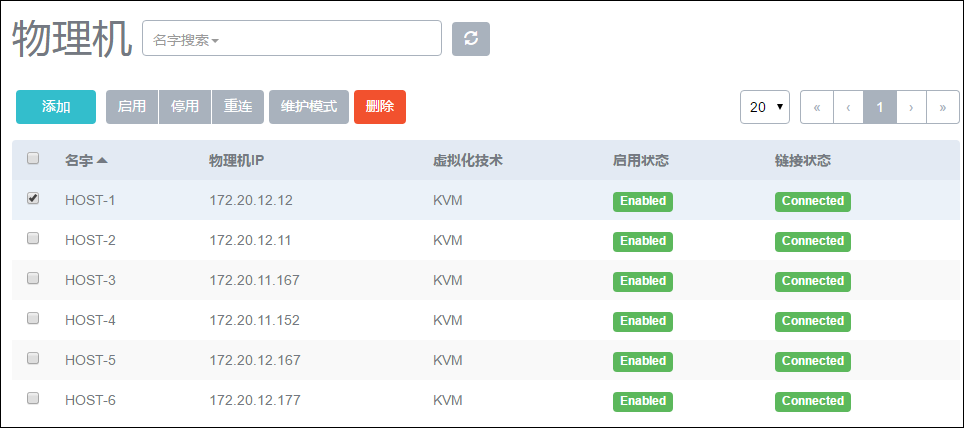
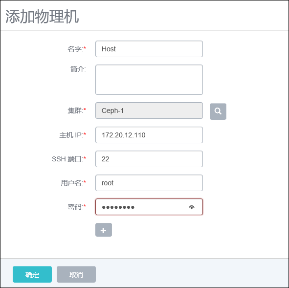
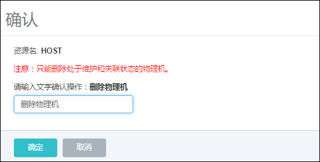

# 8 物理机管理

点击菜单栏的物理机按钮，进入物理机管理界面，如图8-1示。在物理机管理界面，可以查看物理机列表信息，并对物理机进行添加、启用、停用、重连、进入维护模式、删除等操作。

###### 图8-1  物理机管理界面

对物理机操作的相关定义如下：

添加：添加一个计算节点进入系统。在物理机主界面点击添加按钮，会弹出新的添加物理机界面，如图8-2所示，输入物理机名字、简介、IP地址、SSH端口号、用户名、用户密码。点击确定后，系统会部署相应的服务及添加物理机到系统中来。此过程可能需要等待几分钟。

启用：将处于停用状态的计算节点启用。

停用：停止使用某个计算节点，后续云主机不能在此Host上创建。

重连：重新连接计算节点，一般用于计算节点的配置更新之后。

进入维护模式：表示对计算节点进行系统维护，可对计算节点进行物理停机，故障修复等操作。确认物理机进入维护模式后，系统会主动停止该物理机上所有正在运行的云主机。

    删除：将计算节点删除掉，删除物理机需要物理机处于维护模式状态为前提，并需要输入删除物理机进行确认。如图8-3所示。

###### 图8-2  添加物理机

###### 图8-3  删除物理机确认界面

警告：

如果主存储为本地存储，删除物理机后，会自动删除该物理机上的云主机和数据云盘。如果并非采用立即删除策略，删除物理机后，此物理机的对应云资源需手动删除。如果采用立即删除策略，删除物理机后，此物理机的对应资源需会自动删除。由于删除物理机而导致云主机状态变为Destroyed的情况，将无法恢复。即使重新添加此物理机，系统也将重新部署此物理机，之前的数据库资源将无法恢复。

如果采用了共享存储作为主存储，且资源允许，相应的云主机会自动迁移至其他可用的物理机上，不会影响数据安全性；如果资源不足，则相应的云主机会停止。此时可能会有部分云主机因其他物理机满足资源条件已迁移，也有部分云主机因资源不足而停止。

