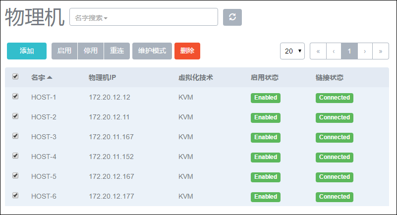
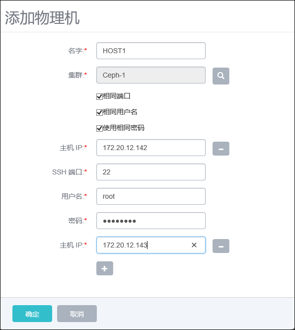

# 8.2 批量物理机操作

在物理机列表界面，勾选左侧的方框，可以批量对物理机进行相应的操作，如图8-2-1示。可支持添加、启用、停用、重连、进入维护模式、删除等操作。

###### 图8-2-1  物理机批量操作界面

批量操作物理机与单物理机的操作差异注意体现在添加物理机上。

批量添加物理机，如图8-2-2所示：

1. 点击添加按钮点击加号按钮，会弹出多个物理机IP输入框。

2. 默认会选择使用相同SSH端口。如果物理机SSH端口不同，去掉勾选“使用相同端口”的选项即可。

3. 默认会选择使用相同用户名。如果物理机用户名不同，去掉勾选“使用相同用户名”的选项即可。

4. 默认会选择使用相同密码。如果物理机密码不同，去掉勾选“使用相同密码”的选项即可。

5. 输入相应的物理机IP地址、SSH 端口号、物理机用户名和用户密码。如果端口号、用户名或密码不相同，针对不同的物理机需分别输入。

6. 点击确定，系统将配置相应的物理机。

如果任意物理机的IP、SSH端口号，用户名，用户密码错误或用户没有sudo权限，或者防火墙策略设置了禁入规则，添加会提示失败，但是正确的Host会添加成功。

批量删除物理机：批量删除物理机的操作需要首先将这些物理机进入维护模式才可操作，否则无法直接批量删除物理机。

###### 图8-2-2  批量添加物理机界面

