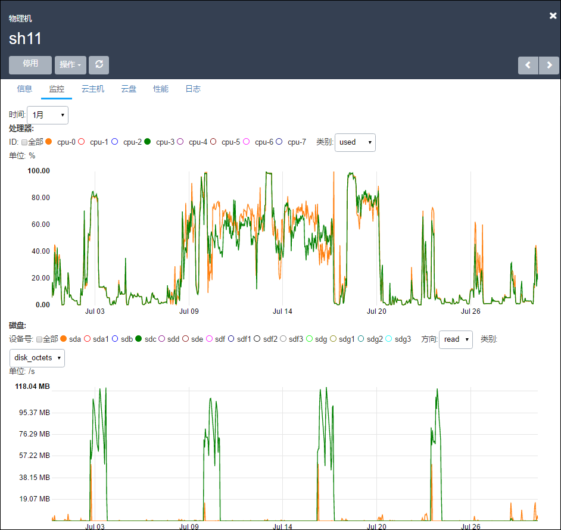

# 8.3 物理机监控

该系统标准版提供了对物理机的实时性能监控，包括处理器、磁盘、内存、网络等资源，如图8-3-1所示。

监控数据将会随着时间自动更新。

通过点击物理机可以进入物理机详情界面查看监控数据。用户可以选择查看监控数据跨度的时间是15分钟，1小时，6小时，1天，两周，1个月甚至是6个月的数据。

用户还可以选择不同的监控指标。

###### 图8-3-1  物理机实时监控

