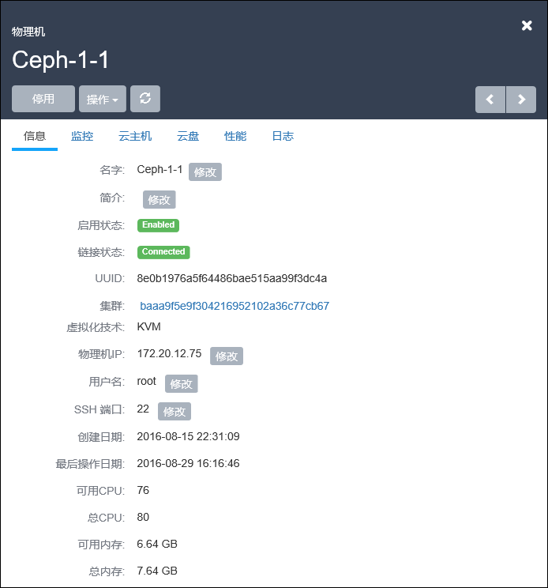
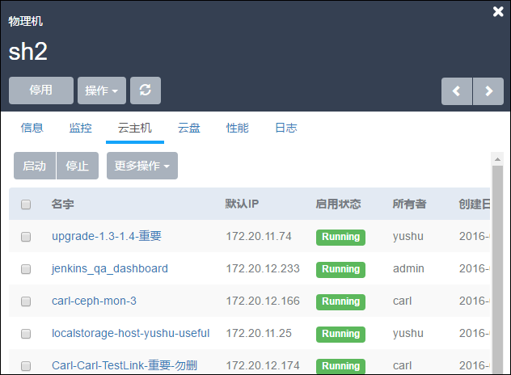
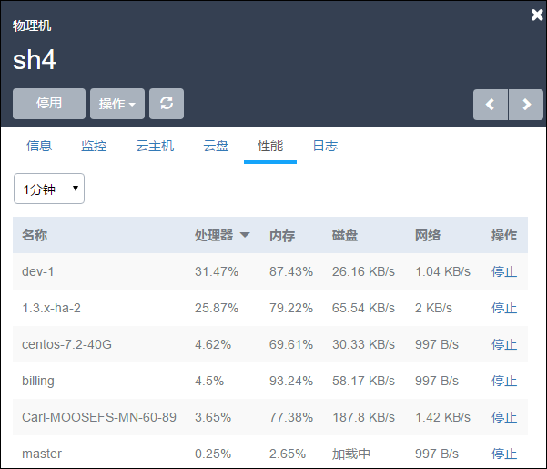

# 8.1 单物理机操作

在物理机列表界面，点击相应的物理机名字，可以展开物理机的详细信息并对物理机进行相应的操作，如图8-1-1示。

可支持启用、停用、重连、进入维护模式、修改密码、删除、修改用户名、修改SSH端口、检查日志等操作。在物理机详情里，可以修改物理机的名字，简介以及物理机的IP地址等。点击右上角的关闭按钮可以关闭窗口。

###### 图8-1-1  物理机单机操作

单台物理机支持的具体操作定义如下：

1.重连：如果更新了物理机的内存或者硬盘，可以使用物理机的重连操作更新系统的数据库。

2.进入维护模式：选择物理机进入维护模式将会自动关闭物理机上的云主机。该操作主要用于之后的系统维护，例如升级软硬件，或者其他断电操作。退出维护模式，重连物理机后，用户还可以继续启动该物理机上的云主机。

3.修改IP：修改物理机的IP地址，如果物理机的IP地址发生了变化，可以点击物理机详情页的信息下的物理机IP修改按钮进行修改。IP地址修改后，系统会重连物理机。

4.修改密码：如果物理机的密码变更了，可以点击修改密码进行物理机密码的更改。

5.删除物理机：删除物理机的操作需要首先将此物理机进入维护模式才可操作，否则无法直接删除物理机。

6.修改用户名：修改物理机的用户名，注意：此操作要求待修改的用户名拥有sudo权限，而且修改完毕用户名，请同时修改此用户名的密码。否则物理机可能重连失败。

7.修改SSH端口：修改物理机SSH登录的端口号。修改此端口号时，请确保此端口号已生效，且物理机的防火墙对端口也允许访问。

8.修改名字、简介等操作：

支持对物理机的名字、简介进行修改。

9.操作云主机、云盘：

在物理机详情界面还可以显示在该物理机上的云主机和数据云盘。如图8-1-2所示。

######图8-1-2  物理机的云主机信息界面

10.云主机性能监控：

在物理机性能界面可以看到此物理机上各云主机使用资源的实时情况。如图8-1-3所示。针对异常负载的云主机可以在此界面点击停止将其关机。

###### 图8-1-3 云主机资源实时情况界面

