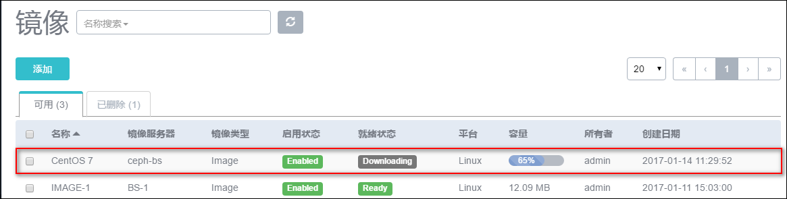
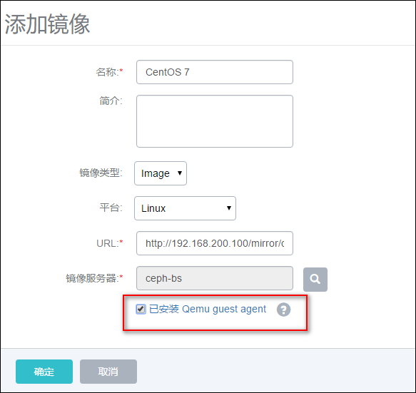

# 11 镜像管理

点击菜单栏的镜像按钮，进入镜像管理界面，如图11-1所示。在镜像管理界面，可以查看镜像列表信息，并对镜像进行添加、启用、停用、导出、删除、彻底删除、恢复和更改所有者等操作。在镜像详情页可以修改镜像的名字、简介、镜像平台及镜像类型

###### 图11-1  镜像管理界面

点击添加镜像，用户选填名称、简介、镜像类型、平台、URL、镜像服务器等信息，在最下方有“已安装Qemu guest agent”选项。

**注意：**请务必确保被导入的镜像己经安装了qemu-ga，并己设置为自启动。满足以上条件后，勾选本选项，则由添加的镜像创建出来的云主机，以及该云主机克隆生成的云主机或者创建的镜像，可以在running状态下从外部修改用户密码。

###### 图11-2  添加镜像界面

从图11-1中可以看到，下载镜像时，就绪状态为**Downloading**，容量处有**进度条**显示，方便用户掌握进度。

添加镜像的详细步骤参考初始化时[添加云主机镜像](/Wizard/image.md)的相关步骤。

镜像列表分为两栏，一栏为可用，代表目前未被删除的镜像。一栏为已删除，代表目前已被删除但尚未彻底删除的镜像。

如果镜像服务器类型为镜像仓库，在镜像界面中选择一个镜像，点击镜像名字进入镜像详情页面，在操作中点击导出按钮。成功导出镜像后，会在弹出的操作助手中显示下载链接，也可以复制该URL。如图11-1所示.

镜像资源的搜索目前支持名字、UUID和所有者进行搜索。

