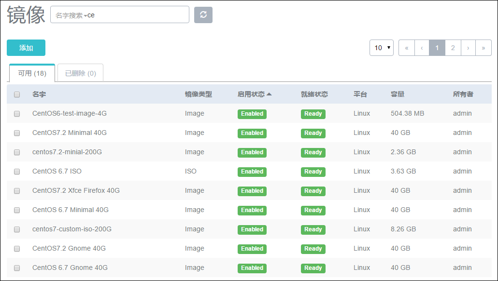

# 11.2 批量镜像操作

在镜像列表界面，勾选左侧的方框，可以批量对物理机进行相应的操作，如图11-2-1所示。可支持启用、停用、删除、恢复、彻底删除等操作。镜像的删除操作与云主机的删除操作类似，也支持延时删除和恢复功能，详细情况请参见“[7.2](/VM/single-vm.md)单个云主机操作”和“[6.2](/Main/base-setting.md)基础设置”中的删除介绍。

###### 图11-2-1  批量镜像操作界面
