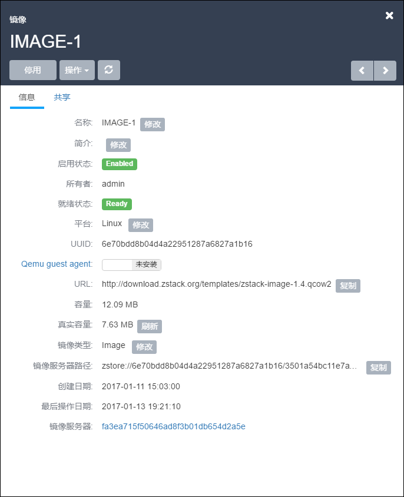
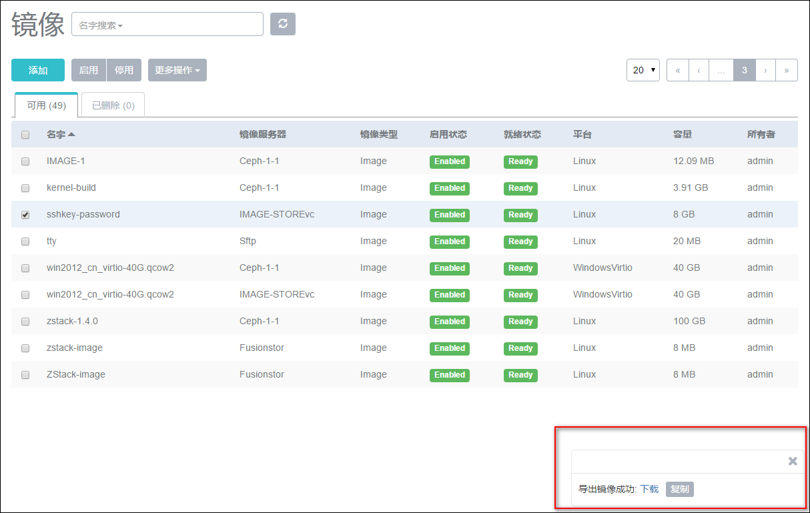
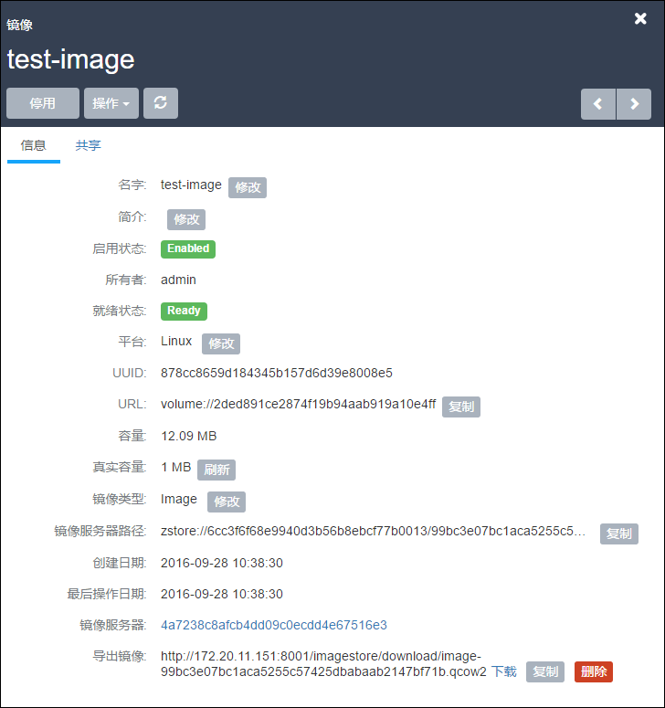

# 11.1 单镜像操作

在镜像列表界面，点击相应的镜像名字，可以展开镜像的详细信息并对镜像进行相应的操作，如图11-1-1所示。可支持添加、启用、停用、导出、删除、恢复、彻底删除、更改所有者等操作。

###### 图11-1-1 镜像详细信息界面

只有镜像仓库类型的镜像服务器上的镜像支持镜像导出及导出镜像删除功能。镜像仓库具体操作请参考[如何使用Image Store在线创建云主机镜像](http://www.mevoco.com/how-to-create-live-image-with-image-store/)

在镜像详情界面里，还可以修改镜像的名字、简介、镜像平台及镜像类型等。镜像详情界面里的容量代表了此云盘占用的虚拟空间大小，实际容量代表了此云盘在物理机上占用的实际空间大小。

点击右上角的关闭按钮可以关闭详情窗口。还可以复制镜像路径，对镜像进行拷贝定制操作。

点击导出按钮，后台会进入导出镜像操作。由于镜像可能较大，导出的时间会较长。

导出成功后，会在右下角弹出一个提示框，如图11-1-2所示。点击下载按钮，会直接在使用的浏览器中开始下载。点击复制按钮，则将镜像的URL写入系统的剪贴板中，可以直接复制到浏览器或者下载工具中下载，也可以直接作为添加镜像的URL使用。

###### 图11-1-2  镜像导出弹窗

对于已导出的镜像，点击该镜像详情页面。如图11-1-3所示，在导出镜像这一栏，会增加一个删除按钮。点击删除按钮，删除镜像服务器中已产生的完整镜像。

###### 图11-1-3 已导出镜像详情界面

* 注意：在镜像仓库中，镜像文件以差量形式存储，只有在使用时（例如创建云主机或者导出镜像）才会产生一个完整镜像文件。该删除操作只删除该完整镜像。镜像服务器中的原有镜像保持不变。

系统会根据镜像平台的类型，给云主机使用不同的设备。例如Linux和WindowsVirtio平台将会使用快速的Virtio设备，Windows平台将会使用QEMU 模拟的普通硬盘和Intel Pro\/MT 1000网卡设备。如果镜像平台在添加时指定错误，可以在镜像详情界面进行修改。

在用户管理中，支持对镜像资源的共享与召回，具体请参考[资源共享与召回](/User-MN/sharing-cancel.md)。Admin账户还可以在操作栏的下拉菜单选择更改所有者将镜像的所有者修改。

