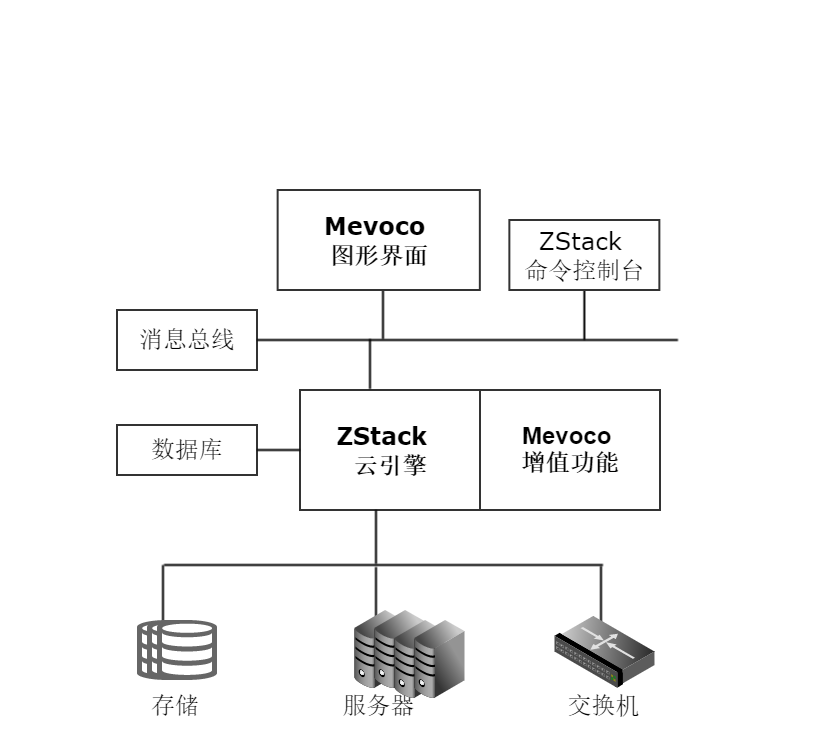

# 1.1 系统简介
旨在满足您对IaaS(基础设施即服务)软件的需求，帮助企业快速升级到云计算，实现互联网+的能力。

本公司基于ZStack云引擎，设计了全新的云计算系统软件。

该云计算系统具有稳定、易用、无缝升级、性能优异等特点。您可以在短时间内根据本手册完成私有云系统的安装和部署。

系统（架构如图1-1所示）由ZStack云引擎、图形界面、增值功能、ZStack命令控制台组成。辅以系统数据库和消息总线，便可以管理和分配数据中心的海量存储、服务器、网络连接能力等资源。

###### 图1-1  系统架构图 

该产品在类似的IaaS软件产品中有一系列独特的创新，包括全异步架构、进程内微服务架构和一致性哈希高可靠环等。通过先进的架构设计，本产品可承载数据中心对云计算平台超高的并发API请求（单一管理节点可以快速响应每秒钟数万条API请求），具备稳定安全的运行能力。同时系统的架构极大的降低了数据中心对云平台在部署、运维方面的需求（普通的网络管理员便可以轻松搭建和配置云平台）。

通过一键安装功能，您可以在一个指定操作系统的物理机上完成全自动的产品安装。安装完成后，您可以通过任意浏览器就可以打开系统的图形界面接口。在首次登录界面后，系统会引导您进行初始化配置。

经过短短7步配置后，您就可以在该系统里创建KVM云主机。系统将根据您的配置，给云主机自动的分配IP地址。您可以添加安全组规则来制定云主机的防火墙策略。针对网络隔离的环境，您也可以设置弹性IP地址，进行公有网络IP地址与私有网络IP地址的动态绑定。

在系统环境中，您可以快速的创建、浏览、监控、操作云主机和云盘等云计算的基础资源。您访问云主机的方式可以通过系统界面集成的控制台，或者通过云主机的IP地址。您可以通过云主机安装程序，快速的保存云主机镜像模板。如果不慎误删除了云主机、云盘或者镜像资源，系统的延时删除策略也可以帮助您快速的恢复误操作。

当运行系统内云主机实际消耗资源比申请的资源小时，系统系统管理员可以通过调整CPU、主存储和内存的超分比例来提高当前云系统的资源利用率。同时系统也设计了主存储资源阈值来监控您实际资源占用率。

当您需要嵌套虚拟化的支持时，可以设置CPU的工作模式，让物理机的CPU特性传递给嵌套的云主机监控器，您在生产环境中可轻松部署嵌套虚拟化。

系统支持支持对现有数据中心中的VMware虚拟化环境进行管理，能够查看VMware vCenter Server所管理的vSphere服务器资源和虚拟机资源，能够在虚拟数据中心中使用VMware vSphere资源，并在VMware vCenter集群中完成对云主机的常用操作。

针对私有云集群和云主机的高可用HA需求，系统可实现两台管理节点处于双工模式，将系统提供的各种服务设置为高可用模式。任一管理节点处于异常断电、断网、关机等情况，另一管理节点可迅速恢复。

系统的多租户管理，可提供不同账户和您对系统资源的访问控制，可实现细粒度的资源归属及权限控制的划分。配合计费功能，以资源的规格和时间作为基本计费单位，并以时长作为服务使用记录，可实现对不同账户使用的业务量进行统计计费。

系统的弹性IP地址，可实现公有网络和私有网络在隔离网络环境之间的通信连接，也可动态绑定和解绑定弹性IP地址，实现弹性IP地址的动态切换和扩展。

系统的性能监控和告警机制，可对私有云内部的各种资源进行实时监控其状态和性能。异常负载或异常状态均可快速定位，方便您分析及控制私有云的稳定性。

系统 的克隆云主机，支持以镜像仓库为镜像服务器的云主机为模板，同时克隆复制出新的云主机。可以对镜像进行定制修改后，不影响现有业务的前提下，可以批量复制云主机，可实现分布式应用的规模化扩展，更方便进行相关业务的动态维护。

系统独创的云路由模块，通过定制的Linux云主机来提供丰富的网络服务。当在一个云路由提供服务的网络上创建一个新的云主机时，如果云路由之前还不存在，这个特殊的提供网络服务的云主机将被创建。云路由提供了多种网络服务：DHCP、DNS、SNAT、EIP、端口转发、IPsec隧道、负载均衡。

系统的定时任务，支持定时对云主机、根云盘执行相关的任务。例如，动态定时开关机，可实现云环境的资源动态调配。定时快照配合镜像仓库可实现云主机存储的动态增量备份。

系统的LDAP登录，系统_LDAP组件使得企业您可以使用现有的LDAP统一认证方式无缝接入系统，提供便捷的体验。

使用系统云平台管理软件可以降低数据中心运维成本，提高数据中心运维效率，帮助您快速进入云管理阶段。

