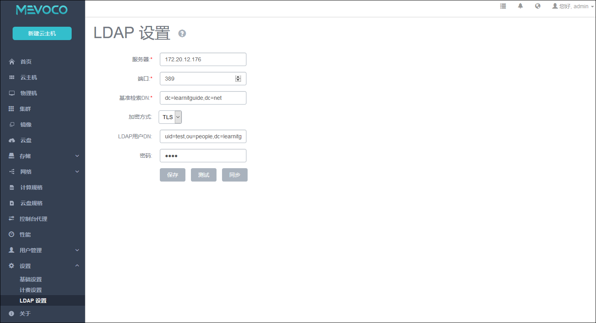

# 6.4 LDAP设置

系统 LDAP组件为系统账户提供了一种额外的登录方式。

系统 LDAP组件使得企业用户可以使用现有的LDAP统一认证方式无缝接入系统，提供便捷的体验。

在系统中配置了LDAP后，管理员可以在用户管理界面将LDAP用户的uid绑定到系统账户，绑定成功后该系统账户就可以使用他的LDAP uid和LDAP 密码登录系统。

###### 图6-4-1 LDAP设置界面

点击菜单栏设置下的LDAP设置，会提示进入LDAP设置界面。如图6-4-1所示，为添加LDAP服务进行设置。

* 其中**服务器**栏为
必填项，填写服务器的ip地址或者域名。

 > 例如：`ldap.testing.com
`或者`172.20.12.176`

* **端口**
栏为必填项，填写访问LDAP服务器所使用的端口，一般情况下，默认访问方式使用389端口。

* **基准检索DN**（Distinguished Name）
必填项，
填写用于检索绑定用户uid的基准DN，要求在该基准DN下不会有重复的uid。必填项。

 > 例如：ou=people,dc=example,dc=com

* **加密方式
** 
如图6-4-2所示，支持TLS加密和普通两种方式，默认为TLS。

 TLS：使用TLS加密，需要LDAP服务器支持TLS加密且正确配置了证书和端口。

 明文：所有数据都是明文传输，不建议使用。
 
###### 图6-4-2 加密方式选择

* **LDAP用户DN
**
填写用于LDAP服务器认证的用户DN和密码，LDAP用户DN需要确保填写完整。

 1. 如果LDAP服务器禁止匿名查询，建议填写一个有权访问基准检索DN的用户DN中权限最小的一个，比如仅有访问和查询该基准检索DN的权限。不推荐填写管理员DN。

 2. 如果LDAP服务器允许匿名查询，建议不填写该项。
> 例如：cn=Manager,ou=people,dc=example,dc=com

如图6-4-2所示，点击**测试**按钮，将会使用所填信息尝试连接LDAP服务器，测试不会在系统保存任何更改。

点击**保存**按钮，系统将记录LDAP连接信息，建议保存前先进行测试，确保连接成功。

当用户的LDAP服务器发生变化时，点击**同步**按钮，将清除系统中无效的LDAP绑定信息。

系统账户与LDAP账户绑定操作请参考[账户](/User-MN/account.md)。
