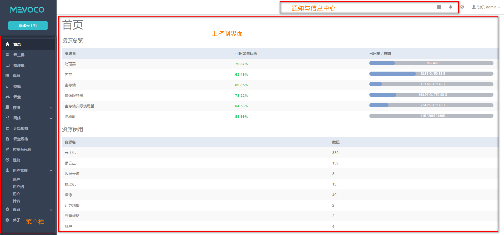

# 6 主界面管理

在配置完三层网络后，系统将进入图形管理主界面，如图6-1所示。

主界面左侧为菜单栏，可以选择进入相应的资源管理界面。

右上侧可以选择语言切换、显示用户信息、修改密码和退出界面。

中间偏右区域为信息展示和主控制区域，当您进行资源操作的时候，会显示当前执行的操作。在操作完成后，会提示操作执行的结果。

主界面首页显示了系统各资源的使用情况。

资源总览列表显示了当前资源的使用情况，

如果绿色显示，表示当前资源可用量为25%以上，还很充足；

如果黄色显示，表示当前资源可用量为10-25%之间，进入告警状态，需引起重视；

如果红色显示，表示当前资源可用量为10%以下，需立刻检查相关资源，进行相应的维护或扩容。

点击右上侧的信息中心，可以显示每次资源操作的结果。可以点击清空按钮，清空所有信息。或者点击失败按钮，只显示所有失败的信息。

如果系统发生异常，控制逻辑会主动提示相关的异常信息。您可参考异常信息，进行相应的系统维护。

###### 图6-1 UI管理界面   

