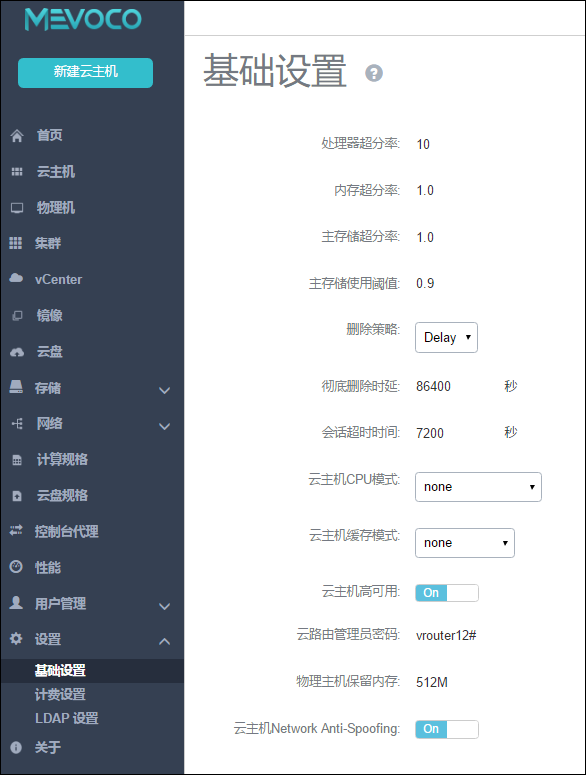

# 6.2 基础设置

在左侧菜单栏下方点击设置按钮下的基础设置，进入基础设置界面，如图6-2-1所示。点击基础设置后边的问号，会显示基础设置的相关帮助。点击服务器日志语言下拉菜单可以选择日志语言。
 

###### 图21-1 基础设置界面  

目前用户可以设置十一个选项：

- **处理器超分率**：默认值为10，主要用于设置可分配的虚拟CPU个数。如果物理机的CPU为四核八线程， 系统会将物理主机CPU的总数(8)以处理器超分率的倍数(10)计算可分配的虚拟CPU的个数，即总量为80。虚拟CPU的总数可以在首页的处理器的总额。

- **内存超分率**：默认值为1.0，如果物理内存为4G，设置为2，那么系统会认为系统可以分配8G的内存给云主机使用。可用范围：>=1。该数值为经验数值，需要根据不同系统和应用的需求来进行配置。通常不应设置的过大，否则会影响云主机的性能。在生产环境中，如果用户打算采用物理内存超分，建议在安装系统时，配置相应的swap分区。

> 例如，如果物理机内存为100G，并打算设置物理内存超分为2，建议设置swap分区也为100G，这样的配置在实际使用中，有足够的swap空间供内存超分使用。

- **主存储超分率**：默认值为1.0，如果主存储可用空间为2T，设置为2，那么系统会认为系统可以分配4T的空间给云主机使用。可用范围：>=1。该数值不应设置的过大。用户需完全理解该设置的含义并设置正确的主存储使用阈值后，才能进行相应的设置。否则会有严重的数据丢失风险！

- **主存储使用阈值**：默认值为0.9，为了防止系统过度使用主存储空间（尤其是当设置了主存储的超分比例后，过度分配云盘有可能使存储溢出，从而导致云主机存储失效崩溃），需要设置主存储阈值。

> 例如,阈值为0.9， 如果当前主存储空间实际使用率到达总容量的90%，整个系统将不能新建云主机或者云盘。此时用户需添加更多的云盘给主存储，并手动重新连接计算节点后，即可进行新建云盘操作。允许范围：0~1 范围的小数。当使用大于1的主存储超分率后，该阈值应设定为0.6或更小，以确保可及时添加主存储。用户需完全理解该设置的含义，才能进行相应的设置。否则会有严重的数据丢失风险！

- **删除策略**：可以选择三种策略，立刻删除（Direct），延时删除（Delay）和永不删除（Never）。该策略会设定用户在删除云主机，云盘以及镜像相关内容的删除规则。当设置为立刻删除时，如果用户删除云主机或者其他资源，这些相关资源会被立刻删除；当设置为延时删除（默认）时，如果用户删除云主机或者其他资源，这些资源会被标记为删除（例如云主机会被标注为Destroyed，云盘和镜像会被标注为Deleted），等彻底延时删除时延超时后或用户手动强制删除时，才会彻底删除相关资源；当设置为永不删除时，当用户删除云主机或者其他资源，这些资源永远不会被系统自动删除。

- **彻底删除时延**：当删除策略为延时删除时，可以选择延时多久彻底删除资源。系统默认时延24小时，也就是86400秒。 

- **会话超时时间**：设定系统图形界面登录后会话多长时间失效，默认为2小时，即7200秒。 当用户登录会话失效后，用户将需要重新登录。

- **云主机CPU模式**：选择云主机的CPU类型是否与物理机的CPU类型一致。当选择host-model类型时，云主机的CPU类型将与物理机的CPU类型相符（例如都显示为Haswell的Intel CPU）；当选择host-passthrough类型，云主机的CPU类型将与物理机的CPU完全一致。当选择host-model或者host-passthrough类型时，云主机可以支持嵌套虚拟化，但可能导致云主机在不同型号CPU的物理机之间迁移失败。

- **云主机缓存模式**：

> None: 云主机不使用物理机的页面缓存，直接访问存储，不带cache。

> writethrough: 物理机的页面缓存工作在透写模式，数据完全写入云主机存储设备后，才返回成功。

> writeback: 云主机使用了物理机的页面缓存机制，数据写入物理机页面缓存即报告给云主机返回成功。

注意：如果设置为writethrough或writeback模式，共享存储下的实时迁移会提示不安全的迁移而失败，需将此项设置为None，才可迁移。

- **云主机高可用**：云主机高可用有两种模式: 

  第一种，None，不设置高可用；

  第二种，NeverStop，表示云主机永不停机。

> * 针对本地存储，某云主机被设置为NeverStop后，只要对应的物理机处于Enabled和connected状态，此云主机会一直运行。即使强制关机，此云主机也会再次启动。但是假如对应的物理机进入维护模式、断网或者断电，那么此云主机会进入Stopped状态。

> * 针对网络存储，某云主机被设置为NeverStop后，在已添加的物理机里，只要有任意一台的资源允许，此云主机就会一直运行。即使强制关闭此云主机、强制关闭此云主机所在的物理机或强制断掉物理机的网络。

- **云主机高可用全局设置**：

on: 全局打开云主机高可用设置。打开后，云主机的高可用模式才可设置。
 
off: 全局关闭云主机高可用设置，关闭后，云主机的高可用设置全部失效，且不可见。

* **云路由管理员密码**：登录云路由设备的密码。admin可以直接在这里设置任意长度字符串，该操作对所有云路由生效。

**注意：**停止云路由后，系统自动再次启动后生效，手动在控制台内重启无效。
 
* 物理主机保留内存
:
所有KVM主机上保留的内存容量。建议可用单位：T/G/M

例如：512M

> 表示为系统预留512M内存，当系统剩下700M的内存的时候，用户又想启动一个内存为512M的云主机是启动不了的。

* **云主机Network Anti-Spoofing**:启用反MAC欺骗象IP欺骗。

