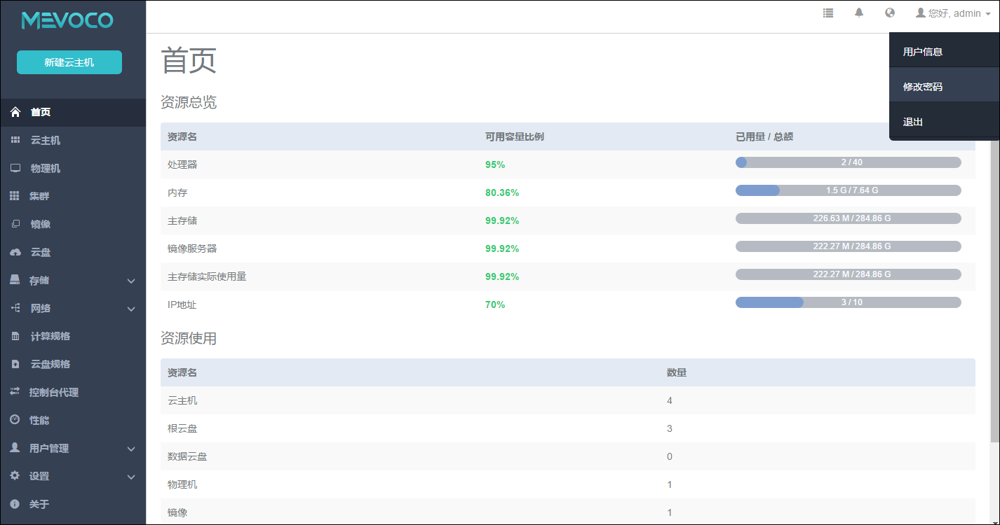

# 6.2 修改密码

点击主界面右上角admin按钮可以显示用户信息、修改密码和退出操作。

点击用户信息会显示账户信息,包括账户名称和UUID信息。在用户信息页面也可以点击修改密码来修改admin账户密码。

也可以在修改密码栏直接点击修改密码,修改密码需要输入原始密码进行确认。当修改了管理员密码后,主要注意zstack-cli的登录密码也会更换。

###### 图6-2-1 修改密码
