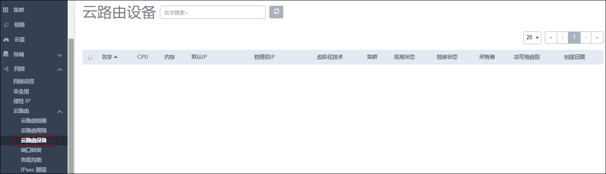
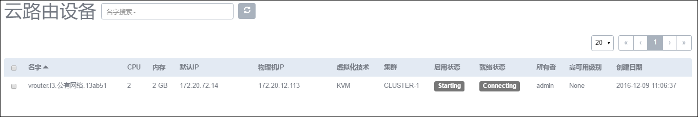

# 14.4.4 云路由设备

接入网络依赖云路由设备提供服务，因此在创建接入网络前需要先创建云路由镜像和规格。启动/创建/重启云主机等操作，**首次使用云路由网络，会自动创建云路由设备**。

根据虚拟当前状态的不同,云主机的操作可支持启动、重连、重启、迁移、控制台、设置控制台密码、删除等操作。 

点击菜单栏的网络中的云路由设备按钮，进入云路由设备管理界面，如图14-4-4-1所示。

###### 图14-4-4-1 云路由设备界面

云路由设备本身是一台特殊的云主机，里面安装了多种网络服务。一个云路由设备对应一个网络。用户不能像控制云主机那样控制云路由设备，当用户启动使用该云路由的云主机时，云路由设备将自动被创建并开启。如图14-4-4-2所示。

###### 图14-4-4-2 自动启动云路由设备

**注意：**如果第一次使用云路由网络的云主机，启动时间会比较长，由于需要先创建一个可用的云路由设备。

此外，云路由可以在基础设置（[6.2](/Main/base-setting.md)）中为云路由设置登录密码。
