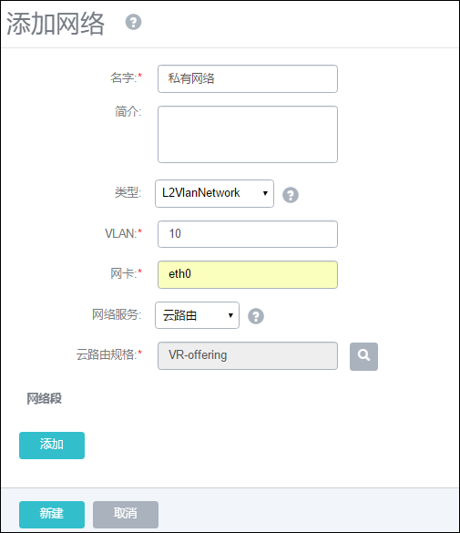

# 14.4.1 网络设置（云路由）
从系统 1.0起，默认支持分布式扁平网络。系统 1.8开始，新增云路由网络功能。管理员在系统中配置云路由后，可以支持弹性网络、IPsec隧道、端口转发等网络功能。

点击菜单栏的网络按钮，进入网络管理界面，如图14-4-1-1所示。在系统中，网络管理主要涉及网络本身、网络IP段、DNS的添加和删除，及网络资源的共享和召回，同时可以显示DHCP Server所占用的IP地址。

网络资源的相关操作与扁平网络相同，请参考[14.1](/Network/network-setting.md)。这里着重介绍如何添加云路由。

在云路由网络中，添加网络（云路由）可以分为添加公有网络、添加云路由镜像、添加云路由规格、添加私有网络四个部分。

* **添加公有网络**
此处所述公有网络与管理网络使用同一网络，为物理服务器配置IP地址。点击菜单栏的网络进入网络设置界面。如图14-4-1-1所示。

###### 图14-4-1-1 网络设置界面

点击添加按钮，在弹出的添加网络中输入如下信息。如图14-4-1-1所示。需要填入：名字，类型，网卡、网络服务、网络段、DNS信息。

###### 图14-4-1-2 添加无服务网络界面

名字： 公有网络

类型： L2NoVlanNetwork

网卡： eth0

网络服务：无服务网络

网络段和DNS根据实际情况填写可以连接公网的网络段和DNS。

###### 图14-4-1-3 添加网络段

 

###### 图14-4-1-4 添加DNS

网络新建后，会弹出挂载集群的窗口，请选择一个可以用的集群挂载。

 
###### 图14-4-1-5 加载网络到集群

挂载完成后，公有网络就创建成功了。公有网络不为云主机提供网络服务（即云主机不会分配到该网络段的IP）。

* **添加云路由镜像**

选择主菜单中网络的云路由镜像，进入云路由镜像界面。如图14-4-1-6所示。

 
###### 图14-4-1-6 云路由镜像界面

点击添加按钮，进入添加云路由镜像界面。这里与添加普通镜像十分类似。输入名字、URL并选择镜像服务器。

**注意：**在官方给出的离线环境中，已经封装了最新的云路由镜像，可以去官网上获取云路由镜像链接。只有类型为镜像仓库和sftp的镜像服务器支持本地路径导入。所有镜像服务器均支持URL添加。
ZStack云路由镜像URL: [http://download.zstack.org/templates/ZStack-VRouter-template-20170208.qcow2](http://download.zstack.org/templates/ZStack-VRouter-template-20170208.qcow2)

vCenter云路由镜像URL: [http://download.zstack.org/templates/vCenter-VRouter-template-20170208.vmdk](http://download.zstack.org/templates/vCenter-VRouter-template-20170208.vmdk)

###### 图14-4-1-7 添加云路由镜像

* **添加云路由规格**

选择主菜单中网络的云路由规格，进入云路由规格界面。如图14-4-1-8所示。

###### 图14-4-1-8 云路由规格界面

点击添加按钮，进入添加云路由镜像界面。输入名字、CPU、内存、镜像、管理L3网络、公共L3网络。如图14-4-1-9所示。

1. 云路由的CPU和内存大小直接影响云路由的性能，请根据自己的环境选择。默认值为2CPU/2G内存，在非测试环境下，请不要低于此配置。

2. 云路由镜像为刚才所添加的镜像，如果只有一个，系统会自动填充。

3. 如上文所述，我们这里的管理网络与公共网络为同一网络的场景。所以这里都选择刚才创建的公有网络。

**注意:**生产环境中管理网络与公共网络往往是分离的，这时需要创建两个无服务网络。在计算规格上分别选择这两个网络。

###### 图14-4-1-9 添加云路由规格

* **添加私有网络**

点击菜单栏的网络进入网络设置界面，点击添加按钮。如图14-4-1-10所示。

###### 图14-4-1-10 添加私有网络

输入名字、类型、网卡、网络服务、云路由规格、网络段、DNS的信息。

1.名字：私有网络

2.类型：L2VlanNetwork（由于实验环境所限，这里使用VLAN来创建私有网络）

3.VLAN：10（VLAN编号可根据实际情况添加，范围：1~4096）

4.网卡：eth0（如果有多块网卡，可以使用NoVLAN的模式，这里填第二块网卡名，如：eth1）

5.网络服务：云路由（私有网络需要通过云路由的网络服务转发到公有网络上）

6.云路由规格：VR-offering（刚才所建云路由规格）

7.网络段：10.0.0.0/24（私有网段，可跟据实际场景任意设置）

###### 图14-4-1-10 添加网络段

8.DNS：8.8.8.8

创建完成后仍然需要挂载到集群，**请确保与之前的公有网络挂载到同一集群上**，否则云主机无法连接网络。

###### 图14-4-1-12 网络添加完成界面

创建云路由网络完成，可以使用该网络创建云主机了。

**注意：**刚创建完成云路由网络时没有云路由设备，参考[云路由设备](/Network/VR-device.md)。

点击私有网络详情页面，如图14-4-1-13所示，与**扁平网络**不同的是新增了**更换云路由规格**按钮，该操作只对新建的云路由设备生效。

###### 图14-4-1-13 网络添加完成界面

对于需要提升云路由性能的用户，新建合适的一个云路由规格（参考[14.4.3](/Network/VR-offering.md)），点击更换云路由规格按钮。弹出待选云路由规格界面，如图14-4-1-12所示，选择规格后点击确定。此操作需要重新创建云路由设备后生效。

###### 图14-4-1-14 网络添加完成界面

因此，如果已用此规格创建了云路由设备，需要先删除现有的云路由设备。然后重新创建云路由（启动/重启/创建云主机）后，新规格生效，并保留原有的网络服务。

**注意：**删除云路由设备后，会造成提供服务的云主机网络异常。
