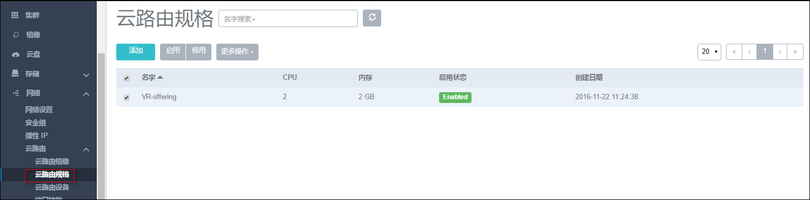
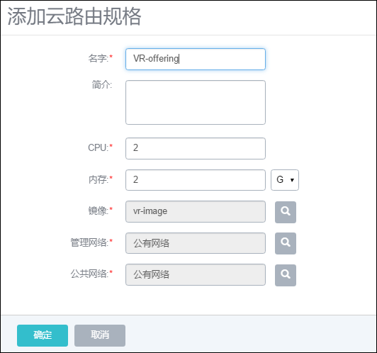
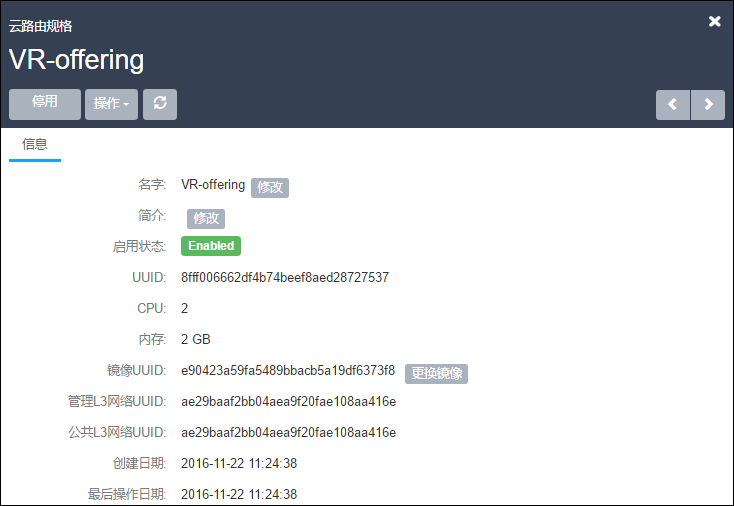

# 14.4.3 云路由规格

点击菜单栏网络中的云路由算规格，进入云路由规格管理界面，如图14-4-3-1示。在计算规格管理界面，可以添加、删除计算规格，也可以进行批量操作。

###### 图14-4-3-1 云路由规格界面

###### 图14-4-3-2 添加云路由规格

在计算规格列表界面，点击添加，可以添加一个计算规格，如图14-4-3-2所示。在添加界面，需要输入如下信息：
名字：计算规格的名字。
简介：可留空不填。
CPU数：云主机CPU的核数。
内存：云主机内存的大小。
镜像：云路由的镜像，请从[官网](/www.mevoco.com)下载。
管理网络和公共网络：这里只可选则的已创建的无服务网络。

注意：请参考[网络设置](/Network/VR-network.md)中对云路由规格的配置。云路由规格用于创建云路由设备，而每个云路由设备对应一个云路由网络（一般为虚拟机使用的网络）。选定网络后，会由此云路由规格创建的云路由设备为选定网络提供服务。

点击某个计算规格，可以查看这个计算规格的详情，除了停用和删除操作，只可以修改这个计算规格的名字和简介，如图14-4-3-3所示。

###### 图14-4-3-3 云路由规格详情
