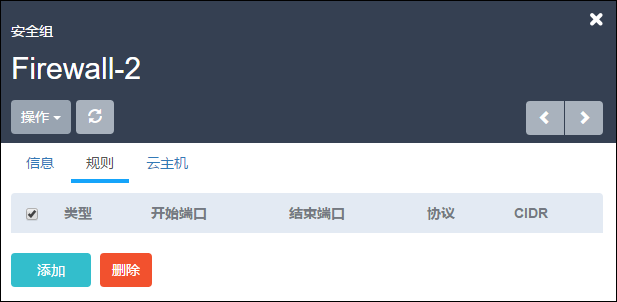
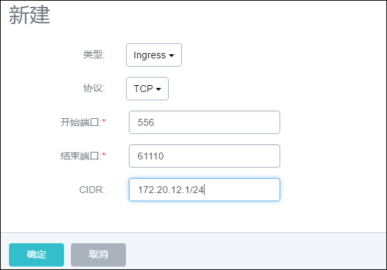

# 14.2.2 添加安全组规则

点击某条安全组，选择规则栏，点击添加按钮，可以给当前安全组添加安全规则。

创建规则后，云主机之间只受port规则约束，不受CIDR的规则约束。外部访问受规则的全部约束。

如图14-2-2所示。

###### 图14-2-2 新建安全组规则

在安全规则中，可以选择网络包的类型（Ingress为发向云主机，Egress为从云主机发出），协议（TCP，UDP或者ICMP），允许的起止端口（当协议为ICMP的类型是，起止端口均为-1，代表全部的ICMP类型），目标IP地址范围（CIDR是标准的IP地址范围标识，例如192.168.0.1/24 相当于从192.168.0.1~192.168.0.255）。详见图14-2-3。一个安全组可以添加多条安全组规则。

###### 图14-2-3  添加安全组规则

