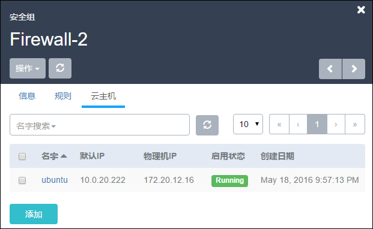
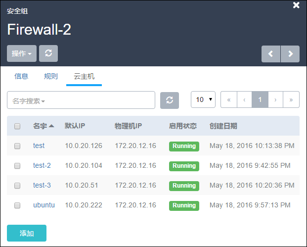

# 14.2.3 添加云主机给安全组

点击某条安全组，选择云主机栏，点击添加按钮，即可以添加云主机到当前安全组。见图14-2-4。

###### 图14-2-4  添加云主机到安全组

在云主机选择框中，支持同时选择多个云主机。

用户也可以通过搜索栏来快速定位需要添加的云主机。

选择某个云主机后，安全组规则将很快在这个云主机的网卡上生效。

详见图14-2-5。当多台云主机在相同安全组之中时，这等同于这些云主机相互受信，他们之间的网络通信不会受到该安全组内规则的约束。

##### 图14-2-5  添加云主机到安全组列表

