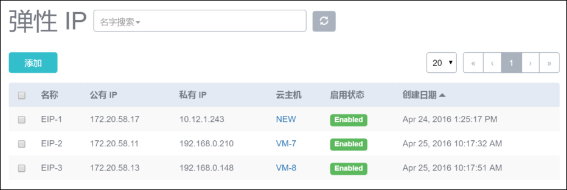
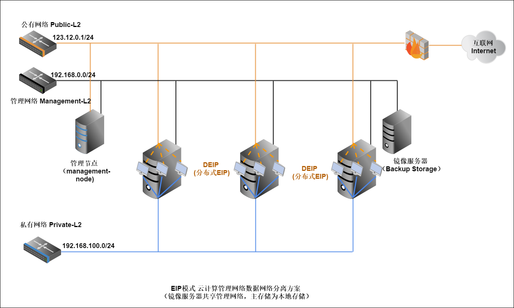
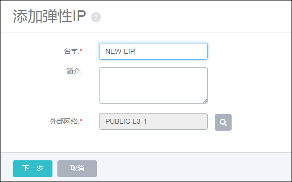
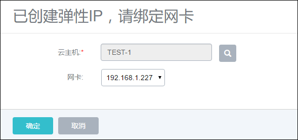
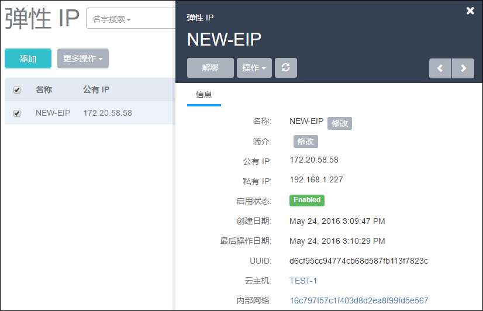
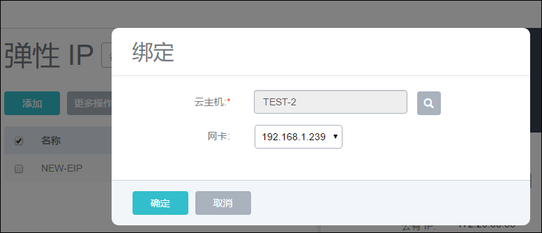
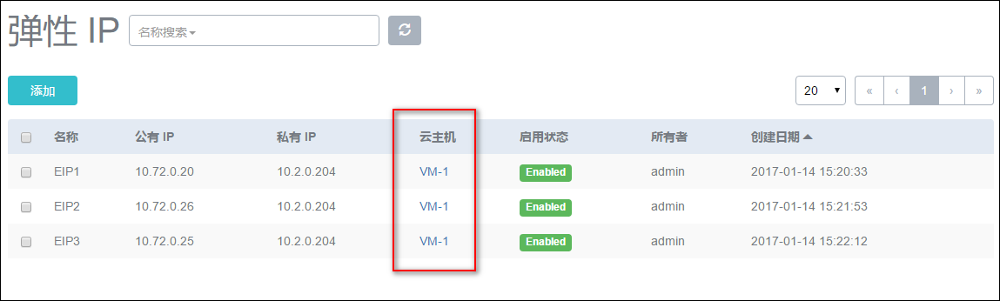

# 14.3 弹性IP

弹性IP地址提供了公有网络访问内部私有网络的方法。

如果网络在规划时，已设置了公有网络、管理网络和私有网络的隔离。

内部的私有网络是无法访问外部的公有网络，公有网络也无法访问到内部的私有网络。

 而且内部的私有网络的IP地址可能会发生动态变化，用户可能不确定云主机的实时的IP地址。

通过弹性IP可以解决公有网络和私有网络在隔离网络环境的通信连接问题。

针对私有网络IP地址动态变化的问题，可以通过绑定固定的公有网络来解决。

如图14-3-1所示的界面，用户只需访问公有网络的IP地址即可关联到此私有网络。

* 注意：弹性IP地址需工作于多网络条件下，如果只有单个网络，则此功能不可用。

###### 图14-3-1  弹性IP地址界面

图14-3-2的网络结构是一个典型的弹性IP地址应用场景。123.12.0.1/24的公用网络，可以通过防火墙连接到互联网。管理节点通过管理网络控制内部的系统私有云管控系统。各个计算节点所在的私有网络提供给云主机内部的私有网络192.168.100.0/24的IP地址。此IP地址默认情况下无法连接到外部的互联网。系统在每个计算节点分别部署分布式的EIP。可分布独立实现公有网络与私有网络的绑定。

###### 图14-3-2  典型EIP网络结构图

创建EIP时，点击添加按钮后的问号，可显示相应的帮助。

创建EIP的具体步骤，如图14-3-3所示：

1.在EIP界面点击创建按钮，在新界面输入EIP的名字，例如图示的NEW-EIP。

###### 图14-3-3  创建EIP

2.在外部网络界面选择可以连接到外部的网络。例如图示的PUBLIC-L3-1。请确保此公有网络可以连接外部网络。

**注意：**对于云路由网络，这里的外部网络一般对应公有网络（无服务网络类型）。

3.点击下一步，系统会从已选择的网络IP池中取出一个可用的IP地址作为EIP的公有网络IP地址。

4.点击云主机后面的按钮，在新界面的云主机列表选择待接入的云主机。例如14-3-4所示的NEW云主机。

###### 图14-3-4 选择EIP的内部网络

5.在网卡栏，选择相应需要进行外部连接的私有网络IP地址。如果此云主机只有一个网络，那么此IP地址为默认选择。

6.点击确定创建EIP。创建完毕后的EIP界面如图14-3-5所示。

7.用户可以登录172.20.58.17 IP地址，访问到的即为IP地址为10.12.1.243的云主机。

###### 图14-3-5 EIP界面

此公有网络IP地址也可以动态的解绑和再次绑定。

解绑EIP：点击EIP界面的解绑按钮，再次确认后，EIP的绑定关系将解除，访问原有的公有IP地址将无法再访问到此云主机。

绑定EIP：如果EIP的公有网络没有绑定私有网络，可以点击绑定进行私有网络的绑定。如图14-3-6所示。

###### 图14-3-6 绑定EIP网卡

一个云主机的网卡可以绑定多个EIP,也就是说可以通过多个EIP访问同一台云主机。如图14-3-7所示。

###### 图14-3-7 一个云主机网卡绑定多个EIP

