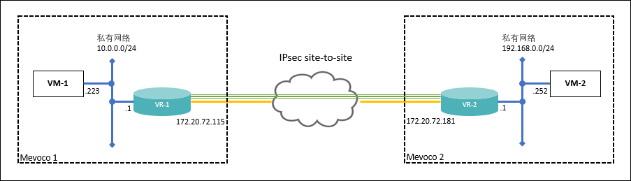
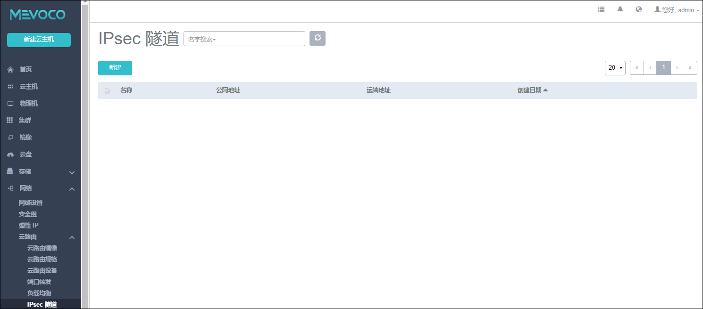
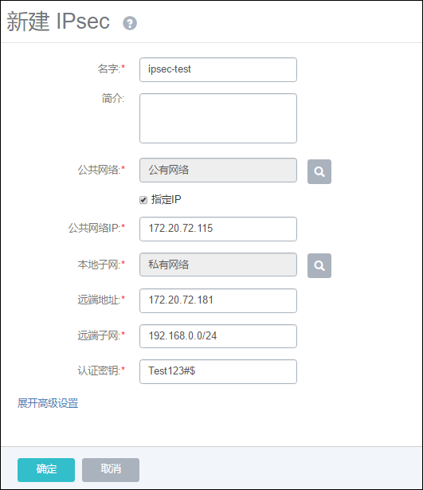
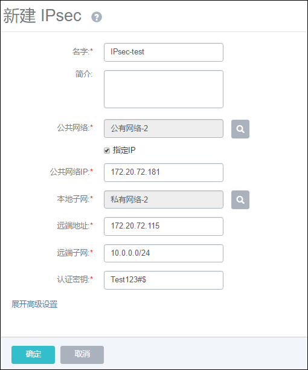
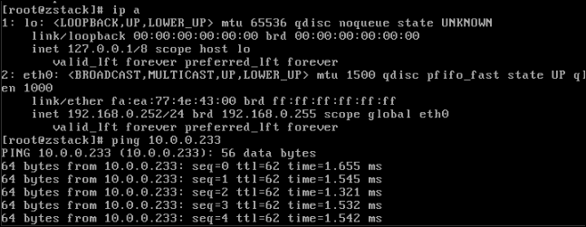

# IPsec隧道

IPsec隧道是透过对IP协议的分组进行加密和认证来保护IP协议的网络传输数据。

系统支持采用IPsec隧道技术实现站点到站点（site-to-site）的虚拟私有网络（VPN）连接。

**注意：**

* IPsec连接模式，基于安全考虑，只支持主动模式（Main Mode），不支持积极模式（Aggressive Mode）；仅支持ESP封装协议；

* IPsec传输模式，只支持站点到站点的隧道模式，不支持PC点对点模式（基于云端网络模型考虑），不支持两端存在NAT网络；

* IPsec路由模型，只支持基于对端网段配对模型，只支持路由配对模式，不支持路由转发模式（不支持OSPF或BGP等动态路由协议）

为了更好的演示IPsec隧道功能，我们准备了**两个系统环境**，其网络情况如下：



###### 图14-4-6-1  通过IPsec连接两个系统网络

```
系统1
公网1:172.20.72.111-120
私网1:10.0.0.0/24
IPsec-test-VM1:10.0.0.223
```
```
系统2
公网2:172.20.72.181-190
私网2:192.168.0.0/24
IPsec-test-VM2:192.168.0.252
```
我们之间进入VM1的console，去ping VM2的IP，是肯定ping不通的。此时我们借助IPsec来联通两个私有网段。

点击系统1菜单栏的网络中的IPsec隧道按钮，进入IPsec隧道界面，如图14-4-6-2所示。


###### 图14-4-6-2 IPsec隧道界面 

点击新建按钮，弹出新建IPsec界面，如图14-4-6-3所示。需要填写名字、简介、公共网络及IP、本地子网、远端地址、远端子网、认证密钥。



###### 图14-4-6-3 新建IPsec隧道1

名字：IPsec隧道名称。

公共网络：选择一个可用的公有网络1（参考[14.4.1](/Network/VR-network.md)），该网络与系统2的公有网络2必须可以通信。

公共网络IP：指定一个个公有网络段中的IP。

本地子网：选择一个可用的私有网络1（参考[14.4.1](/Network/VR-network.md)）。

远端地址：系统2中的公共网络IP。我们这里从公网2中选择一个172.20.72.181,在配置系统2的公共网络IP也设置为此IP.

远端子网：远端的一个私有网络段，这里为192.168.0.0/24。

认证密码：两边通信的校验密码。支持所有长度的任意字符串。

创建系统1的IPsec后，打开系统2的新建IPsec页面。如图14-4-6-4所示。



###### 图14-4-6-4 新建IPsec隧道2

**注意：**两个环境中，公共网络IP和远端地址互相指定。两边的认证密钥务必保持一致。

这时两边的网络应该已经联通，我们相互ping 子网IP测试一下。如下图所示。


###### 图14-4-6-5 连接测试1




###### 图14-4-6-6 连接测试2

在以上的场景中，创建IPsec隧道时提供默认的IKE和ESP配置信息，该配置信息隐藏在**高级设置**中。如果管理员设计系统云路由与支持IPsec隧道的第三方设备对接，则需要两端协商具体的配置信息。

**高级设置:**

创建IPsec隧道时，根据对端的网络设备IPsec配置内容需调整以下的参数，包括：IKE验证算法、IKE加密算法、IKE完整向前保密、ESP认证算法、ESP加密算法和完全正向保密（PFS）等参数。管理员需根据对端的网络设备，调整高级设置的内容。

