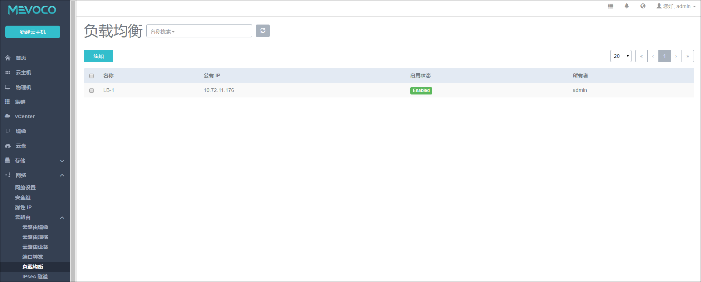
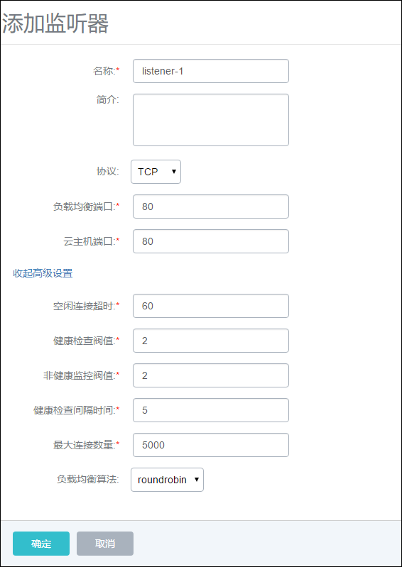
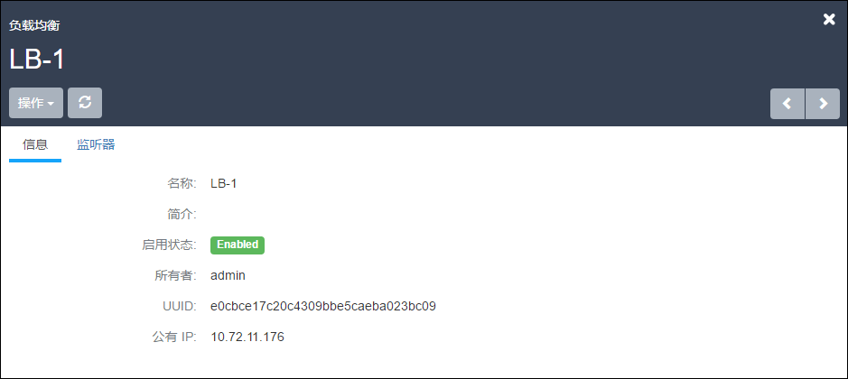
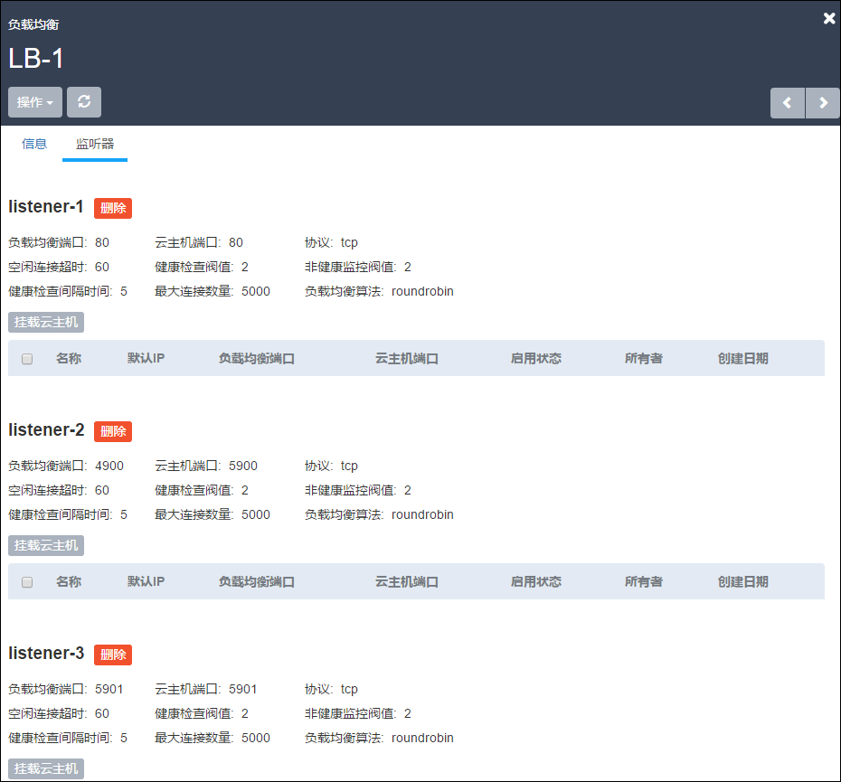
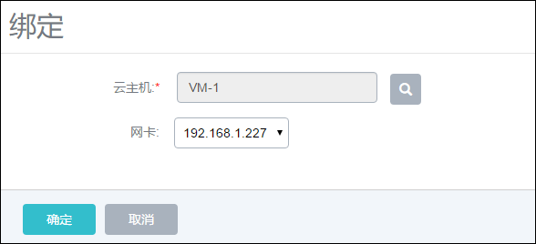

# 负载均衡

负载均衡器可以将公网地址的访问流量分发到一组后端的云主机上， 并支持自动检测并隔离不可用的主机，从而提高业务的服务能力和可用性。 

可以根据实际情况，随时添加或删减负载均衡规则中的云主机来调整服务能力，而且这些操作不会影响业务的正常访问。 负载均衡器支持HTTP/TCP 两种协议。此外，负载均衡器还支持灵活配置多种转发策略，实现高级转发控制功能。

### 添加负载均衡器

点击菜单栏中的负载均衡按钮，进入负载均衡管理页面。如图14-4-7-1所示，用户可以在此界面查看负载均衡状态。

###### 图14-4-7-1  负载均衡

点击添加按钮，弹出添加负载均衡窗口。填写名称、外部网络、负载均衡端口、云主机端口，点击确定添加完成。

1. 名称：填写负载均衡器的名字；

2. 简介：对此负载均衡器的描述，选填；

3. 外部网络：将从共有网络中随机选取一个IP，作为负载均衡服务监听地址。

### 添加监听器

1. 名称：监听器名称；

2. 简介：对此监听器的描述，选填；

3. 协议：根据应用业务类型，选择`HTTP`或`TCP`；

4. 负载均衡端口：上述IP中所设定的端口，即云主机公网地址端口，范围1~65535；

5. 云主机端口：云主机私有IP端口，范围1~65535，可与负载均衡端口；

###### 图14-4-7-2  添加负载均衡器

##### 高级设置

点击展开高级设置，如图14-4-7-3所示高级设置界面。高级设置参数如下，普通用户使用默认参数即可。

**健康检查的间隔时间**：最大健康检查的间隔时间（秒）；

**非健康检查阈值**：连续不通过健康检查的最少次数，用于判断是否要把对应的云主机设定为非健康状态；

**空闲连接超时**：最大关闭空闲连接的超时时间（秒），包括客户端和服务端任意方向的连接；

**最大允许连接数量**：最大允许的并发连接数量；

**负载均衡算法**：负载均衡算法可以对网络包设定不同的路由规则，目前支持的算法有： roundrobin, leastconn, source。我们将在下文详细介绍这三种算法。

###### 图14-4-7-3  添加监听器

##### 负载均衡算法：

**roundrobin:** 通过"轮询"调度算法将外部请求按顺序轮流分配到负载均衡规则指定的云主机中，它均等地对待每一台云主机，而不管其上实际的连接数和系统负载。

**leastConn：**调度器通过"最少连接"调度算法动态地将网络请求调度到已建立的链接数最少的云主机上。 如果集群中的服务器（云主机）具有相近的系统性能，采用"最小连接"调度算法可以较好地均衡负载。

**Source：**“源地址哈希”算法根据请求的源IP地址，作为散列键（Hash Key）从静态分配的散列表找出对应的服务器，若该服务器是可用的且未超载，将请求发送到该服务器，否则返回空。

### 挂载云主机
点击已创建的负载均衡器，进入负载均衡器详情页面，如图14-4-7-4所示。

###### 图14-4-7-4  负载均衡器详情页面

点击监听器，如图14-4-7-5所示。可以为监听器挂载云主机，每个监听器可以挂载多个云主机的网卡。

**注意**：一个负载均衡器可以添加多个监听器，一个监听器只允许挂载一个云主机的一块网卡。

###### 图14-4-7-5  监听器状态界面

点击挂载云主机，绑定云主机的一块网卡，如图14-4-7-6所示。选择云主机及其网卡后，点击确定完成绑定操作。

###### 图14-4-7-6  挂载云主机

