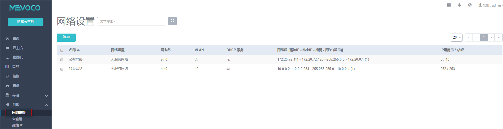

# 14.1 网络设置（扁平网络）

点击菜单栏的网络按钮，进入网络管理界面，如图14-1-1所示。在系统中，网络管理主要涉及网络本身、网络IP段、DNS的添加和删除，及网络资源的共享和召回，同时可以显示DHCP Server所占用的IP地址。

###### 图14-1-1  网络管理界面

支持的操作如下：

1.添加网络：可参考在引导界面里添加网络的方法。在网络界面也可以再次添加网络。点击网络界面的添加按钮，在新界面中，输入相关字段即可添加。

以输入Vlan为例，具体步骤如下，如图14-1-2所示：

a) 输入网络名称，此名称为三层网络的名称。例如，图示的NEW-VLAN字段。

b) 输入网络的简介，也可留空不填。

c) 输入网络类型，需参考[添加二层网络](/Wizard/l2.md)的要求，此处选择L2VlanNetwork。

d) 输入Vlan编号，Vlan编号为0到4094的一个数字。

e) 点击网络段下的添加按钮，在新界面添加网络段。支持直接网络段和CIDR两种方法：

当交换机接入口配置为Access模式时，用户需设置L2NoVlanNetwo

第一，网络段，选择网络段，点击网络段下的添加按钮，在新界面参考引导界面中对三层网络的输入要求输入相关字段。图示输入的为起始IP地址为10.12.1.0，结束IP地址为10.12.1.255，子网掩码为255.255.255.0，网关为10.12.0.1。

第二，CIDR，选择CIDR，点击网络段下的添加按钮，在新界面添加CIDR，如图14-3所示。

###### 图14-1-2  添加网络界面

###### 图14-1-3  CIDR添加网络段界面

f) 点击DNS下面的添加按钮，输入相应的DNS地址，例如输入8.8.8.8。

g) 点击确定添加新的网络。

注意：添加网络时，注意网络段的IP地址池不可重叠

2.删除网络：删除网络则直接将已使用此网络的云主机的网络给卸载掉。如果此网络是云主机的唯一网络，删除网络后，运行中的云主机的网络会被卸载，但依然保持运行状态。

删除网络的步骤如图14-1-4所示：

a) 选择待删除的网络，点击删除按钮。

b) 在新的弹出界面输入删除网络进行确认，如图14-3所示。

c) 点击确定删除网络。

###### 图14-1-4  删除网络确认界面

3.添加网络段：当网络升级或扩容需求发生时，可能需要添加网络的IP段范围。点击相应网络的网络段一栏，点击添加，在新界面输入相应的IP段信息，点击添加。添加完毕后，IP池的资源就会新增。添加网络段后，启动已停止的云主机或创建新的云主机会从填加后的整个IP资源池获取IP地址。

注意：添加网络段时，注意网络段的IP地址池不可重叠。

4.删除网络段：点击相应网络的网络段一栏，选择待删除的网络段，点击删除按钮。 输入ok进行确认。

* 注意：此操作会导致使用此IP地址范围的运行中的云主机停止，且无法正常启动。如果用户再次添加了可用的网络段，则启动此云主机会从新的IP池获取IP。

5.添加DNS：点击相应网络的DNS一栏，点击添加按钮，在新界面添加DNS地址。表示多个DNS地址共用。

6.删除DNS：点击相应网络的DNS一栏，选择待删除的DNS，点击删除按钮。 输入ok进行确认。

7.共享资源：在用户管理中，支持对网络的共享与召回，具体请参考[18.3](/User-MN/sharing-cancel.md)资源共享与召回。

8.修改默认网络：如果在创建云主机时，选择了多个网络，可以点击默认按钮切换相应的默认路由。切换默认网络，需要手动重启网络才能生效。
