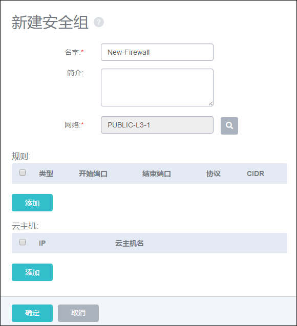

# 14.2.1 新建安全组

点击新建按钮，可以创建新的安全组，在选择网络后，会显示云主机选项，如图14-2-1所示。点击新建安全组旁边的问号按钮，可显示帮助文件。详情请参考[添加安全组规则](/Network/add-sg-rule.md)、[添加云主机详见](/Network/attach-sg-to-vm.md)。

添加安全组，默认为允许规则。

新建安全组时，如果没有加载任何云主机，也没有配置任何规则，则此安全组并不生效。

新建安全组时，如果加载了云主机，但没有配置任何规则，则默认规则为所有的外部访问均禁止进入此云主机的IP地址；此云主机的IP地址可通过访问外部；此时云主机之间不能相互访问。

###### 图14-2-1  新建安全组
