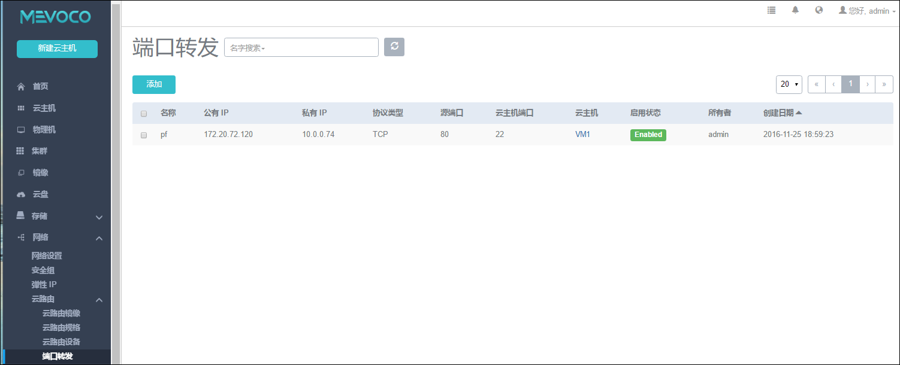
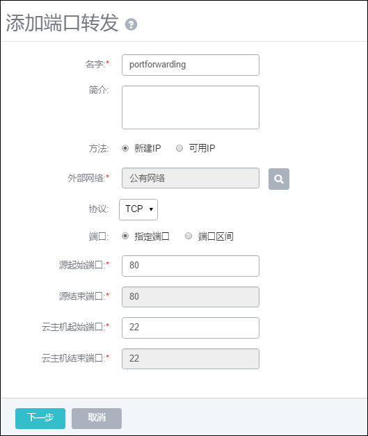
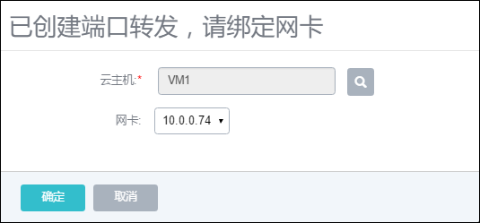
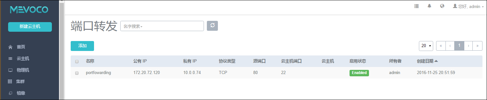
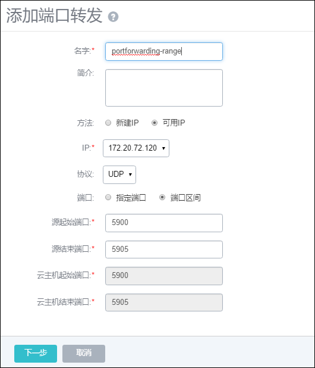

# 14.4.5 端口转发

端口转发服务，是基于云路由提供的三层转发服务，可提供将指定公共网络的IP地址端口流量转发到云主机对应协议的端口。在公共网络地址紧缺情况下，通过端口转发可以提供多个云主机对外服务，以节省公共网络地址。

点击菜单栏的网络中的端口转发按钮，进入端口转发界面，如图14-4-5-1所示。

###### 图14-4-5-1 端口转发界面

端口转发可以将一个公网节点的网络端口转发到一个私网节点的网络端口。让用户从外部经过云路由访问一个私有网络IP的端口上（访问云主机的某个端口）。

**注意：**请确认云主机内部防火墙策略，指定端口需要开放，该功能才能正常使用。

点击添加端口转发按钮，如图14-4-5-2所示。填写名字、简介、外部网络、协议、端口、外网IP起止端口、云主机IP起止端口。

###### 图14-4-5-2 添加端口转发界面

名字：端口转发名称

简介：端口转发简单介绍

外部网络：在创建端口转发规则时，可使用新的公共网络地址，亦可使用已有规则中的公共网络地址（使用不同端口）。选择【新建IP】则分配新的公网地址，选择【可用IP】则使用已有的公共网络地址。

支持协议类型:目前端口转发服务，支持TCP和UDP协议的端口

端口:从1到65535，可以指定端口一一对应，也可以选择端口段对应。

**注意：**系统支持端口转发方式有两类：指定端口映射和端口区间范围映射。前者是指定IP映射，后者是区间范围的IP地址一一对应。选择【指定端口】，管理员填写起始端口后，结束端口与之一致；选择【端口区间】，管理员填写源起始端口和源结束端口，则自动生成云主机起始和结束端口；

点击下一步，进入绑定云主机网卡界面。如图14-4-5-3所示。选择一个云主机后，选择该云主机的一个网卡IP。

###### 图14-4-5-3 绑定云主机网卡界面

创建完成端口转发规则后，如图14-4-5-3所示。

###### 图14-4-5-4 端口转发界面

在创建完成第一条端口转发规则后，我们已经使用了一个外网IP为端口转发服务。那么第二次创建端口转发规则的时候，就可以选择可用IP，这次的协议选择UDP,设置端口区间（不能包含此服务已分配端口）。如图14-4-5-5所示。与上述情况一样，绑定云主机网卡后，设置完成。

###### 图14-4-5-5 端口转发界面

至此，我们创建了两个端口转发规则。使用同一个公有IP，转发到同一台云主机的不同端口。外部访问172.20.72.120:80会自动转发到10.0.0.74:22端口；外部访问172.20.72.120:5900~5905会自动转发到10.0.0.74:5900~5905端口（此处端口号一一对应）。

端口转发组合种类较多，需要满足**如下规则**：

1. 一个云主机只能**被**指定一个公网IP。
2. 每个**用做端口转发的公网IP**可以创建多个转发规则，**每个规则有且仅能指定到一个云主机**（同一云主机的被指端口不能重复）。
3. 如果一个公网IP指定到某个云主机端口，那么这个IP所创建的其他规则**只能适用于其所在的网络**中的云主机端口。

