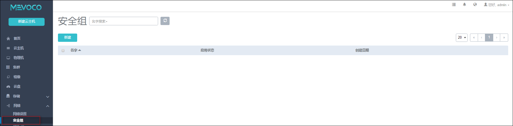

# 14.2 安全组管理

点击菜单栏的安全组按钮，进入安全组管理界面，如图14-2所示。在安全组管理界面，可以查看安全组列表信息，并对安全组进行添加、删除等操作。

安全组主要给云主机提供三层网络防火墙控制，可以控制TCP/UDP/ICMP等包可以从哪些IP地址访问云主机或者该云主机可以被哪些IP地址访问到。

安全组可以挂载到多个云主机，它们会共享相同的安全组规则。<!--属于同一安全组规则下的云主机之间不受此安全组规则限制，可以相互通讯。-->

###### 图14-2  安全组界面
