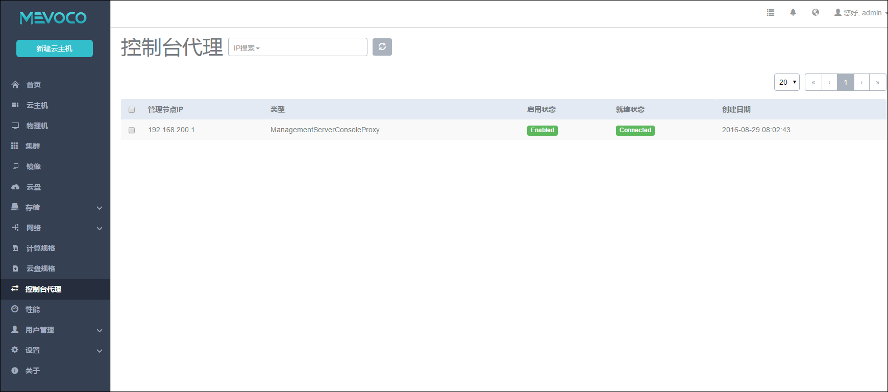

# 18.2 控制台代理

在控制台代理菜单，显示了当前控制台代理的信息，即打开云主机的控制台时，使用的代理信息，如图18-2-1所示。

默认代理显示的IP为管理节点的IP地址。

显示类型为ManagementServerConsoleProxy。

仅有状态为Enabled和Connected时，打开云主机的控制台才可正常访问到云主机。

支持的操作为重连。一般发生在云主机控制台打开失败时，进行重连操作。如果状态显示为Enabled和Connected，代表控制台可以正常打开。

###### 图18-2-1  控制台代理界面
