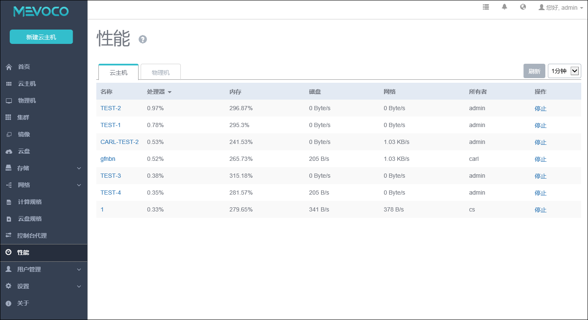

# 18.1 性能监控

在性能监控菜单，显示了当前系统内云主机和物理机的性能信息，如图18-1-1所示。默认会显示云主机的性能监控统计信息，点击物理机按钮，会显示物理机相关的性能监控统计信息。

在监控界面，默认按照CPU的使用率从高到低排序，针对超过100%的CPU代表当前CPU个数超过1个。例如：如果一台物理机上有4个CPU，那么它的CPU使用率上限为400%。可以点击内存、磁盘、网络等按钮按照相应的资源的使用从高到低排序。

在监控界面可选择右侧的时间，来选择不同的时间段，来显示最近一段时间内的资源使用情况，可选值为1分钟，15分钟，1小时，6小时，一天，一周。

其中磁盘IO为读写速度的总和，网络IO为上下行速度总和，CPU、内存、磁盘、网络的读出值为用户所选时间单位内的平均值。

###### 图18-1-1  性能监控界面
