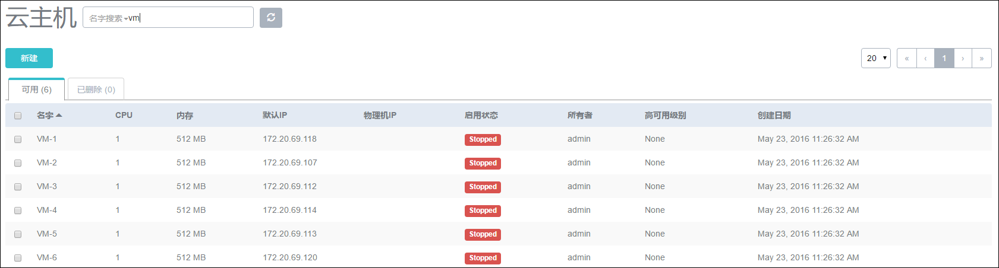
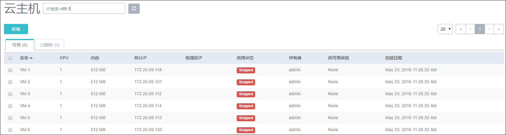

# 18.3 资源查询和排序

在资源列表页或者资源详情页的上方，用户可以通过在搜索栏中输入的资源关键信息来快速过滤各种资源。如图18-3-1所示，用户可以根据云主机的名字来快速查找云主机。也可以通过IP地址来定位云主机，如图18-3-2。

###### 图18-3-1  按照云主机的名字查询

###### 图18-3-2  按照云主机的IP地址查询

在资源的列表页，用户还可以通过点击列表第一行中的部分字段，让资源以字段进行排序。

