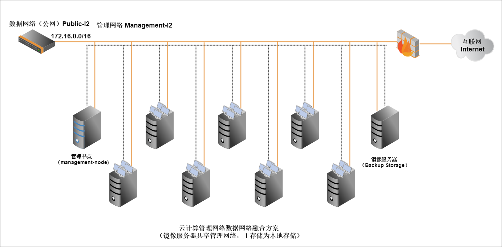

# 2.1 网络环境
云计算环境是公司内非常重要的IT基础架构。在安装系统软件前，请仔细阅读并依照配置需求完成基础环境的软件硬件环境准备。不当的环境配置，可能导致无法完成随后的私有云环境部署，或者在使用中遇到异常。

图2-1是搭建在一个在小型数据中心上典型的私有云环境。该环境由若干台功能不同的服务器，两个独立的网络环境构成。

其中有两台服务器用于系统管理节点和存放云主机的镜像（在小型数据中心中，管理节点和镜像服务器可以共用一台服务器，在大规模的物理环境中可以配置多台管理节点提供高可用性和多台镜像服务器扩展镜像存储容量和吞吐率），其余服务器作为云主机的物理宿主机。

每台服务器均连接到管理网络和数据网络，其中数据网络可以通过防火墙访问互联网。

管理网络是管理节点管理物理机，云主机，云盘等云端资源的网络。

数据网络是云主机提供数据服务的网络。图中的IP地址仅作为示例给用户参考。

需注意：连接管理网络的服务器需指定静态的IP地址，并在之后添加物理服务器的时使用。

连接数据网络服务器上的网卡可以不用指定IP地址，但是每台服务器连接数据网络的网卡设备名称需相同（例如都是eth0)。

###### 图2-1 私有云环境网络环境

其他的软硬件需求，请参考2.2和2.3章节。
