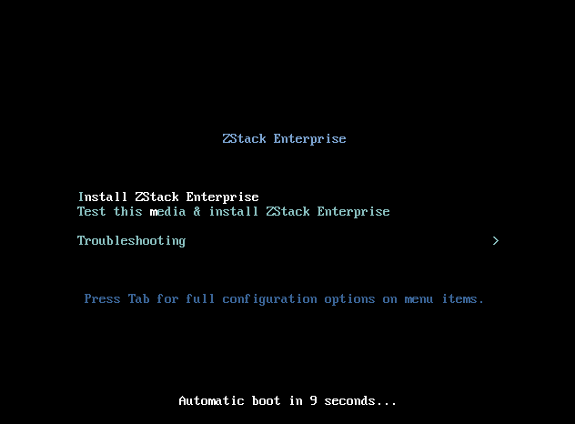
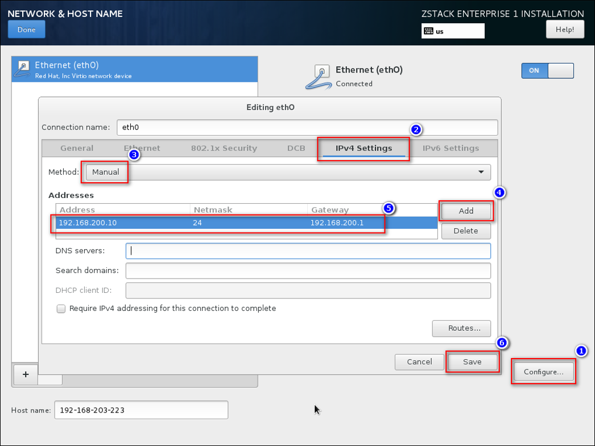

# 2.3 ZStack企业版ISO

基于CentOS-7-x86_64-Minimal-1511.ISO官方ISO，ZStack社区深度定制了ZStack-Enterprise ISO，方便用户安装使用。

**注意：**安装/升级ZStack企业版必须使用**离线模式**。

支持以下特性：

1. 基于CentOS-7-x86_64-Minimal-1511.ISO深度定制，友好的TUI管理界面，支持多种系统配置；

2. 包含系统需要的所有安装包，安装系统时，无需连接外网，也无须配置yum源，就可以实现系统的完全离线安装；

3. 提供三种安装模式：管理节点、计算节点、专家模式用户根据需求选择即可；

4. 设置了root密码为password，支持安装OS后修改密码；（安装过程手动设置）

5. 取消了eth设置。采用系统默认的网卡命名规则；

6. 默认选项：时区--亚洲东八区，语言--English，键盘--English(United States)。

具体步骤如下：

1.下载ZStack定制版ZStack-Community-ISO
文件名称：ZStack-Community-x86_64-DVD-1.9.0.iso

下载地址1：

[http://download.zstack.org/ISO/ZStack-Enterprise-x86_64-DVD-1.9.0.iso](http://download.zstack.org/ISO/ZStack-Enterprise-x86_64-DVD-1.9.0.iso)

下载地址2：

[http://pan.baidu.com/s/1sl911oh](http://pan.baidu.com/s/1kV2VTeJ)

2.使用UltraISO（可点击此链接下载试用版），将此ISO刻录到U盘，打开UltraISO后，点击“文件”按钮，打开此ISO，如图2-3-1所示。

###### 图2-3-1 UltraISO打开ISO 
  
3.点击“启动”按钮，选择“写入硬盘镜像”，如图2-3-2所示。

###### 图2-3-2 选择写入硬盘镜像
 

4.在硬盘驱动器列表选择相应的U盘进行刻录，如果系统只插了一个U盘，则默认以此U盘进行刻录和写入，在刻录前，注意备份U盘之前的内容。

其他选项，按照默认设置，无须额外配置。点击“写入”按钮，如图2-3-3所示。

###### 图2-3-3 点击写入按钮

5.点击“是”按钮进行确认，如图2-3-4所示，UltraISO将会把此ISO刻录到U盘。

###### 图2-3-4 点击是按钮进行确认

6.刻录成功的界面如图2-3-5所示，表示Stack-Enterprise-Installation可引导U盘已刻录成功。

 
###### 图2-3-5 刻录成功界面

7.使用U盘引导安装 ，在BIOS启动界面，选择使用此U盘引导安装ZStack-Enterprise-Installation，引导安装界面如图2-3-6所示：

 
###### 图2-3-6 ISO引导安装界面

8.进入系统安装界面后，如图2-3-7所示若干配置选项。需要格外注意的是红色方框中的配置项。

 
###### 图2-3-7 选择一种安装模式

9.进入“INSTALLATION DESTINATION”后的配置界面，如图2-3-8所示。
1. 选择磁盘。注意：不要把用于安装系统的U盘也选中!
2. 选择“Automatically configure partitioning”，自动将所选磁盘配置为LVM。当然也可以保持默认选择“I will configure partitioning”进行手动配置。

 
###### 图2-3-8 选择一种安装模式

10.进入“NETWORK & HOST NAME”后的配置界面，如图2-3-9所示。
1. 选中待配置网卡
2. 开启网卡
3. 查看获取的DHCP地址

 
###### 图2-3-9 选择一种安装模式

11.如果无法获取DHCP地址，或者需要手动配置静态地址，则按图2-3-10所示操作。
1. 点击“Configure”按钮
2. 进入“IPv4 Settings”选项页
3. 选择“Manual”以进行手动配置
4. 点击“Add”增加新的配置条目
5. 根据实际情况配置网卡地址信息
6. 点击“Save”保存

 
###### 图2-3-10 选择一种安装模式

12.为了使网卡在重启之后自动启动，可按图2-3-11所示操作：
1. 点击“Configure”按钮
2. 进入“General”选项页
3. 勾选“Automatically connect to this network when it is available”
4. 点击“Save”保存

 
###### 图2-3-11 选择一种安装模式

13最终配置界面应该如图2-3-12所示。尤其注意网卡配置项，**必须保证有一个网卡是开启且配置了地址的，否则ZStack无法正常安装！**

 
###### 图2-3-12 选择一种安装模式

14.分区完毕后点击SOFTWARE SELECTION,有三种安装模式可供选择，如图2-3-8所示，ZStack Management Node、ZStack Compute Node、ZStack Expert Node。首次安装请选择第一项，我们会在[安装部署](/install/README.md)章节详细介绍。

 
###### 图2-3-13 选择一种安装模式

15.选择安装软件后，点击“Begin Installation”按钮，如图2-3-9所示，开始安装。

 
###### 图2-3-14 点击“Begin Installation”按钮

16.如图2-3-10安装过程中请设置root password，所有的安装包安装完毕后，点击“重启”按钮，即可启动进入Stack-Enterprise-x86_64-DVD-Installation系统。

 
###### 图2-3-15 系统安装过程界面

**注意：**如果选择管理节点或者计算节点安装模式，系统重启后会自动安装对应的ZStack软件。专家模式下重启后进入shell界面，由高级玩家自定义安装。

