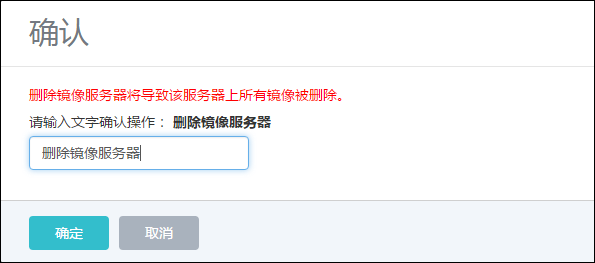
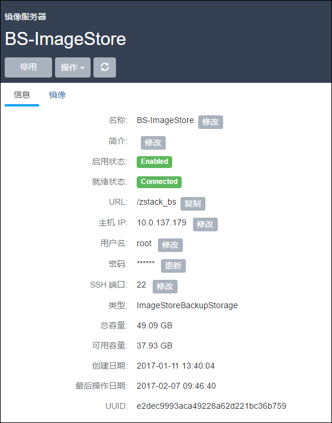
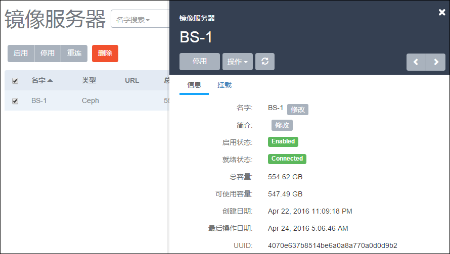

# 12.2 镜像服务器

针对不同类型的镜像服务器，镜像服务器界面显示的信息也不相同。但均支持以下操作：

1.启用：将处于停用状态的镜像服务器启用。

2.停用：将镜像服务器停用。停用镜像服务器后，新的云主机将无法从镜像列表选择可用镜像。

3.重连：重新连接镜像服务器。重连镜像服务器会更新镜像服务器相关的存储信息。

4.删除：将镜像服务器删除掉。如图12-2-1所示。

注意：删除镜像服务器是非常危险的操作。此操作会直接删除所有镜像文件，且无法恢复。即使重新添加此镜像服务器，系统也无法自动识别上面的文件。

###### 图12-2-1  确认删除镜像服务器

5.修改名字：支持修改镜像服务器的名字信息。

6.修改简介：支持修改镜像服务器的简介信息。

针对镜像仓库类型的镜像服务器，可支持添加多个镜像服务器。

镜像仓库类型的服务器，也类似物理机一样，支持修改用户名、密码、端口号。如图12-2-2所示。具体定义如下：

修改用户名：修改镜像服务器的用户名。

* 注意：此操作要求待修改的用户名拥有sudo权限，而且修改完毕用户名，请同时修改此用户名的密码。否则镜像服务器可能重连失败。

修改密码：修改镜像服务器的用户密码。

修改SSH端口：修改镜像服务器SSH登录的端口号。修改此端口号时，请确保此端口号已生效，且镜像服务器的防火墙对端口也允许访问。

###### 图12-2-2  镜像仓库类型镜像服务器管理界面

针对Ceph或FusionStor类型的镜像服务器，支持在挂载栏添加同一集群的多个监控节点。以Ceph存储为例，如图12-2-3所示。而且也可以在挂载页面修改相应的SSH用户名、SSH密码、SSH端口号、Ceph Mon的端口号。

###### 图12-2-3  Ceph类型镜像服务器管理界面

