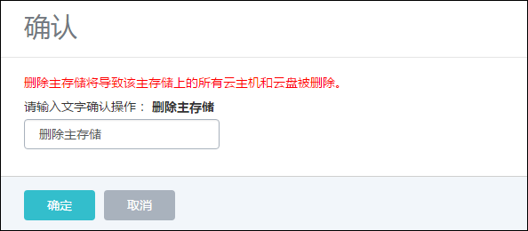

# 12.1 主存储

针对不同类型的主存储，主存储界面显示的信息也不相同。但均支持以下操作：

1.启用：将处于停用状态的主存储启用。

2.停用：将主存储停用。停用主存储后，新的云主机、云盘、快照将无法创建。

3.重连：重新连接主存储。重连主存储会更新主存储相关的存储信息。

* 注意：如果有任意一台物理机连接到主存储，该主存储的状态就会为connected。

4.加载：挂载主存储到集群

5.添加云盘：进入主存储详情页面，点击操作按钮，选择添加云盘

6.进入维护模式：主存储进入维护模式后，所有使用该主存储的云主机都会关闭（包括neverstop）。

7.删除：将主存储删除掉。点击删除按钮会弹出相应界面，删除前请从所有集群卸载该主存储。删除主存储如图12-1-1所示。


###### 图12-1-1 删除主存储界面

* 注意：删除主存储是非常危险的操作。此操作会直接删除所有云主机的云盘文件，且无法恢复。即使重新添加此主存储，系统也无法自动识别上面的文件。

8.添加：在删除主存储后，添加按钮将会显示出来。可再次添加主存储。默认此按钮不显示。

9.修改名字：支持修改主存储的名字信息。

10.修改简介：支持修改主存储的简介信息。

各种主存储管理界面的差异：

1.本地存储：本地存储显示的类型为LocalStorage, URL显示为已添加的各物理机的绝对路径信息，显示了总容量和可用容量信息。如图12-1-2所示。


###### 图12-1-2 本地主存储管理界面

2.NFS存储：NFS存储类型显示为NFS，URL显示的为NFS服务器的共享目录。如图12-1-3所示。

如果用户以NFS作为主存储，，需要将旧存储上运行的VM移至新的存储上，此时在UI界面更改NFS的URL就十分便利了。具体操作如下：
* 关闭云主机；


* 在第一个计算节点，挂载新的NFS存储到/mnt/new-nfs/目录；

```
mount -t nfs 172.20.12.28:/share/new-ps /mnt/new-nfs/

```
* 通过rsync命令同步数据：

```
rsync -avu /opt/zstack/nfsprimarystorage/prim-
45d54052761e4dacaa336415d9bfda8b/* /mnt/new-nfs/
数据同步完成后，执行卸载新的NFS：umount /mnt/new-nfs
```

* 在UI上，修改已有NFS的路径，修改为新NFS路径：172.20.12.28:/share/new-ps


###### 图12-1-3 NFS主存储管理界面

3.Ceph存储：Ceph存储显示类型为Ceph，如图12-1-4所示。相应的监控节点信息现在是挂载栏。在挂载栏中可以添加同一集群的多个Ceph监控节点。如图12-1-5所示。而且可以修改相应的SSH用户名、SSH密码、SSH端口号、Ceph Mon的端口号。


###### 图12-1-4 Ceph主存储管理界面


###### 图12-1-5 Ceph主存储挂载界面

4.FusionStor存储：FusionStor存储显示类型为FusionStor，如图12-1-6所示。相应的监控节点信息现在是挂载栏。在挂载栏中可以添加同一集群的多个FusionStor监控节点。而且也可以像Ceph一样修改相应的SSH用户名、SSH密码、SSH端口号、FusionStor Mon的端口号。


###### 图12-1-6 FusionStor主存储管理界面

5.Shared Mount Point：Shared Mount Point显示的类型为Shared Mount Point，URL显示的为网络存储挂载在本地的目录。如图12-1-7所示。


###### 图12-1-7 Shared Mount Point主存储界面

