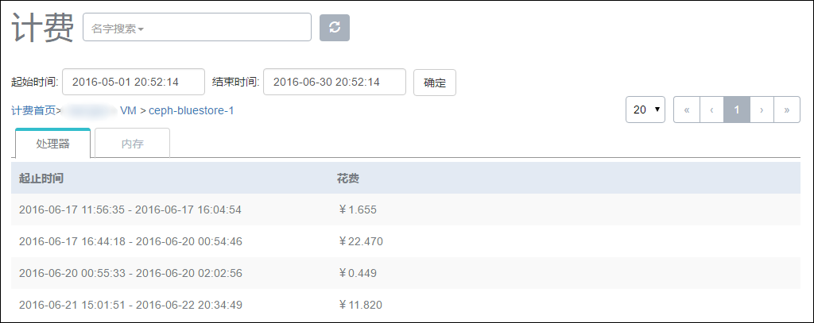

# 20.6 账户计费

在创建完各项资源的单价后，普通账户对云主机的相关资源使用均会受到计费系统的统计。在普通账户详情页面的计费栏中可以看到普通账户使用云资源的消费信息。

相应的计费规则：

1. 在计费单价创建之后，已创建的云主机会自动被计费系统跟踪相关的消费情况。

2. 旧版本没有计费功能，升级到新版本后，原本的云主机在创建计费单价后，不需要任何额外操作，即可被自动统计到计费信息中。

3. 删除策略为延迟删除时，云主机变为已删除状态，此时CPU、内存不再计费，但相关的根云盘和数据云盘因为占据物理存储空间，仍需计费，只有彻底删除，相应的存储释放后，才不继续计费。

4. 云主机停止状态只对云盘资源进行计费。

5. 属于账户名下未加载的数据云盘也将进行计费。

6. 在更改云主机、云盘的所有者时，以更改时为时间分割点，更改前属于前一账户的计费，更改后属于后一个账户的计费。

7. 计费规则对所有账户均生效。

费用查询：

admin账户可以对任一账户的消费情况进行查询和统计。点击菜单栏中用户管理下的计费按钮，可以看到各个账户的消费情况，如图20-6-1所示。

###### 图20-6-1 计费界面

计费的默认起始时间为当前时间的前一个月，结束时间默认为现在。总计的价格显示此账户在选择的时间段内消费的费用总计，包含云主机的CPU、内存、云盘资源信息等。

用户可以点击账户行进入单个账户的计费页面，其中花费类型有根云盘、云主机和数据云盘，如图20-6-2所示，若账户里没有云主机或是数据云盘则不显示此项。

###### 图20-6-2 单个账户计费界面

继续点击可以看到更多详情。比如，点击云主机可以看到账户下各个云主机的具体消费情况，如图20-6-3。继续点击单个云主机就可以看到该云主机下的处理器和内存分别的花费金额，如图20-6-4。

###### 图20-6-3 账户下云主机计费界面

###### 图20-6-4 单个云主机计费界面
