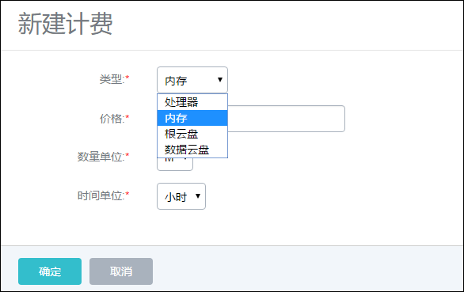

# 20.5 计费设置

系统的计费功能目前涉及到的基本计费资源包括CPU、内存和云盘。以各资源的规格大小和时间作为基本计费单位，并以时长作为服务使用记录，可以对不同账户使用的业务量进行统计计费。

计费设置提供了计费的单价设置。

点击菜单栏页面的设置按钮下的计费设置，会提示进入计费设置界面，如图20-5-1所示。计费类型分为四种，分别为CPU、内存、根云盘和数据云盘。

###### 图20-5-1 计费设置界面

点击新建按钮会弹出新界面，提示新建计费单价。如图20-5-2所示。其中，类型可以选择CPU、内存、根云盘和数据云盘；价格为单位时间内单位资源的费用，可选值为 double精度的数值，必须大于0；CPU的数量单位默认为个数，且不可修改，内存、根云盘和数据云盘的数量单位默认为M, 可选值为 M、G、T；时间单位默认为小时，可选值为秒、分、小时、天。

###### 图20-5-2 新建CPU计费单价界面

创建计费单价后，相关的资源列表，会显示相应的计费单价。在计费列表中，每个资源的首行代表该资源的当前使用价格，其他行代表该资源在特定时间段内的使用价格。价格列显示了资源的计费单价明细，例如内存栏的￥0.17/GB/小时，代表内存每小时每GB的价格为0.17元。起始时间列代表此价格的生效时间。

> 例如May 26 2016 10:23:58 AM, 代表当前计费从2016年5月26日10点23分58秒开始计费。简介列详述了当前单价生效的时间段和单价的明细。

如果在相关资源成本发生变化时，也可以对资源的计费单价进行调整。例如，因市场发生变化，内存条价格下跌，相关的成本也开始下降，此时需要下调内存的计费单价，用户可以新建内存计费单价实时更新。

> 例如图20-5-3所示，在￥0.17/GB/小时计费一段时间后，开始以￥0.15/GB/小时开始对内存进行计费。针对正在使用中的资源，计费单价会从新建计费的时间点切入进行计费，图示的￥0.17/GB/小时的有效时间为2016年6月28日14点07分44秒到2016年6月28日14点09分33秒，此时间段内的费用按照￥0.17/GB/小时的单价计费。从2016年6月28日14点09分33秒后，开始按照￥0.15/GB/小时进行内存计费。

###### 图20-5-3 内存单价明细界面

勾选需要删除的计费规则，点击删除按钮，输入‘ok’后，点击确定按钮即可删除计费规则。删除内存计费规则如图20-5-4所示：

###### 图20-5-4 删除内存计费规则界面

* 注意：如果删除所有计费规则，则账户计费清零。

