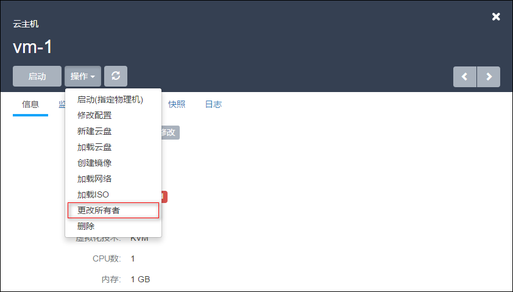
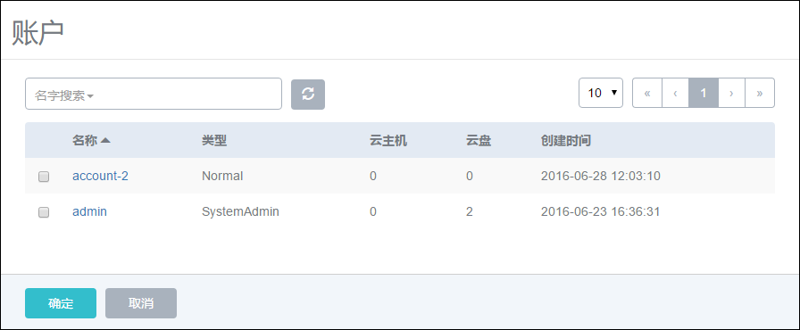
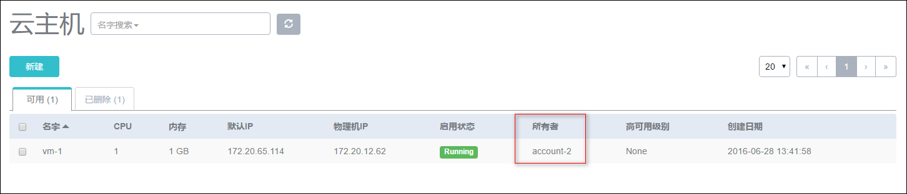

# 20.4 更改所有者

在账户管理中，支持对云主机、镜像、云盘等资源变更所有者的操作。将一个资源的所有者属性更改到其他账户名下。

以云主机为例，在云主机详情界面的操作按钮下点击更改所有者，如图20-4-1所示。

###### 图20-4-1 更改所有者

在弹出的新界面中选择待拥有此云主机的账户，如图20-4-2所示，点击确定后生效。

###### 图20-4-2 选择所有者进行更改

更改所有者后，在云主机列表可以看到此云主机的所有者已经变更。如果使用此账户登录，即可看到此云主机。如图20-4-3所示。

###### 图20-4-3更改所有者后界面

注意：云主机和云盘分属不同的资源，如果云主机挂载云盘，更改所有者只会将云主机的所有者更改，云盘需要另外在云盘界面进行更改所有者的操作。

镜像资源和云盘资源拥有类似的更改所有者操作，可以参考云主机的所有者更改进行操作。

针对镜像，更改所有者的操作和共享召回的操作相互之间并不影响。

