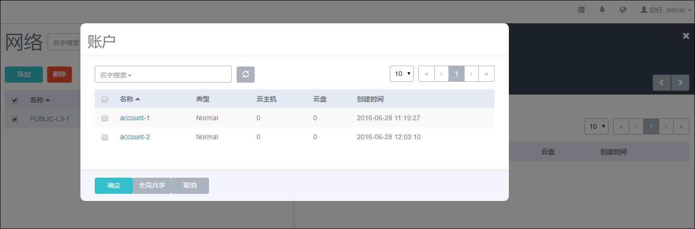
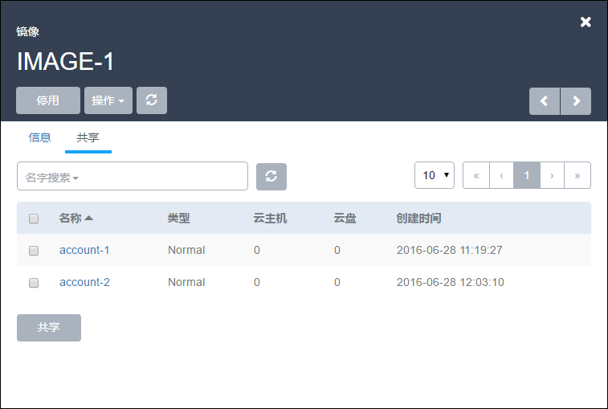
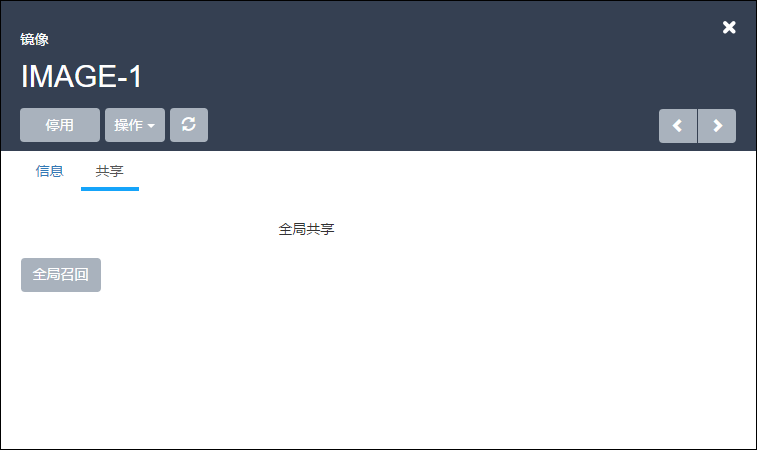

# 20.3 资源共享与召回

在用户管理中，admin账户对资源控制的基本粒度分为账户和用户。

Admin账户创建的计算规格、云盘规格、镜像、网络等创建云主机的基本资源默认并不分享给账户。

需要分享给账户后，账户和用户才可看到相应的资源，否则账户和用户无法使用这些基本资源。

* 注意：用户并不占有资源，所以资源并不直接分享给用户，而是分享给账户。

针对计算规格、云盘规格、镜像、网络的几类资源均可支持共享与召回，下面以镜像共享为例介绍资源共享与召回，其他资源均可参考同样的方法实现资源共享与召回。

在镜像详情页的共享栏中，可以操作共享将镜像资源共享给其他账户。

点击共享界面的共享按钮，会弹出需分享的账户列表。如图20-3-1所示。可以勾选单个用户，也可以勾选多个用户，点击确定后，就将此资源共享给特定账户。如果点击了全局共享，那么无须选择账户，此资源将对所有账户全局共享。

###### 图20-3-1 选择待共享账户界面

如果选择指定账户进行共享，共享完毕后，共享栏的界面显示，如图20-3-2所示。可勾选相应账户对其进行共享与召回的操作。如果不勾选任何账户，召回按钮为隐藏状态，图示状态为已勾选了一个普通账户。点击召回按钮，即对此账户不再共享此镜像资源。点击共享按钮，则可将此资源再共享给其他未曾共享的账户。

如果选择了全局共享，镜像资源的界面只会显示全局共享，而只有全局召回可以操作。如图20-3-3所示。全局召回需要进行确认操作，如图20-3-4所示。

* 注意：如果管理员单独共享给一个账户后，再依次进行全局共享，全局召回的操作，这个用户仍然对该资源有操作权限。

###### 图20-3-2 镜像资源指定账户共享后界面

###### 图20-3-3 镜像资源全局共享后界面

###### 图20-3-4 镜像资源全局召回确认界面

