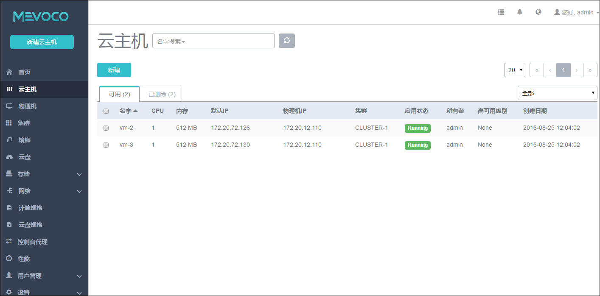

# 7 云主机管理
云主机是系统直接交付给用户使用的虚拟主机系统,是系统的重要组成部分。

点击菜单栏的云主机按钮,可以进入云主机管理界面,如图7-1所示。在云主机管理界面, 可以查看云主机列表信息,并对云主机进行创建、重启、停止、启动、控制台、新建云盘、加载云盘、卸载云盘、加载ISO、卸载ISO、修改配置、修改启动顺序、创建镜像、克隆、定时任务、迁移、删除、加载网络、卸载网络、设置IP、设置高可用、更改所有者、设置用户标签、指定物理机启动等操作。

云主机界面目前分为两栏,一栏为可用,代表目前处于运行状态或者停止状态的云主机。另一栏为已删除,代表目前处于已删除状态的云主机。

###### 7-1 云主机管理界面

通过搜索栏,用户可以根据云主机的名字、UUID、IP地址、物理机IP、所有者、用户标签等进行快速搜索云主机。用户可以手动刷新云主机的状态(例如用户使用poweroff命令关闭了云主机系统,可以点击刷新按钮更新云主机的状态)。
 
在云主机列表里,用户可以配置每一页显示的云主机数量。
