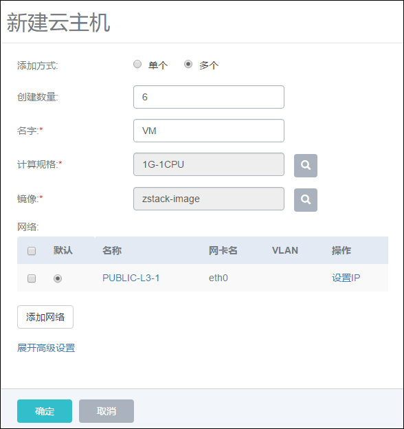

# 7.6 批量新建云主机

1. 点击新建按钮，系统会弹出新的新建云主机界面，如图7-6-1所示。

2. 选择添加方式为多个，输入需要批量创建的云主机数量。

3. 输入批量云主机名字，多个云主机的名字以输入字符串加后缀进行区分，例如，输入VM，则云主机名字以VM-1，VM-2依序排列。

4. 点击计算规格按钮，在弹出的新界面中选择启动相应云主机使用的计算规格。

5. 点击镜像按钮，在弹出的新界面中选择启动相应云主机使用的镜像。

6. 点击添加网络，在弹出的新界面选择选择启动云主机使用的网络

7. 点击创建按钮，进行批量创建。

注意：由于计算节点能力不同，并行创建大量云主机的时候，可能会导致每一个云主机启动时间变的很长。所以并发创建云主机的数量最好结合计算节点的数量以及计算节点的能力进行综合考虑，如果创建的云主机数量所占资源的任意类型（CPU、内存、存储、网络）超过系统可用资源，则至多创建出各类型的所允许的最少数量。

###### 图7-6-1  批量创建云主机界面

