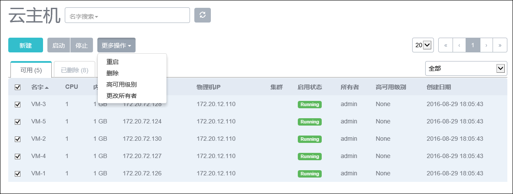
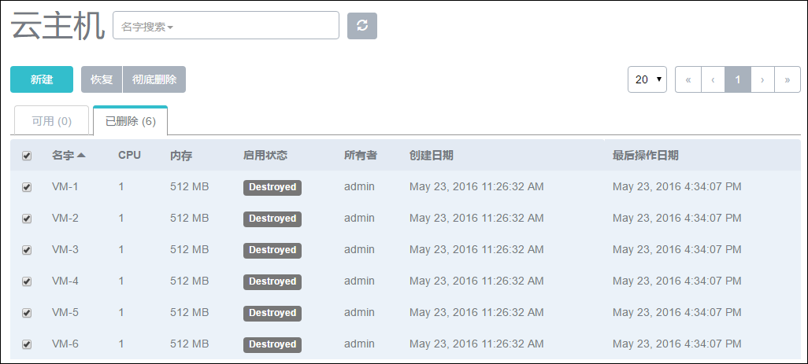
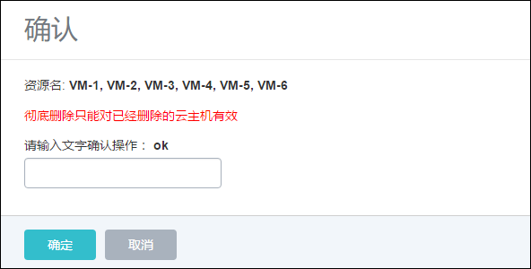

# 7.7 批量操作云主机

在云主机列表界面，当选择多个云主机之后，可以进行批量操作。可支持启动、停止、重启、更改所有者、定时任务、删除、恢复、彻底删除、设置高可用级别等操作。

> 例如，停止选中的所有云主机，如图7-7-1所示。批量操作将会自动过滤选中的但已经处于目标状态的云主机。例如，当选择一组云主机进行停止操作，停止的批量操作将会自动跳过已经处于停止状态的云主机。彻底删除的操作需云主机处于Destroyed状态，如果云主机非Destroyed状态，则不会对此云主机进行任何操作。

批量删除云主机需要以云主机处于Deteled状态为前提，需要将云主机批量删除后， 在已删除栏，选中点击彻底删除，如图7-7-2所示。在新界面输入ok进行确认。如图7-7-3所示。

###### 图7-7-1  批量操作云主机界面

###### 图7-7-2  批量删除云主机后界

###### 图7-7-3 批量彻底删除云主机确认界面
