# 7.3 安装云主机镜像-Linux

安装云主机镜像，需在创建云主机过程中使用ISO进行系统安装，并将安装完毕的云主机系统保存成一个标准的镜像模板。

安装Linux云主机的镜像的具体步骤如下（以CentOS7.2为例）：

1.在镜像资源里，添加CentOS 7.2 安装光盘，如图7-3-1所示。

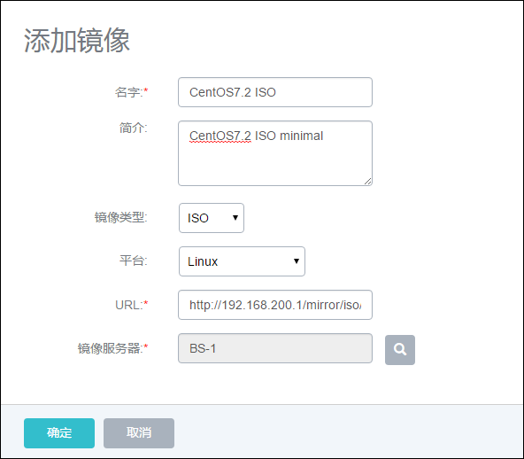

###### 图7-3-1 添加Linux ISO界面

2.根据待安装云主机的存储需求，在左侧云盘规格页面中创建合适大小的云盘规格，如图7-3-2所示。

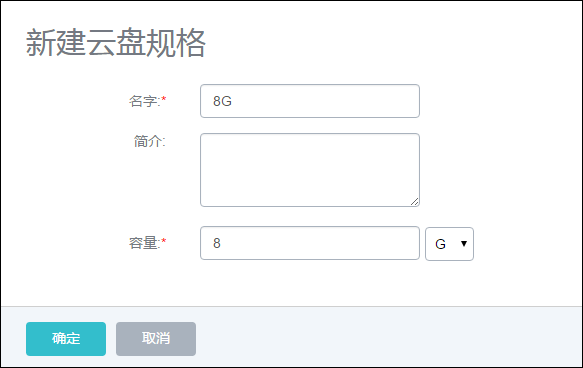

###### 图7-3-2 新建云盘规格界面

3.在计算规格中添加用于安装的计算规格。如图7-3-3所示，包括1个CPU和1G内存：

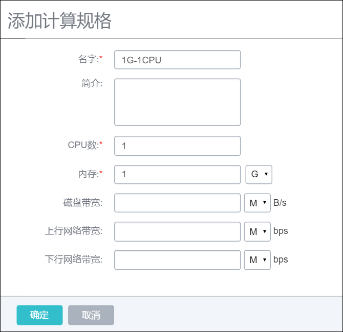

###### 图7-3-3 添加计算规格界面

4.在新建云主机时，选择相应的Linux ISO作为引导，在根云盘规格选择根云盘模板的大小，在添加其他选项后，进行创建，如图7-3-4所示。

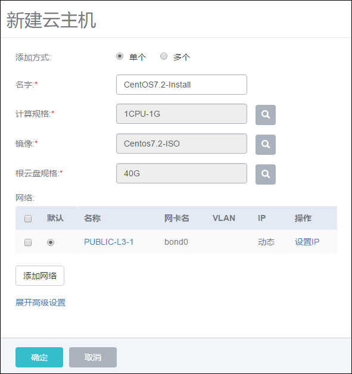

###### 图7-3-4 新建Linux 云主机选择界面

5.点击确定，名为CentOS-Install的云主机便会成功创建。点击该云主机所在行，系统会显示该云主机的详情，如图7-3-5所示。

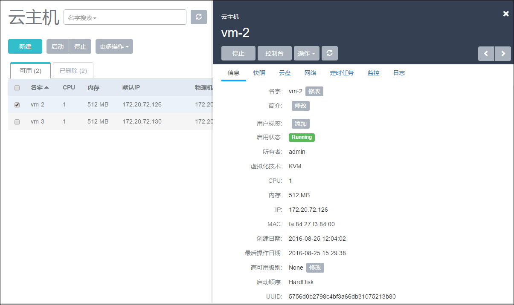

###### 图7-3-5新建云主机详情

6.点击操作-&gt;控制台，系统会弹出云主机安装界面，如图7-3-6所示。新的控制台为一个弹出的窗口，浏览器通常由于安全设置可能会阻止弹出新的窗口。如果发生该问题，就需要用户手动点击并允许弹出窗口，如图7-3-7所示。

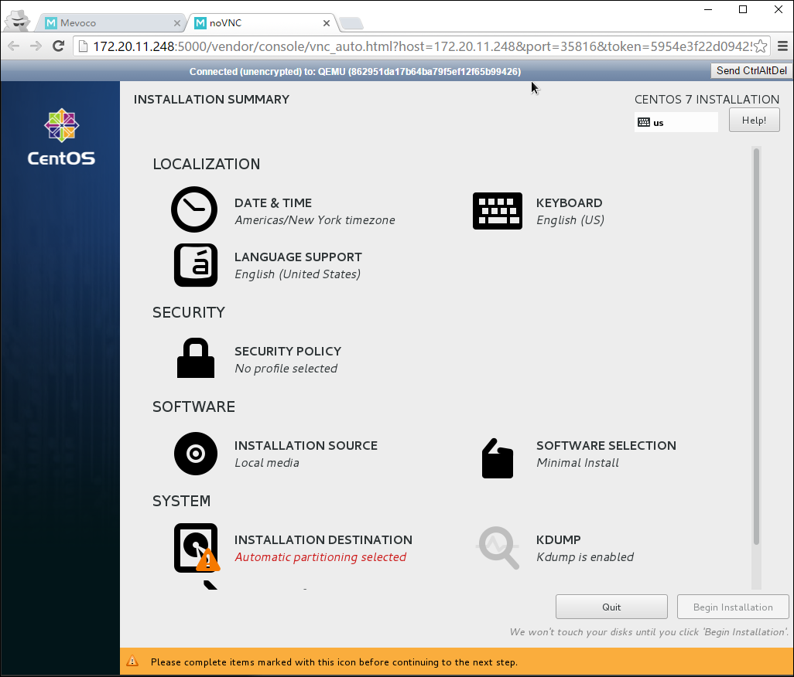

###### 图7-3-6 安装Linux 云主机镜像界面

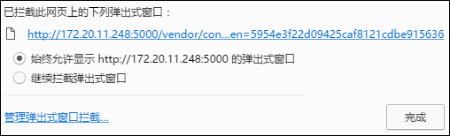

###### 图7-3-7 手动允许浏览器弹出窗口

7.安装云主机镜像过程，与安装普通Linux操作系统一样，需要进行一系列配置。

8.在安装完毕之后，点击reboot按钮，如图7-3-8示，系统就会重启。在系统重启前，用户无须预先停止云主机或者卸载ISO，云主机便可以自行重启进入安装好的操作系统。

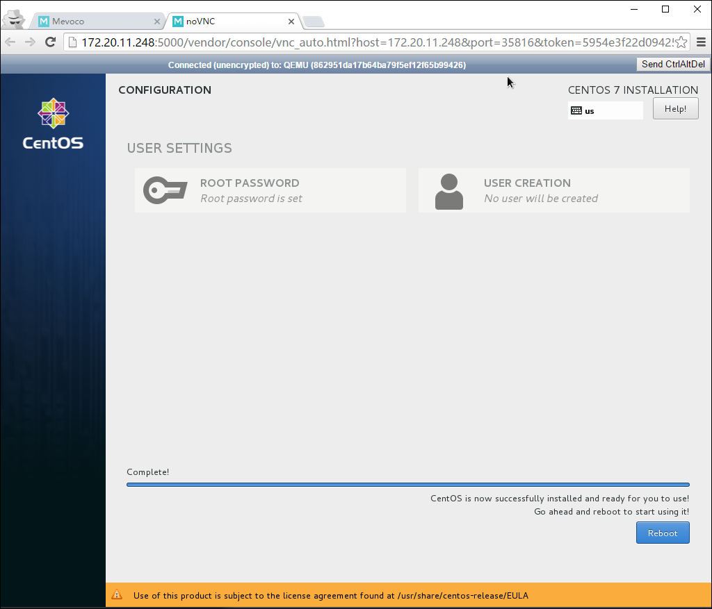

###### 图7-3-8 安装Linux 云主机镜像重启界面

9.此时原有控制台界面会失效，需要重新点击控制台启动新的窗口。显示界面如图7-3-9所示。

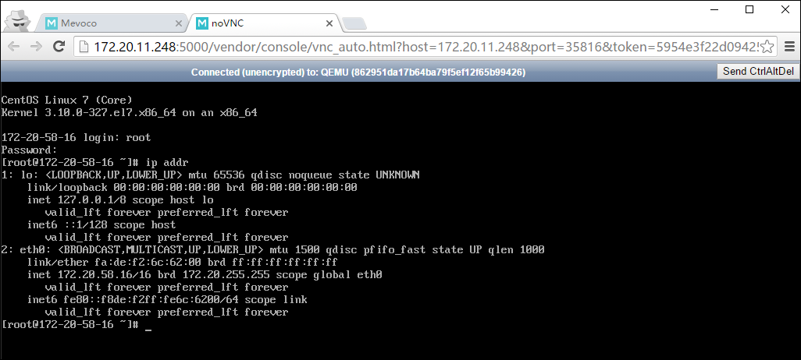

###### 图7-3-9 成功安装Linux 云主机镜像后运行界面

10.用户对系统进行定制修改后（例如安装Web 服务器，数据库），可以到云主机详情界面点击停止按钮将云主机停止。

11.点击操作-&gt;“卸载ISO”按钮来卸载云主机ISO，如图7-3-10所示。

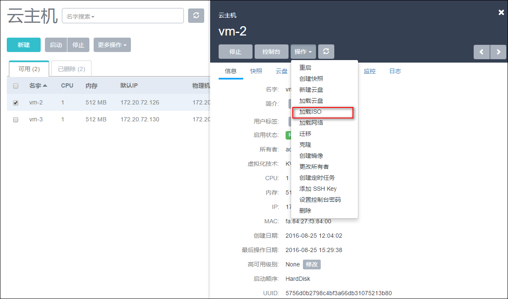

###### 图7-3-10 卸载云主机ISO界面

12点击操作-创建镜像，来创建云主机的镜像，当镜像服务器为仓库时，在云主机运行状态下就可以创建。对于其他类型镜像服务器需要停止云主机后，再点击操作按钮下的创建镜像可以把云主机的根云盘保存成标准的镜像文件，之后即可使用这个镜像文件复制创建更多的云主机。 如图7-3-11所示。

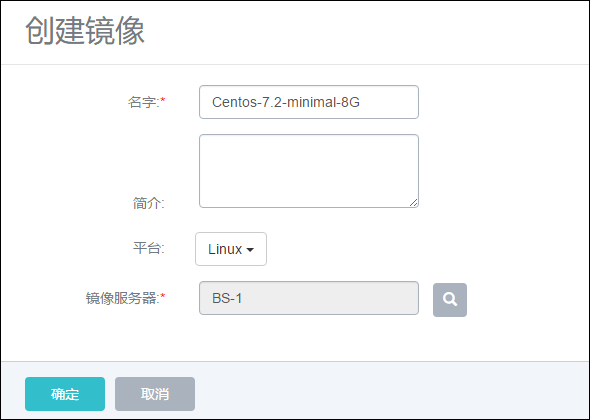

###### 图7-3-11 从云主机创建镜像

13.创建镜像完毕后，针对用户对云主机镜像的定制需求，可以拷贝系统的云主机镜像进行再次定制，在镜像服务器界面，点击镜像所在行，显示镜像详情。点击镜像服务器路径右侧的复制按钮，如图7-3-12示，即可复制此镜像在镜像服务器的具体路径。用户可根据此路径的文件进行镜像的再次定制与修改。

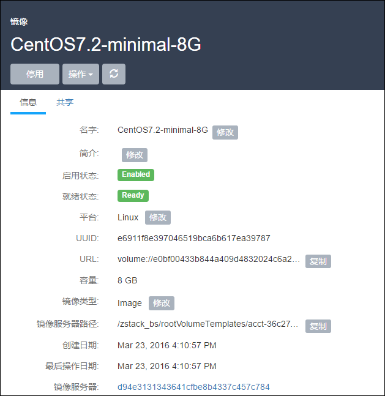

###### 图7-3-12  拷贝镜像路径界面


* 如果镜像服务器采用的是Ceph的块存储。那么路径复制按钮则会显示ceph中对应的pool和image信息。


拷贝此镜像需要在点击复制了相应的路径后，如图7-3-13所示，在Ceph服务器上执行rbd命令镜fusionstor像的导出。

假如镜像存储路径为

`ceph://bak-t-c9923f9821bf45498fdf9cdfa1749943/61ece0adc7244b0cbd12dafbc5494f0c`

其导出方法如下：

`[root@ceph-node1 ~]#rbd export -p bak-t-c9923f9821bf45498fdf9cdfa1749943 --image 61ece0adc7244b0cbd12dafbc5494f0c /root/export-test.image`

`#bak-t-c9923f9821bf45498fdf9cdfa1749943表示镜像所在的pool的名字`

`#61ece0adc7244b0cbd12dafbc5494f0c表示镜像的名字`

`#/root/export-test.image表示导出的目标文件名字`

导出目标文件后，用户即可对此镜像文件进行定制和修改。

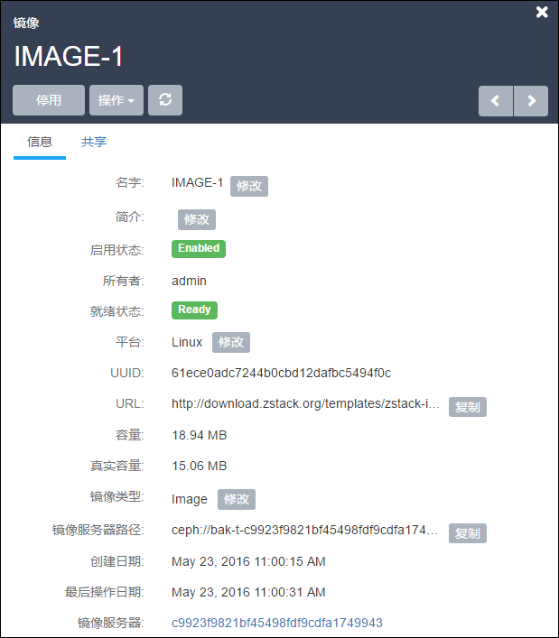

###### 图7-3-13  拷贝Ceph镜像路径界面

* 与ceph类似，如果镜像服务器采用的是fusionstor，可以使用 `lichbd export pool/image  /root/xxx -p nbd` 导出镜像。例如：

```
 lichbd export bak-t-8e694c40cf214db1af9e5d641b2e792d/8f1e0debfae042e5ae074133a59c0622 /root/test.img -p nbd

```


