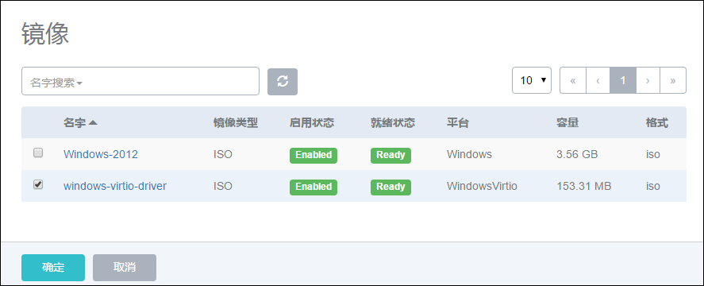

# 7.4 安装云主机镜像-Windows

安装Windows的云主机镜像的步骤与安装Linux云主机镜像的差别注意如下：（以Windows-2012-Server为例）：

1.在添加Windows ISO镜像时，如图7-4-1所示，需特别注意平台选择Windows。

注意：Windows ISO可以通过

[https://www.microsoft.com/zh-cn/evalcenter/evaluate-windows-server-2012-r2](https://www.microsoft.com/zh-cn/evalcenter/evaluate-windows-server-2012-r2)

链接下载官网试用版Windows Server 2012。

###### 图7-4-1 添加Windows ISO界面

2.在前述的新建云主机的第四步中选择相应的Windows ISO作为引导，在添加完毕其他选项后，进行创建，如图7-4-2所示，点击控制台会弹出云主机安装界面。

###### 图7-4-2 新建Windows 云主机选择界面

3.打开控制台，如图7-4-3所示，安装云主机镜像过程，请参考普通Windows操作系统一样进行一系列配置。

###### 图7-4-3 安装Windows 云主机镜像界面

4.安装完毕，在设置密码后，系统会自动重启，登录时，请点击控制台界面左下方的辅助按钮，选择屏幕键盘，同时按下ctrl+alt，并使用鼠标点击屏幕键盘的del按键，会提示使用密码。如图7-4-4所示，登录后请停止云主机，并点击windows云主机详情界面的操作->卸载ISO，卸载掉Windows的系统ISO。

###### 图7-4-4 登录Windows输入密码界面

5.Windows镜像默认使用模拟的I/O设备，模拟IO效率比较慢。建议安装额外的Virtio驱动，以提高Windows云主机的磁盘和网络IO性能。Virtio驱动的安装方法如下：

a) 将Virtio驱动安装光盘以ISO格式添加到镜像服务器中，如图7-4-5所示（与添加Linux安装光盘类似）下载路径为：[https://fedorapeople.org/groups/virt/virtio-win/direct-downloads/stable-virtio/virtio-win.iso](https://fedorapeople.org/groups/virt/virtio-win/direct-downloads/stable-virtio/virtio-win.iso)

###### 图7-4-5  添加Windows Virtio ISO界面

b) 将下载完的ISO光盘挂载到Windows云主机上，如图7-4-6所示：

###### 图7-4-6  加载Windows Virtio ISO至Windows云主机界面

c) 点击云主机操作，选择“新建云盘”，给Windows云主机挂载一个新的数据云盘，如图7-4-7所示。

###### 图7-4-7  挂载新的云盘至Windows云主机界面

d) 挂载云盘成功后，点击云主机操作，选择“控制台”。

e) 在Windows的控制台中，Windows的设备管理器中出现新的SCSI控制器，需要给新加的设备添加驱动程序。右击SCSI控制器，选择更新驱动程序，如图7-4-8所示。选择浏览计算机查找驱动程序软件，点击浏览，选择新添加的Virtio的CD驱动器并点击确定，在新弹出的界面，选择始终安装此驱动程序软件，如图7-4-9所示。Windows就可以顺利安装Virtio的云盘驱动，安装完成的界面如图7-4-10所示。

###### 图7-4-8  安装Virtio驱动至Windows云主机的云盘界面

###### 图7-4-9  选择始终安装驱动至Windows云主机

###### 图7-4-10  数据云盘的Virtio驱动界面

6.在安装完毕Virtio磁盘驱动后，建议对未知的PCI设备和网络适配器同时安装Virtio Balloon驱动和Virtio网卡驱动。PCI设备驱动安装与Virtio的云盘驱动安装方法一致。在安装Virtio网卡驱动时，需要强制安装，如图7-4-11所示。强制安装后，设备管理器的设备驱动如图7-4-12所示，其中Virtio磁盘及Balloon驱动已可正常工作，网卡驱动提示感叹号，只是代表在目前网卡采用的是模拟的Intel网卡，暂时不能使用Virtio驱动正常工作。在云主机镜像保存成Virtio模式后，使用此镜像启动，即可正常工作，不影响Virtio模式下网卡的使用。

7.安装Windows完毕后，停止云主机，可将云主机创建成镜像文件。如果Windows云主机尚未安装Virtio驱动，创建镜像时，请选择Windows平台，如果已经安装了Virtio驱动，创建镜像时，请选择WindowsVirtio平台。警告：如果平台选择错误，可能会导致云主机启动失败！

8.如果对Windows云主机镜像有定制的需求，可以点击保存好的镜像文件详情，复制镜像路径，即可访问将此镜像的模板文件，拷贝后再进行定制与修改。

###### 图7-4-11  强制安装的Virtio网卡驱动界面

###### 图7-4-12  Virtio网卡、磁盘及Balloon驱动界面

