# 7.2 单个云主机操作

在云主机列表界面,点击相应云主机的行,可以展开云主机的详细信息并对云主机进行相应的操作,如图7-2-1所示。

根据云主机当前状态的不同,云主机的操作可支持启动、停止、重启、关闭电源、暂停、恢复、控制台、设置boot选项、新建云盘、加载云盘、卸载云盘、加载ISO、卸载ISO、重置云主机、修改启动顺序、迁移、 删除、修改配置、创建镜像、创建快照、恢复快照、删除快照、加载网络、卸载网络、克隆、定时任务、设置静态IP、取消静态IP设置、修改名字、修改简介、修改平台、修改高可用级别、设置QGA状态、设置用户标签、指定物理机启动、更改所有者检查日志等操作。

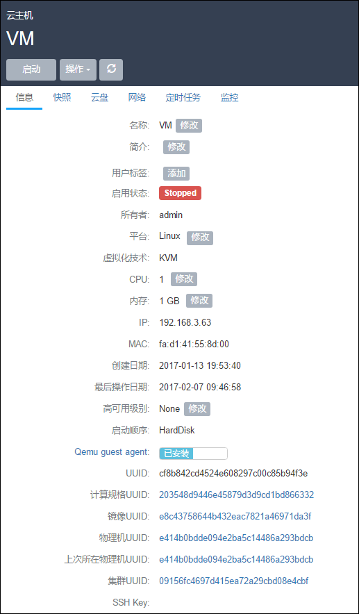

###### 图7-2-1 云主机详细信息界面

在相应的操作中,有如下约束条件:

1. 运行状态的云主机支持停止、重启、关闭电源、挂起、控制台、新建云盘、加载云盘、卸载云盘、加载ISO、卸载ISO、删除、加载网络、卸载网络、克隆、定时任务、设置用户标签、设置高可用级别、设置QGA状态、修改云主机密码、更改所有者、创建快照、删除快照、查看日志等操作。对于镜像仓库类型的镜像服务器，支持创建镜像操作。

2. 停止状态的云主机支持启动、修改配置、新建云盘、加载云盘、创建镜像、加载ISO、删除、加载网络、卸载网络、克隆、定时任务、设置静态IP、取消静态IP设置、设置用户标签、设置高可用级别、设置QGA状态、指定物理机启动、更改所有者、创建快照、删除快照、恢复快照、查看日志等操作。

3. 删除状态的云主机支持恢复、彻底删除和更改所有者等操作。

4. 主存储如果为本地存储,运行中的云主机不支持迁移,必须停止云主机才可进行迁移。此时的迁移主要为迁移根云盘或数据云盘。

5. 主存储如果为网络共享存储,运行中的云主机支持迁移,停止状态的云主机不支持迁移。此时的迁移为云主机在线实时迁移。主要为拷贝内存及CPU相关寄存器状态。

6. 彻底删除的操作需要将云主机首先删除作为前提。

7. QGA的设置，应该确保镜像中已经安装了QGA服务，否则不生效。QGA安装请参考官网镜像封装教程。

对云主机操作的各定义如下:

1.**启动**:将处于停止状态的云主机启动起来,进入云主机系统;

2.**停止**:将处于运行状态的云主机停止掉,使云主机系统关机;

3.重启:将处于运行状态的云主机重启,使云主机系统重新启动;

4.**暂停**（Pause）：Pause是让VM暂停，并没有让整个云主机的状态写入硬盘中，因此使用Pause时请不要关闭该云主机所在的物理机。 该操作只对运行中的云主机生效，支持批量操作。

**注意：**当VM 配置的内存过小时，其状态会由 running 变为 paused。

5.**恢复**：将处于暂停状态恢复工作。该操作只对暂停状态的云主机生效，支持批量操作。

6.**关闭电源**：当云主机处于运行状态时，使云主机强制进入停止状态。如图7-2-2所示，在云主机详情页面，点击操作列表中的关闭电源。正常状态下不建议执行此操作；

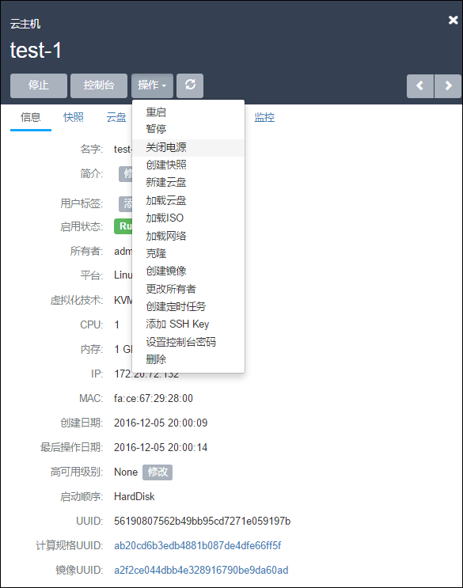

###### 图7-2-2 选择关闭电源

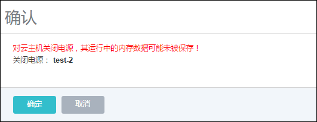

###### 图7-2-3 关闭电源界面

7.**控制台**:将进入云主机系统的控制界面,可以登录控制云主机;（支持开机时设置boot选项，点击ESC进入选项菜单）

8.**新建云盘**:创建一个新的云盘并添加给云主机。具体步骤如下示:

a\) 在云主机详情页的云盘栏,点击新建云盘按钮,进入新建云盘界面,如图7-2-4所示;

b\) 输入云盘名称并选择对应的云盘规格,点击确定;

**注意:**在系统初始化后,若系统没有添加过云盘规格,需要提前在云盘规格界面,创建新的云盘规格。详见第11章云盘管理。

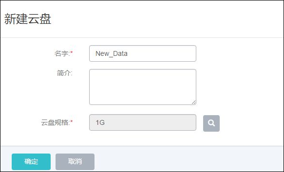

###### 图7-2-4 新建云盘界面

9.**加载云盘**:将一个可用的未挂载云盘挂载到当前云主机。需注意:如果主存储为本地存储,那么该云盘需要和云主机在相同的物理机上。当目标云盘和云主机不在相同物理机的时,需参考第11章云盘管理的云盘详情里把云盘迁移到云主机对应的物理机上。

10.**卸载云盘**:将系统之前添加过的数据云盘移除掉,具体步骤如下示:

a\)点击卸载云盘按钮,进入卸载云盘界面,如图7-2-5所示;

b\)从云盘列表选择需要移除的云盘,点击确认进行移除

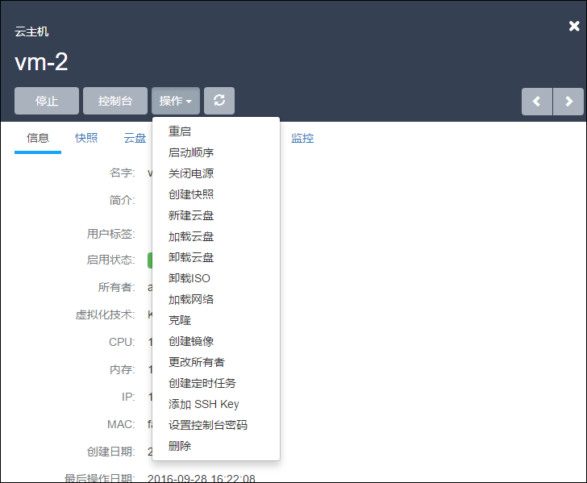

###### 图 7-2-5 卸载云盘界面

11.**加载ISO**:添加ISO镜像到云主机中,具体步骤如下示:

a\)点击加载ISO按钮,进入加载ISO界面;

b\)从ISO列表选择需要加载的ISO,点击确认进行加载。

12.**卸载ISO**:将已添加的ISO镜像从云主机中卸载,点击卸载ISO按钮,直接卸载ISO。

13.**修改启动顺序**:如果用户是在云主机创建之后挂载ISO\(在创建云主机时,镜像选 择为ISO时,会首先从ISO启动\),云主机默认的启动顺序是:第一从硬盘引导,第二从ISO 引导。

用户如需更改启动顺序,例如通过ISO启动来修复硬盘,需点击云主机详情的“启动顺序” 按钮来更改云主机的启动顺序。

如图7-2-6及7-2-7所示。其中Cdrom代表ISO引导时的虚拟光驱。需注意:如果选择CdRom是第一启动顺序,只有通过UI上点击停止和启动后,才会从CdRom启动。如果直接在云主机操作系统中通过reboot命令重启,还是会从硬盘启动。

用户在第一次创建云主机选择ISO进行安装时,无需选择启动顺序,系统会自行从ISO引导。

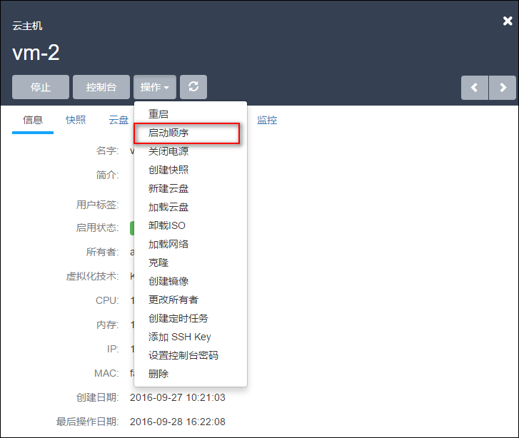

###### 图7-2-6 点击启动顺序

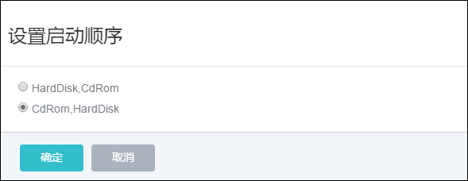

###### 图7-2-7 设置启动顺序

14.**迁移**:将云主机迁移至其他计算节点。迁移的速度与两台主机的网络配置有关,如果网络配置较低,迁移速度可能较慢。具体步骤如下示:

a\)点击迁移按钮,进入迁移界面,如图7-2-9所示;

b\)从计算节点列表选择需要迁移的目的机器,点击确认进行迁移。

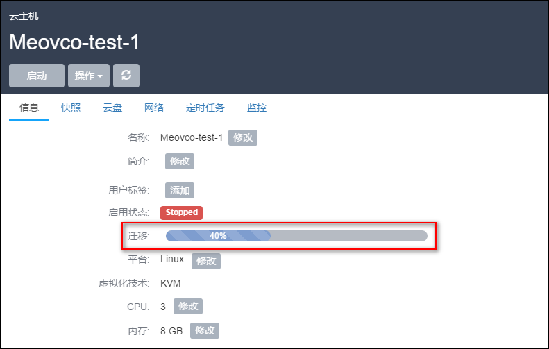
###### 图7-2-8 迁移进度显示

**注意**：只有云主机所在主存储类型为本地存储才支持迁移，在Ceph主存储中不会显示进度条。

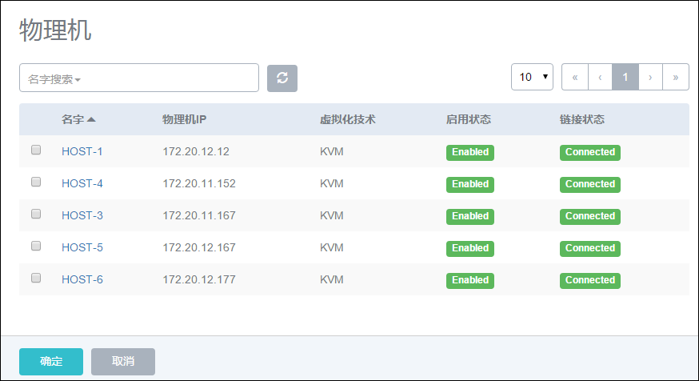

###### 图7-2-9 云主机迁移选择物理机界面

15.**删除**:系统支持三种云主机删除模式,可以在基础设置中修改:

a\)立刻删除:当用户删除云主机的时候,云主机相关资源会被立刻删除。

b\)延时删除\(默认\):当用户删除云主机的时候,云主机会被标记为Destroyed。24小时后,才会彻底删除,如图7-2-10所示。删除延时可以在基础设置中修改。

c\)永不删除:当用户删除云主机后,云主机相关资源永远不删除。

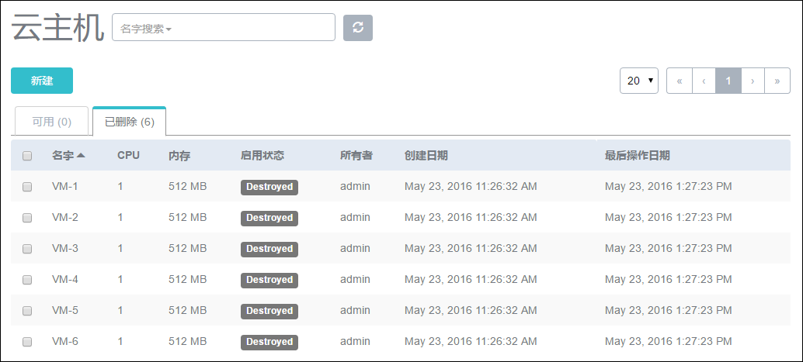

###### 图7-2-10 延时删除后云主机界面

如果在删除云主机的时候同时勾选了“同时删除云盘”,在删除云主机时将会同时删除该云主机上所有的云盘。如图7-2-11所示:

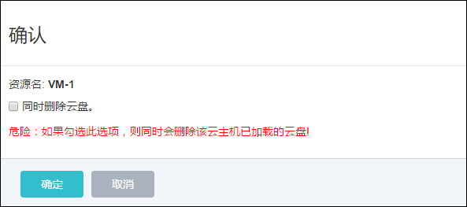

###### 图7-2-11 同时删除云盘界面

16.**彻底删除/恢复云主机**:当选择延时删除云主机后,云主机会进入“Destroyed”的状态。用户可以通过点击该云主机,选择对应的按钮恢复删除的云主机,或者彻底删除它, 如图7-2-12所示。

a\)恢复:选择恢复的云主机,将会进入到“Stopped”的状态,用户可以通过启动按钮,启动该云主机。删除一个云主机,该云主机的IP地址将会返回IP地址池中。当再次恢复该云 主机时,这个云主机的IP地址可能与删除前不同。

b\)彻底删除:选择彻底删除后,云主机相关资源会被彻底删除掉。镜像文件,云盘也有相同的恢复和彻底删除的按钮。用户需谨慎操作。

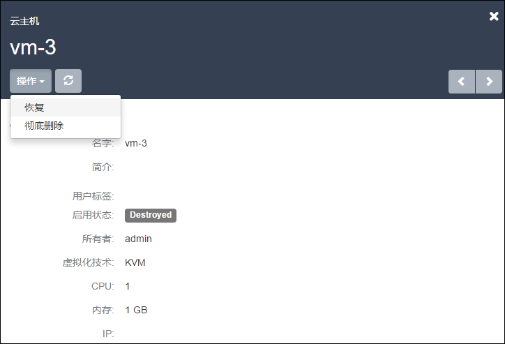

###### 图7-2-12 彻底删除\/恢复云主机界面

17.**修改配置**:对已停止的云主机,用户可以点击修改配置来选择其他可用的计算规格,在新弹出的界面选择需更换使用的计算规格来调整云主机使用的CPU、内存或其他资源。

18.**克隆**：对云主机的根云盘进行复制，根据此云主机的计算规格，克隆出与当前云主机相同系统的云主机。克隆功能主要考虑根云盘的克隆，用户在克隆前对云主机根云盘安装的程序或进行的配置都会复制到新克隆出的云主机内。并不考虑其他配置的复制。例如，用户标签，定时任务等。镜像仓库类型的镜像服务器支持在线克隆。

**注意**：**镜像仓库**类型的镜像服务器支持在线/离线克隆，**Ceph**类型的镜像服务器支持离线克隆。克隆的云主机会同时克隆设置的密码。

如图7-2-13中所示，填写名字与数量后，点击确定，系统会在后台创建克隆出的云主机。创建成功后，云主机列表中会显示新的云主机，新建的云主机处于运行状态。

**注意:**只有镜像服务器类型为镜像仓库时，才支持克隆功能

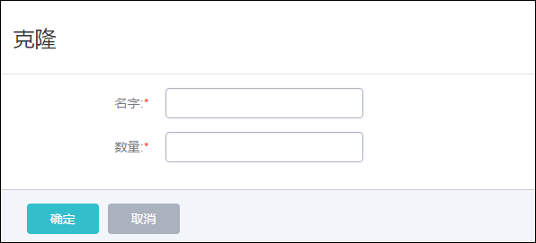

###### 图7-2-13 克隆云主机界面


19.**创建镜像**：用户可以对云主机进行定制，可保存为镜像模板文件。如果用户使用类型为**镜像仓库**的镜像服务器，对于云主机运行状态创建的镜像，可以保存云主机当时的应用场景。(对分布式存储无效)


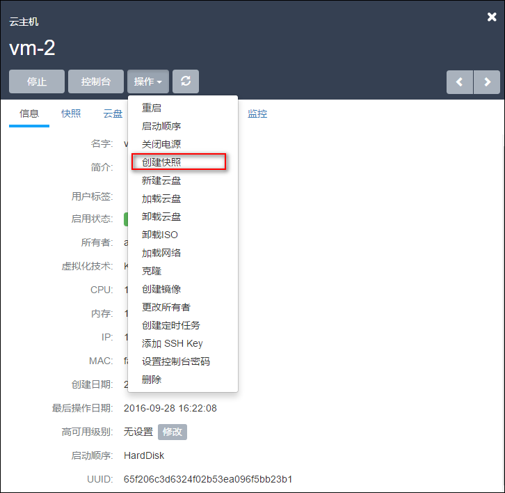

###### 图7-2-14 镜像仓库创建在线虚拟机镜像界面

如图7-2-15所示，点击创建镜像按钮，在新弹出的界面输入待保存的镜像名字，点击确定，程序会后台创建镜像文件。其他类型的镜像服务器需要在云主机停止后才能进行此操作。创建成功后，镜像列表会显示此镜像文件。

在创建镜像过程中，支持进度条显示创建情况，如图7-2-15所示。

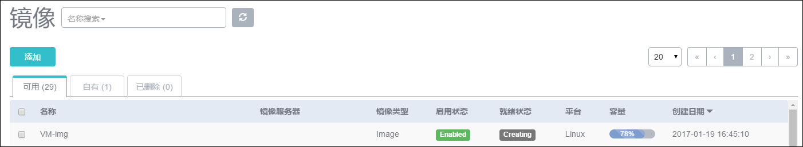

###### 图7-2-15 创建镜像进度条

20.**创建快照**:用户可以对云主机的根云盘进行创建快照的操作。从1.4版本后，系统支持在线创建快照,即对运行中的云主机创建快照点。如图7-2-16所示,点击创建快照按钮,在新界面输入待创建快照的名称,点击确定即可对根云盘当前状态创建快照。

**注意:**如果云主机正在进行大量的I\/O并发,此时创建快照,有可能会有数据丢失的风险,请谨慎操作。以防万一,可以在云主机停止后,再创建快照。如果用户从低版本升级到新版本,在线快照并不适用于正在运行中的云主机,需要云主机重启后才可生效。

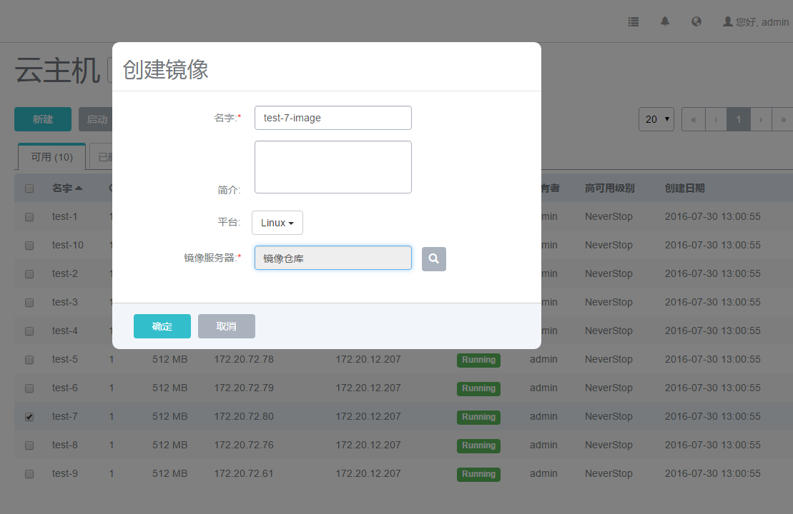

###### 图7-2-16 快照页面

21.**加载网络**:用户可对云主机动态的增加网络,例如,新增一个Vlan网络到云主机。点击云主机详情页的网络栏,点击加载按钮,新界面会列出可添加的网络列表,如图7-2-17所示,在列表中选择可加载的网络,如果存在多个网络,也可批量添加。添加网络的方法可参考第12章网络管理。加载后,云主机网络列表会显示多个网络。

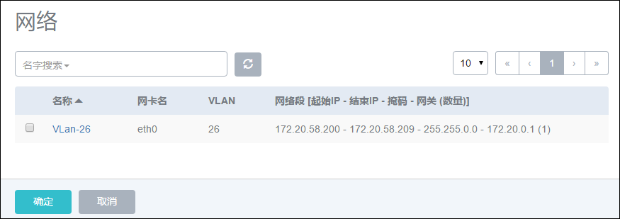

###### 图7-2-17 加载网络弹出的可选网络列表

22.**卸载网络**:用户可对云主机动态的卸载网络,例如从云主机移除一个网络。在网络栏点击待卸载的网络,点击卸载即可将网络从云主机移除,如图7-2-18所示。

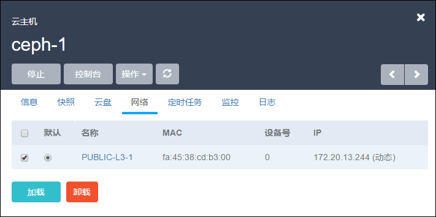

###### 图7-2-18 卸载网络界面

23.**修改默认网络**:在多网络列表的默认列中,选择相应的网络,会弹出新界面进行确认操作,点击确定后即可更换默认网络。

24.**设置静态IP**:IP地址的设置可以在新建云主机前选择网络,点击设置IP按钮,进行设置静态IP地址。也可以在停止云主机后,在云主机的网络界面选择网络设置静态IP地址。 如果设置静态IP地址,需避免与现有IP地址冲突。

25.**取消静态IP**:针对已设置过静态IP地址的云主机,可以取消静态IP的设置。如图 7-2-18所示,在停止云主机后,在网络页面选择待取消设置的网络,点击取消静态IP按钮,在新界面点击确定,即可取消静态IP的设置。

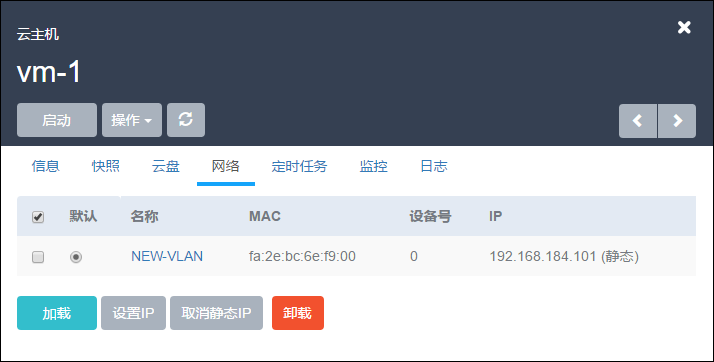

###### 图7-2-19 取消静态 IP 界面

26.**修改名字**:修改云主机的名称。云主机的名称可以重复,但建议使用易区分之云主机名字。UUID为系统中唯一确定云主机身份的标识。

27.**修改简介**:修改云主机的简介。

28.**修改高可用级别**:高可用级别有NeverStop或None两种模式。当高可用模式为NeverStop时，用户停止云主机的操作将会失效。

29.**设置用户标签**:对云主机设置用户标签,方便用户搜索查询云主机。用户标签可以创建多个。点击用户标签右侧的“x”可对用户标签进行删除。如图7-2-19所示:

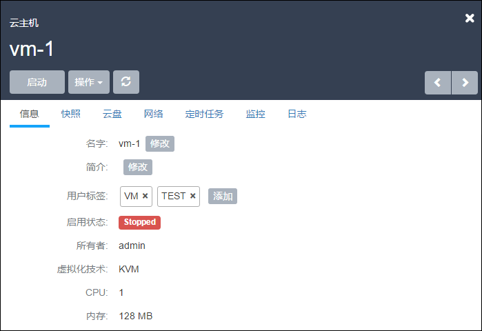

###### 图7-2-20 用户标签界面

30.**指定物理机启动**:针对停止状态的云主机,可以指定从特定物理机启动,此功能只适用于使用网络共享存储的主存储方式,如果主存储为本地存储,此功能只能选择根云盘所在的物理机启动。在点击启动\(指定物理机\),会弹出可用的物理机界面,点击确定后,会直接从选择的物理机启动。如果主存储为本地存储,则无此功能。

31.**更改所有者**: 将云主机的所有者更改,具体参考17.4更改所有者。

32.**定时任务**：定时任务能够帮助用户完成周期性的资源操作任务，比如根据业务需要定时启动云主机、停止云主机、重启云主机、为云主机根云盘创建快照等。详情请参照[18.1](/Schedule/vm-schedule.md)章节。

33.**设置控制台密码**：
用户可以添加\/删除云主机控制台密码，该密码为VNC协议的密码，而不是云主机本身的密码。设置完成后，重启云主机生效。

* 添加控制台密码
  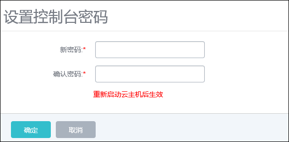

  ###### 图7-2-21 添加控制台密码界面

* 删除控制台密码
  

  ###### 图7-2-22 删除控制台密码界面

34.**修改云主机密码**：对于运行中的云主机，点击云主机界面操作列表中的修改云主机密码按钮，进入修改云主机密码界面。如图7-2-23所示，输入用户名密码后，点击确定生效。使用**已修改密码的云主机**创建的**镜像**，生成新的云主机或者新**克隆**出来的云主机均支持该功能。

已支持修改密码镜像类型：
```
1. CentOS 7.x\(32位\/64位\);

2. CentOS 6.x\(32位\/64位\);

3. Ubuntu 16.x\/15.x\/14.x\/13.x\/12.x\(64位);
```

**注意：**在使用镜像仓库/sftp/ceph类型镜像服务器添加镜像时，勾选了“支持修改密码”的qcow2镜像所创建的云主机，支持该功能。

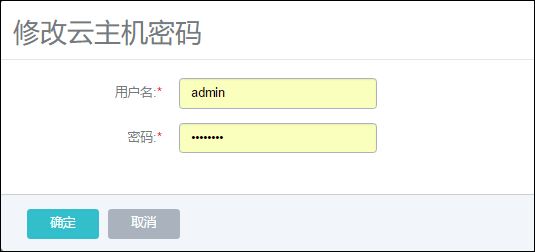

###### 图7-2-23 删除控制台密码界面

35.**添加/删除SSH Key**：点击云主机界面操作列表中的添加SSH Key按钮，进入添加SSH Key界面。如图7-2-32所示，在文本框中输入要添加的SSH Key，点击确认，重启后生效。SSH key具体介绍请参考[7.5](/VM/ssh-key.md)章节。

**注意：**如果云主机之前已注入过ssh-key，则需在云主机中手动执行：rm -rf \/var\/lib\/cloud\/instances， 以清理先前配置。

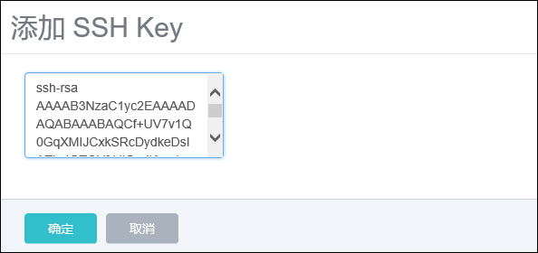

###### 图7-2-24 添加SSH Key界面

36.**重置云主机**：如果云主机是使用镜像创建的（区别于使用ISO安装创建的方式），使用该API可以重置虚拟机到创建时的状态。要求该云主机处于Stopped状态。点击云主机界面操作列表中的重置云主机按钮，启动后生效。

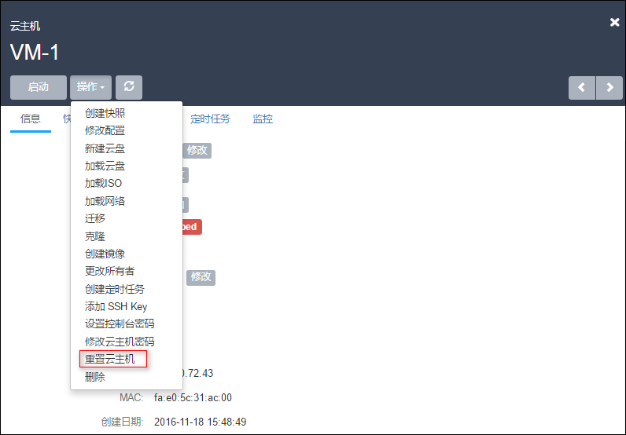

###### 图7-2-25 选择重置云主机界面

37.**云主机网络QoS**：在云主机停止或者运行状态下，修改网络QoS，单位可以为Kbps/Mbps/Gbps。

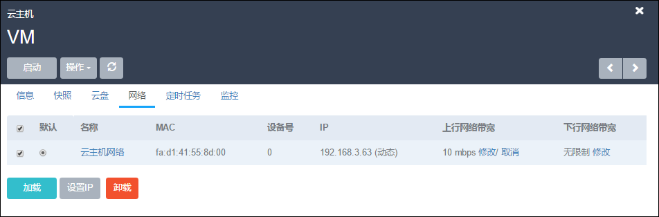
###### 图7-2-26 云主机网络界面

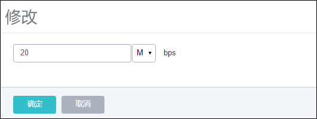
###### 图7-2-27 设置网络QoS

38.**修改云主机CPU/Memory**：如果云主机的某项配置需要更改，可以在详情页中直接修改CPU或者内存，重启后生效。

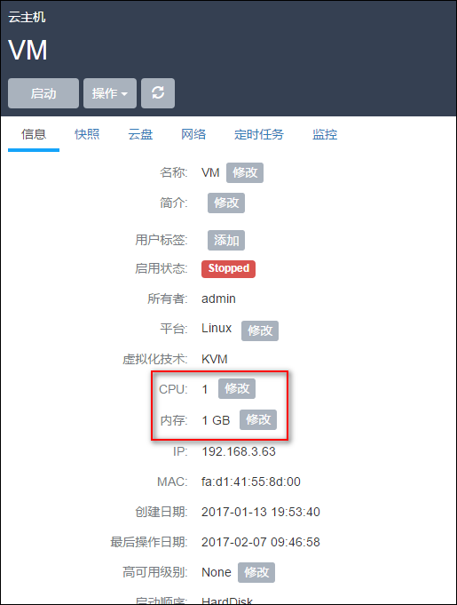
###### 图7-2-28 设置云主机CPU/Memory


