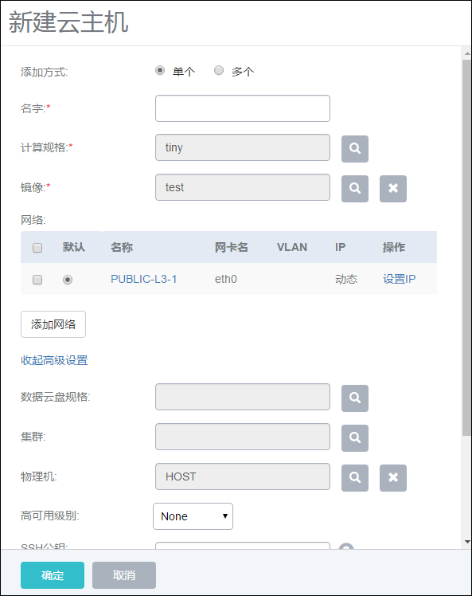

# 7.5 SSH公钥管理

在创建云主机的选项中，用户可以输入SSH公钥。注入SSH公钥可以给云主机的root用户设置SSH公钥，在云主机启动后，用户可以用对应的SSH私钥进行SSH无密码登录，如图7-5-1示。

SSH公钥目前使用cloud-init注入方式实现，采用的是Amazon AWS的标准用法，用户可以直接在相关CentOS、Ubuntu官网直接下载相应的镜像直接测试使用。

用户可以直接在相关CentOS、Ubuntu官网直接下载相应的镜像直接测试使用，相应的下载连接如下：

CentOS 7.2 : [http://cloud.centos.org/centos/7/images/](http://cloud.centos.org/centos/7/images/)

Ubuntu 14.04 [http://uec-images.ubuntu.com/trusty/current/](http://uec-images.ubuntu.com/trusty/current/)

使用该功能云主机模板需要预装cloud-init。

###### 图7-5-1  给云主机设置SSH公钥

在添加SSH Key后，用户可在云主机详情页查看对应的SSH Key的基本信息。可看到对应公钥的用户名或主机信息

SSH公钥由“ssh-keygen”命令生成，默认会存放在/root/.ssh/id_rsa.pub文件。创建云主机时，将此文件内容贴入SSH公钥输入框即可。

在CentOS云主机里可以通过yum install cloud-init 直接安装cloud-init，安装完毕后保存成镜像，之后使用此镜像的云主机在启动时，如果输入SSH Key，在云主机启动后，拥有对应的SSH Key私钥的主机即可无密码登录此云主机。

