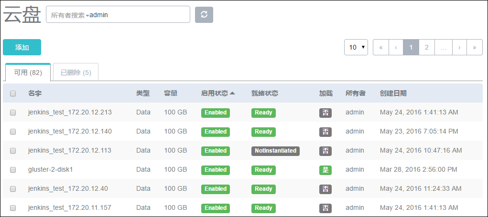
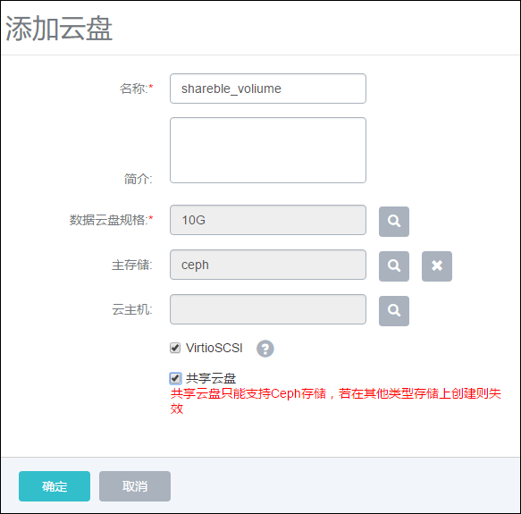
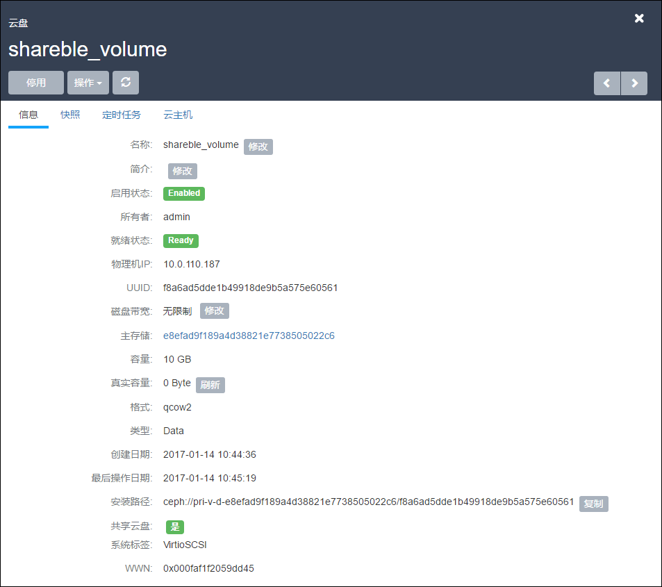
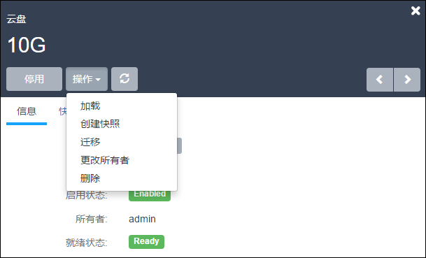
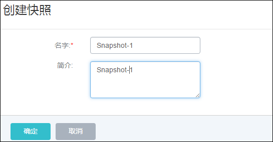
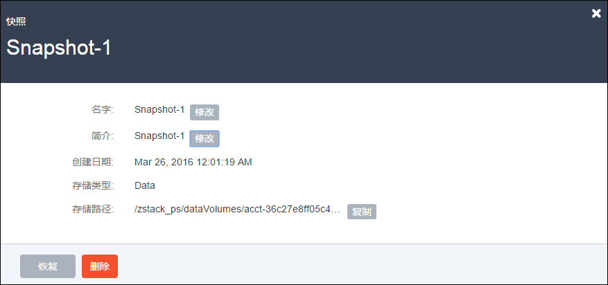

# 13 云盘管理

点击菜单栏的云盘，进入云盘管理界面，如图13-1所示。在云盘管理界面，可以查看数据云盘列表信息及云盘大小，并对云盘进行添加、删除、迁移、停用、启用、恢复、彻底删除、更改所有者、更改磁盘带宽、创建快照、定时任务等操作。

###### 图13-1  云盘列表

点击添加按钮，可以新建一个云盘并将其挂载到某个云主机，如图13-2所示。在新界面中输入云盘的名字，选择云盘规格,指定创建云盘的主存储。

如果不选择云主机，将会创建一个未加载的空白云盘。未加载的空白云盘可以在创建之后，再挂载到其他云主机上，**挂载后才真正占用空间**。

如果勾选VirtioSCSI,数据云盘具有全局SCSI wwn识别标记，系统内部自动创建唯一识别ID，并将此识别ID带到云盘设备。云主机（例如Linux）启动后，从/dev/disk/by-id/下可查看wwn。wwn标记方便管理员和用户挂载和卸载数据云盘。

如果勾选“共享云盘”，将自动勾选VirtioSCSI选项。勾选后创建的云盘可以挂载到多个云主机上。

**注意：**只有在Ceph主存储的环境下才能实现共享云盘。同时的读写云盘可能造成数据的不一致，请在明确需求的情况下使用此功能。禁止在写云盘的过程中，detach对应的云主机。

###### 图13-2  新建云盘

点击某个云盘可以查看该云盘的详情，如图13-3所示。在云盘详情页里可以查看云盘所在的物理机IP地址，挂载的云主机的信息，云盘的大小，实际路径等信息，也可以修改云盘的名字和简介。其中容量代表了此云盘占用的虚拟空间大小，实际容量代表了此云盘在物理机上占用的实际空间大小。

###### 图13-3  云盘详情

如果云盘已经挂载在某个云主机上，可以点击操作->卸载来卸载该云盘。一个还没有初始化的云盘可以通过点击挂载，将云盘挂载到任意某台状态为运行或者停止的云主机上。

**磁盘带宽设置**：支持修改云盘的磁盘带宽，单位可以为MB/s,GB/s,
TB/s。

针对本地主存储，如果需要挂载一个卸载过的云盘，则需要保证该云盘和目标云主机在相同的物理机上。如果该云盘和目标云主机不在相同的物理机上，就需要用户将云盘和云主机迁移到相同的物理机上。

用户可以选择迁移云主机（需要首先停止云主机），也可以选择迁移云盘。在卸载云盘后，点击云盘详情的操作，再点击迁移，在弹出的对话框中选择希望迁移的目标物理机后，系统就可以将该云盘迁移到目标物理机。如图13-4所示：

###### 图13-4  云盘迁移

针对其他类型的主存储，则无云盘迁移的概念。

支持在线快照。快照可以保存当前云盘的所有数据，用户可以使用快照快速的把云盘的状态恢复到历史的某个状态。首次创建快照，可能需较久时间来进行快照存储。与创建快照类似，恢复快照也只能操作一个已经卸载或者已经停止运行的云主机上的云盘。

###### 图13-5  创建云盘快照

在云盘的详情界面，点击快照界面，选择需要恢复的快照，在弹出的窗口中确认恢复，就可以把该云盘还原到当前快照状态。如图13-6所示，此处的恢复会将当前的快照恢复到云盘中。删除按钮代表删除当前快照。

###### 图13-6  恢复云盘快照

云盘的定时任务，可以定时为数据云盘创建快照，详情参考[云盘定时任务](/Schedule/volume-schedule.md)。

如果共享云盘挂载在多个云主机上，可以在云盘的详情页中看到云主机信息。如图13-7所示，可以进行批量加载和卸载的操作。

###### 图13-7  共享云盘挂载多个云主机

