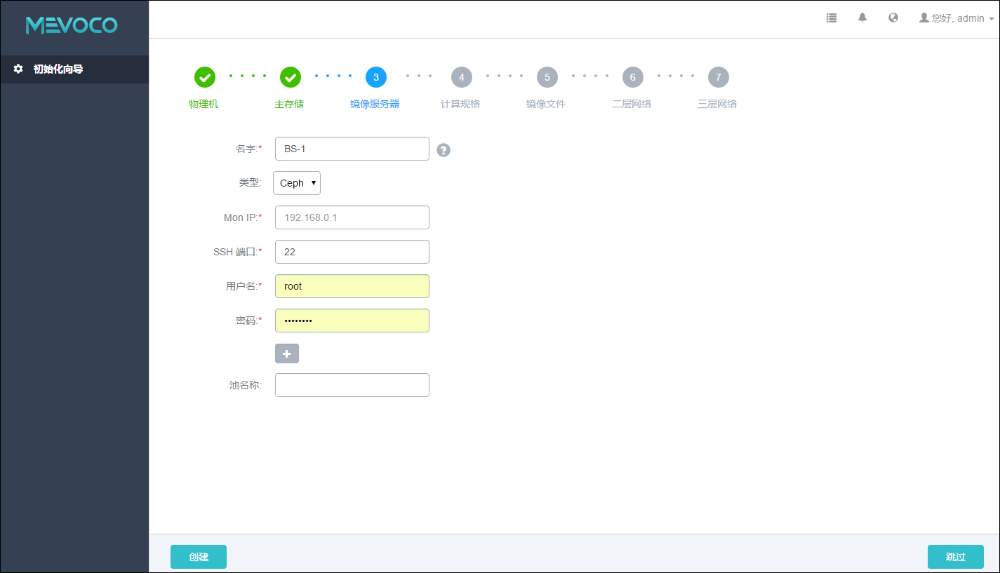
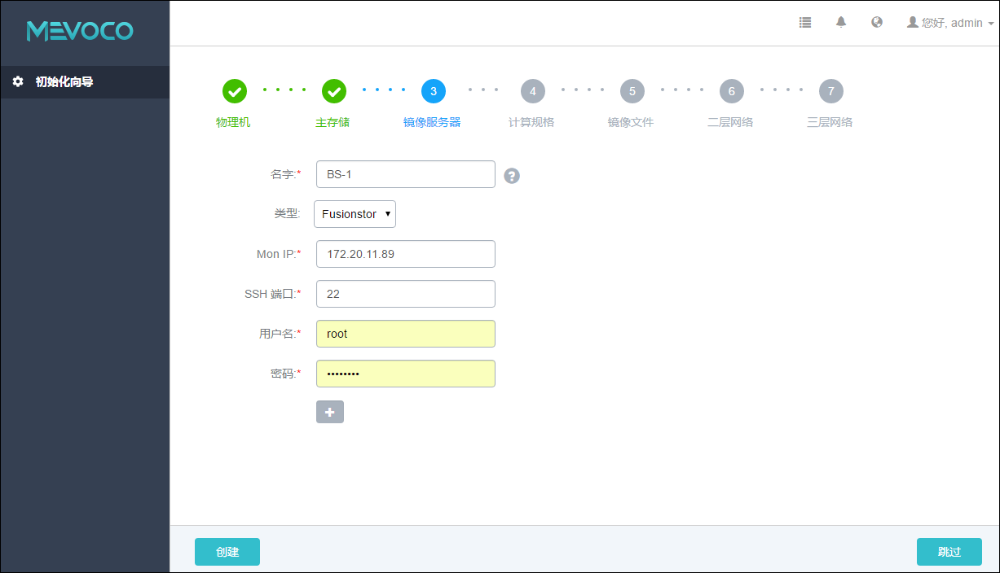

# 5.3 添加镜像服务器

添加完主存储后，Wizard将引导进入添加镜像服务器界面。

镜像服务器的类型与主存储的类型有关联性要求。

如果主存储采用了Ceph，那么镜像服务器也会使用同一个Ceph集群做镜像存储。

如果主存储采用了FusionStor，那么镜像服务器也会使用同一个FusionStor集群做镜像存储。

Ceph采用了Ceph集群提供的分布式块存储作为镜像存储。

FusionStor采用了FusionStor集群提供的分布式块存储作为镜像存储。

如果添加Ceph主存储未指定存储池，则系统会自动添加同一个Ceph存储为镜像存储。

如果添加了Fusion主存储,则系统会自动添加同一个Fusionstor存储为镜像存储。

当主存储选为本地存储、NFS或Share Mount Point类型时，镜像服务器的默认类型为镜像仓库。

如果主存储采用了NFS 或者SharedMountPoint类型，用户可以手动将此相应的共享目录挂载到对应的镜像服务器的本地目录上，通过此方法可以实现主存储和镜像服务器存储全部使用网络共享存储方式。

### 镜像仓库
添加镜像仓库类型镜像服务器具体步骤，如图5-3-1所示：

1. 输入镜像服务器的名字。点击名字输入框后边的问号，会提示添加镜像服务器的帮助。

2. 输入镜像服务器的IP地址，例如，192.168.0.1。在生产环境中，建议用户采用管理和公有网络分离的方案。镜像存储服务器的IP地址可以和管理网络共享，以节省公网网络带宽；当公有网络是万兆网络环境时，也可以和公有网络共享，以提高镜像在镜像服务器和计算节点之间的传递速度。通常在添加镜像，保存镜像的时候，会占用较大的网络带宽。如果和公有网络共享网络的时候，建议可以选择在网络空闲时段进行镜像相关的操作。有条件的客户，也可以设置独立的存储网络。

3. 输入SSH端口，默认为22，如果镜像服务器没有配置SSH端口，则可按照默认配置的22端口使用。

4. 输入镜像服务器上的挂载大容量存储的路径，例如，输入/zstack_bs

5. 输入用户名，默认为root用户，也可输入普通用户。如果镜像服务器没有添加普通用户，则可按照默认的root用户使用。普通用户要求拥有sudo权限。

6. 输入用户密码，输入密码时请注意大小写。

7. 点击创建按钮，系统会配置镜像服务器。

### Ceph

如果在添加主存储时，指定了存储池，则需手动添加同一个Ceph存储为镜像服务器。

添加Ceph类型镜像服务器具体步骤，如图5-3-2所示：

1. 输入镜像服务器的名字。

2. 输入和主存储同一个Ceph集群的监控节点IP地址。

3. 输入Ceph 监控节点的SSH端口号，默认为22，如果此节点没有配置SSH端口，则可按照默认配置的22端口使用。

4. 输入Ceph 监控节点的用户名，默认为root用户，也可输入普通用户。如果此Ceph 监控节点没有添加普通用户，则可按照默认的root用户使用。普通用户要求拥有sudo权限。

5. 输入Ceph 监控节点的对应的用户密码，输入密码时请注意大小写。

6. 输入池名称（可选）。用户需在添加镜像服务器前首先在Ceph集群自行创建。存储池名为可选项，如果不指定，则系统会自动创建。

7. 点击创建按钮，系统会配置镜像服务器。

可以点击加号添加多个Ceph 监控节点。通常添加三个Ceph监控节点为较合适的方案。至少需添加一个可用的Ceph监控节点。也可以点击减号减少Ceph 监控节点的添加个数。

###### 图5-3-2 添加Ceph类型镜像服务器界面
### Fusionstor
一般情况下Fusionstor类型的镜像服务器会自动添加，无须手动配置。其添加会随着Fusionstor主存储一起添加。

添加FusionStor类型镜像服务器具体步骤，与添加Ceph的步骤类似，如图5-3-3所示：

###### 图5-3-3 添加FusionStor类型镜像服务器界面 

注意：添加镜像服务器错误，请参考[添加镜像服务器](/exception/bs.md)异常处理。
