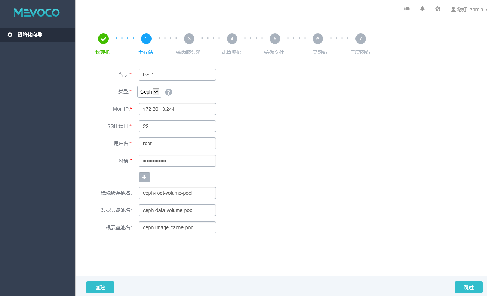
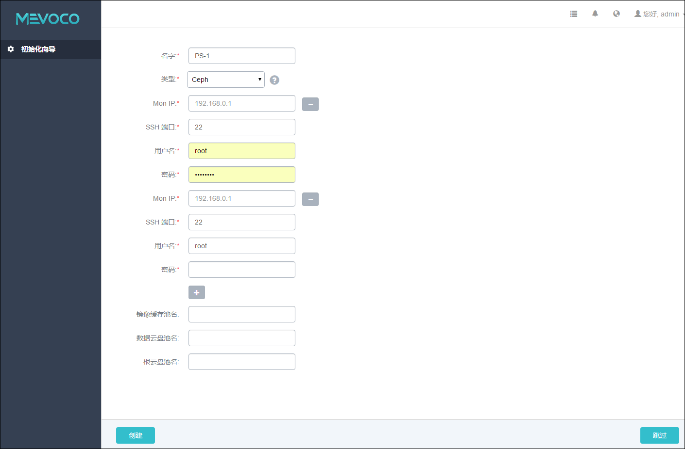

# 5.2.3 Ceph

系统对Ceph的支持为块存储的模式。如需使用Ceph，则需提前配置好Ceph分布式存储。

如果在添加Ceph主存储时，用户没有指定自建的Ceph存储池，则系统将自动配置同一个Ceph镜像服务器作为镜像存储。如果用户在添加Ceph主存储时，指定了任一Ceph存储池，则不会自动配置Ceph镜像服务器。

添加Ceph存储具体步骤，如图5-2-4所示：

1. 输入主存储的名字。

2. 选择主存储的类型为Ceph。

3. 输入Ceph 监控节点的IP地址。

4. 输入Ceph 监控节点的SSH端口号，默认为22，如果此节点没有配置SSH端口，则可按照默认配置的22端口使用。

5. 输入Ceph 监控节点的用户名，默认为root用户，也可输入普通用户。如果此Ceph 监控节点没有添加普通用户，则可按照默认的root用户使用。普通用户要求拥有sudo权限。

6. 输入Ceph 监控节点的对应的用户密码，输入密码时请注意大小写。

7. 输入镜像缓存池名、数据云盘池名、跟云盘池名（可选）。用户需在添加主存储前首先在Ceph集群自行创建。存储池名为可选项，如果不指定，则系统会自动创建。

8. 点击创建按钮，系统会配置Ceph的块存储作为主存储。

###### 图5-2-4 添加Ceph主存储界面

一般Ceph集群会配置多个监控节点，可以点击加号，添加多个Ceph的监控节点。如图5-2-5所示。在新的输入框需要输入新的Ceph监控节点IP、SSH端口号、用户名和用户密码。如需取消一些节点输入，也可以直接点击新输入框右侧的减号按钮，进行取消。

###### 图5-2-5 添加多个Ceph监控节点界面

* 注意：请确保至少输入一个可用的Ceph监控节点。建议在初始化引导界面，只添加一个Ceph监控节点以快速完成基本的初始化，其他监控节点也可在主存储界面再次挂载添加。如果用户对Ceph的相关配置不熟悉，建议选择其他主存储类型进行配置。
