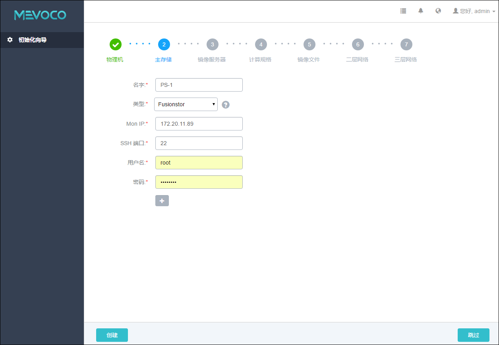
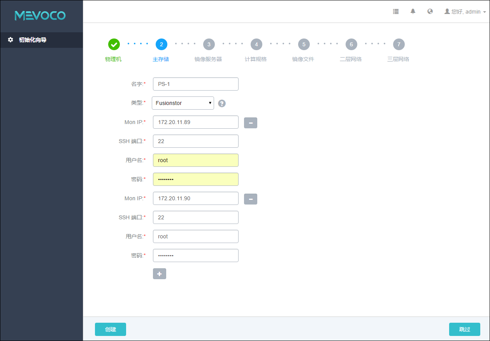

# 5.2.4 FusionStor

FusionStor采用了华云网际提供的分布式块存储方式。如需使用Fusionstor，则需提前配置好FusionStor分布式存储。

添加FusionStor存储具体步骤，与添加Ceph存储的步骤类似，如图5-2-6所示：
1. 输入主存储的名字。

2. 选择主存储的类型为FusionStor。

3. 输入FusionStor监控节点的IP地址。

4. 输入FusionStor监控节点的SSH端口号，默认为22，如果此节点没有配置SSH端口，则可按照默认配置的22端口使用。

5. 输入FusionStor监控节点的用户名，默认为root用户，也可输入普通用户。如果此FusionStor监控节点没有添加普通用户，则可按照默认的root用户使用。普通用户要求拥有sudo权限。

6. 输入FusionStor监控节点的对应的用户密码，输入密码时请注意大小写。

7. 点击创建按钮，系统会配置FusionStor的块存储作为主存储。

###### 图5-2-6 添加FusionStor主存储界面

一般FusionStor集群会配置多个监控节点，可以点击加号，添加多个FusionStor的监控节点。如图5-2-7所示。在新的输入框需要输入新的FusionStor监控节点IP、SSH端口号、用户名和用户密码。如需取消一些节点输入，也可以直接点击新输入框右侧的减号按钮，进行取消。

###### 图5-2-7 添加多个FusionStor监控节点界面 

* 注意：请确保至少输入一个可用的FusionStor监控节点。建议在初始化引导界面，只添加一个FusionStor监控节点以快速完成基本的初始化，其他监控节点也可在主存储界面再次挂载添加。如果用户对FusionStor的相关配置不熟悉，建议选择其他主存储类型进行配置。

* 注意：添加Fusionstor主存储后，系统会自动添加同一个Fusionstor存储为Fusion镜像服务器。
